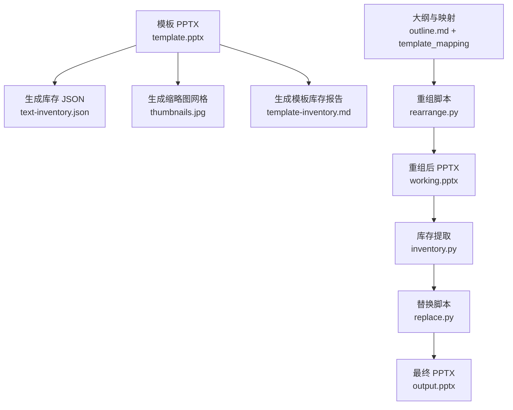
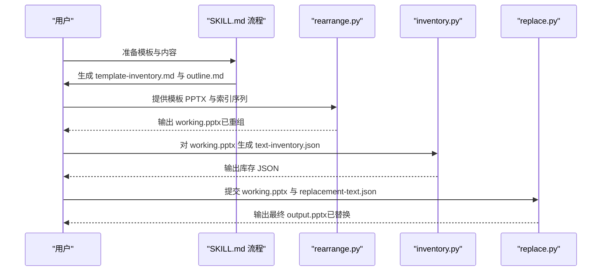
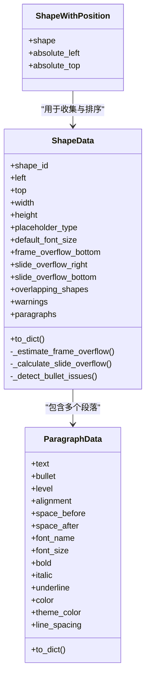
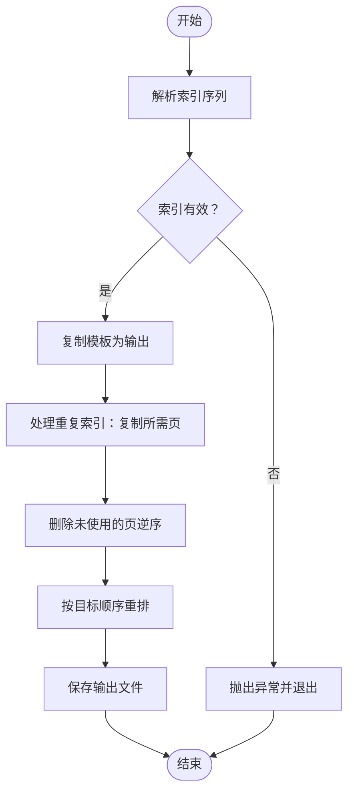
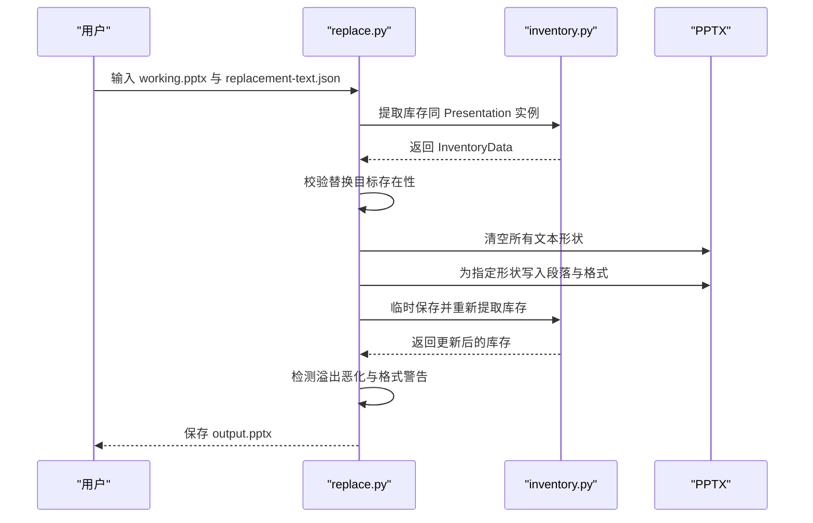
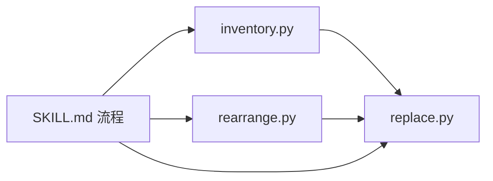

# 模板管理与重用

<cite>
**本文引用的文件**
- [SKILL.md](file://skills/pptx/SKILL.md)
- [inventory.py](file://skills/pptx/scripts/inventory.py)
- [rearrange.py](file://skills/pptx/scripts/rearrange.py)
- [replace.py](file://skills/pptx/scripts/replace.py)
- [html2pptx.md](file://skills/pptx/html2pptx.md)
- [unpack.py](file://skills/pptx/ooxml/scripts/unpack.py)
- [validate.py](file://skills/pptx/ooxml/scripts/validate.py)
</cite>

## 目录
1. [简介](#简介)
2. [项目结构](#项目结构)
3. [核心组件](#核心组件)
4. [架构总览](#架构总览)
5. [详细组件分析](#详细组件分析)
6. [依赖关系分析](#依赖关系分析)
7. [性能考量](#性能考量)
8. [故障排查指南](#故障排查指南)
9. [结论](#结论)
10. [附录](#附录)

## 简介
本文件面向“PPTX 模板管理与重用”的完整工作流，围绕以下目标展开：
- 基于现有模板创建新演示文稿：从模板分析、幻灯片重组、内容替换三个环节，形成可复用的标准化流程。
- 模板库存与映射：定义 template-inventory.md 的生成与使用方法、outline.md 的创建规范、template_mapping 的设计原则。
- 工具链使用：详解 inventory.py 的库存提取、rearrange.py 的幻灯片重组、replace.py 的内容替换机制。
- 实战案例：给出基于模板创建专业演示文稿的关键步骤与注意事项，包括布局选择、内容适配、格式保持等。

## 项目结构
与 PPTX 模板管理直接相关的目录与文件如下：
- 技能说明与流程：skills/pptx/SKILL.md
- 模板转换与 HTML 工作流：skills/pptx/html2pptx.md
- 脚本工具：
  - inventory.py：文本库存提取与结构化输出
  - rearrange.py：按索引序列重组幻灯片
  - replace.py：基于库存进行内容替换与格式应用
- OOXML 支撑脚本：
  - ooxml/scripts/unpack.py：解包 Office 文件以便分析
  - ooxml/scripts/validate.py：对 XML 进行校验

图表来源
- [SKILL.md](file://skills/pptx/SKILL.md#L182-L407)
- [inventory.py](file://skills/pptx/scripts/inventory.py#L914-L1017)
- [rearrange.py](file://skills/pptx/scripts/rearrange.py#L149-L227)
- [replace.py](file://skills/pptx/scripts/replace.py#L214-L354)

章节来源
- [SKILL.md](file://skills/pptx/SKILL.md#L182-L407)

## 核心组件
- inventory.py：负责从 PPTX 中提取所有文本形状，按视觉位置排序，计算溢出与重叠问题，并输出结构化 JSON，供后续替换使用。
- rearrange.py：根据给定的幻灯片索引序列复制、删除、重排幻灯片，支持重复使用同一张模板页。
- replace.py：加载库存 JSON，校验替换目标，清理旧内容并应用新段落及其格式属性，自动检测溢出恶化与格式警告。

章节来源
- [inventory.py](file://skills/pptx/scripts/inventory.py#L128-L740)
- [rearrange.py](file://skills/pptx/scripts/rearrange.py#L75-L227)
- [replace.py](file://skills/pptx/scripts/replace.py#L214-L354)

## 架构总览
下图展示了从模板到成品的端到端流程，以及各脚本之间的协作关系：

图表来源
- [SKILL.md](file://skills/pptx/SKILL.md#L182-L407)
- [rearrange.py](file://skills/pptx/scripts/rearrange.py#L149-L227)
- [inventory.py](file://skills/pptx/scripts/inventory.py#L914-L1017)
- [replace.py](file://skills/pptx/scripts/replace.py#L214-L354)

## 详细组件分析

### 组件一：库存提取 inventory.py
- 功能要点
  - 支持组形状递归遍历与绝对定位计算，保证嵌套结构的正确性。
  - 过滤掉页码与数字页脚等非内容占位符。
  - 按视觉位置排序（先按顶部坐标，再按左侧坐标），为后续映射提供稳定顺序。
  - 计算形状溢出（文本框内溢出）、滑块边界溢出与形状间重叠，标注警告信息。
  - 输出结构化 JSON，包含段落级格式（对齐、缩进、字体、颜色、间距等）。
- 关键数据结构
  - ShapeData：封装形状位置、尺寸、占位符类型、默认字号、溢出与重叠信息、段落列表。
  - ParagraphData：封装段落文本与格式属性，支持导出字典。
- 使用建议
  - 若仅需定位问题形状，可使用“仅问题模式”过滤。
  - 保存 JSON 后，结合替换脚本进行批量内容替换。

图表来源
- [inventory.py](file://skills/pptx/scripts/inventory.py#L128-L740)

章节来源
- [inventory.py](file://skills/pptx/scripts/inventory.py#L914-L1017)

### 组件二：幻灯片重组 rearrange.py
- 功能要点
  - 接收“0 基索引”的幻灯片序列，自动复制重复出现的索引，删除未使用的幻灯片，最后按目标顺序重排。
  - 复制幻灯片时保留版式与媒体关系，确保图片与媒体正确引用。
  - 通过索引映射跟踪重复副本，保证重排后索引一致性。
- 使用方法
  - 命令行参数：模板 PPTX、输出 PPTX、逗号分隔的索引序列。
  - 索引可重复（如 34 出现两次表示复制该页两次）。
- 注意事项
  - 索引必须在模板总页数范围内，超出将报错。
  - 重排过程会修改原文件（若输出路径与输入相同），建议先复制一份。

图表来源
- [rearrange.py](file://skills/pptx/scripts/rearrange.py#L149-L227)

章节来源
- [rearrange.py](file://skills/pptx/scripts/rearrange.py#L149-L227)

### 组件三：内容替换 replace.py
- 功能要点
  - 加载目标 PPTX 并提取库存（与 inventory.py 共享数据结构）。
  - 读取 replacement-text.json，校验替换目标是否存在于库存中。
  - 清空库存中的所有文本形状，仅对显式提供“paragraphs”的形状写入新内容。
  - 应用段落级格式：对齐、缩进、字体、颜色、间距、项目符号层级等。
  - 替换后重新提取库存，检测是否造成文本溢出恶化或新增格式警告。
- 关键流程
  - 加载 PPTX 与库存 JSON
  - 校验替换目标存在性与唯一性
  - 清空并写入新段落
  - 二次库存检查与溢出/警告汇总
  - 成功后保存输出

图表来源
- [replace.py](file://skills/pptx/scripts/replace.py#L214-L354)
- [inventory.py](file://skills/pptx/scripts/inventory.py#L914-L1017)

章节来源
- [replace.py](file://skills/pptx/scripts/replace.py#L214-L354)

## 依赖关系分析
- inventory.py 与 replace.py：共享 InventoryData 类型与库存结构，replace.py 内部直接调用 inventory.py 的提取函数。
- rearrange.py 与 replace.py：两者都依赖 pptx 库操作 PPTX；rearrange.py 产出的 working.pptx 作为 replace.py 的输入。
- SKILL.md：定义了完整的模板管理流程，指导 inventory、rearrange、replace 的组合使用。

图表来源
- [inventory.py](file://skills/pptx/scripts/inventory.py#L914-L1017)
- [replace.py](file://skills/pptx/scripts/replace.py#L214-L354)
- [rearrange.py](file://skills/pptx/scripts/rearrange.py#L149-L227)
- [SKILL.md](file://skills/pptx/SKILL.md#L182-L407)

章节来源
- [SKILL.md](file://skills/pptx/SKILL.md#L182-L407)

## 性能考量
- 形状排序与重叠检测：对每页形状进行排序与两两重叠计算，时间复杂度近似 O(n^2)。对于大页数或每页大量形状的模板，建议：
  - 仅在必要时启用“仅问题模式”，缩小处理规模。
  - 控制单页形状数量，避免极端密集布局。
- 文本测量与字体加载：估算溢出时使用 PIL 进行文本长度测量，可能受系统字体路径与可用字体影响。建议：
  - 在目标环境中预装常用字体，或在 JSON 中显式指定字体名称与大小，减少回退开销。
- IO 与内存：库存 JSON 与临时文件读写较多，建议：
  - 使用 SSD 存储中间文件。
  - 控制输出文件大小，避免过大的媒体资源导致内存峰值过高。

## 故障排查指南
- 库存校验失败
  - 现象：提示“形状不存在于库存中”或“幻灯片索引不存在”。
  - 处理：对照 text-inventory.json 逐项核对，修正 replacement-text.json 或 outline.md 的映射。
- 溢出恶化
  - 现象：替换后某形状出现更严重的文本溢出。
  - 处理：调整段落长度、字体大小或行距；考虑改用更大占位符或拆分内容。
- 格式警告
  - 现象：提示“请使用正确的项目符号格式”等。
  - 处理：在 replacement-text.json 中使用布尔与层级字段，不要手动添加符号字符。
- 重排异常
  - 现象：索引越界或重排后顺序不符。
  - 处理：确认索引在模板页数范围内；注意重复索引的处理逻辑。

章节来源
- [replace.py](file://skills/pptx/scripts/replace.py#L162-L201)
- [replace.py](file://skills/pptx/scripts/replace.py#L307-L343)
- [rearrange.py](file://skills/pptx/scripts/rearrange.py#L167-L171)

## 结论
通过 inventory.py、rearrange.py、replace.py 三脚本的协同，可以高效地完成“模板分析—幻灯片重组—内容替换”的全流程。配合 SKILL.md 的模板库存与映射规范，能够稳定地产出高质量、可复用的演示文稿。建议在团队内统一 outline.md 与 template_mapping 的命名约定，确保跨项目的一致性与可维护性。

## 附录

### template-inventory.md 的生成与使用
- 生成步骤
  - 使用缩略图网格辅助视觉分析，记录每页布局与占位符分布。
  - 编写 template-inventory.md，列出每页索引、布局代码（如有）与用途描述。
- 使用建议
  - 严格使用 0 基索引，避免混淆。
  - 将页面按“标题页—内容页—总结页”等逻辑分组，便于后续映射。

章节来源
- [SKILL.md](file://skills/pptx/SKILL.md#L193-L212)

### outline.md 的创建规范与 template_mapping 设计原则
- 创建规范
  - 基于 template-inventory.md 选择合适布局：单列、双列、三分栏、图文等，确保占位符与内容一一对应。
  - 明确每节内容与页数，避免过度拥挤或留白过多。
- 映射设计原则
  - 一对一映射：每个 outline 条目尽量对应一页模板页。
  - 可复用性：对重复内容使用同一模板页索引（允许重复）。
  - 容错性：预留 1–2 页缓冲，应对内容增删。

章节来源
- [SKILL.md](file://skills/pptx/SKILL.md#L214-L243)

### inventory.py 的库存提取最佳实践
- 输出结构
  - 每页键名：slide-0、slide-1…
  - 每页内形状键名：shape-0、shape-1…（按视觉顺序稳定）
  - 形状字段：位置、尺寸、占位符类型、默认字号、溢出与重叠、段落数组
- 使用建议
  - 仅在需要时开启“仅问题模式”，提高效率。
  - 将库存 JSON 与替换 JSON 分离，便于版本控制与回溯。

章节来源
- [SKILL.md](file://skills/pptx/SKILL.md#L254-L304)
- [inventory.py](file://skills/pptx/scripts/inventory.py#L914-L1017)

### rearrange.py 的使用方法
- 命令行
  - python scripts/rearrange.py template.pptx working.pptx 0,34,34,50,52
- 行为说明
  - 自动复制重复页、删除未用页、按目标顺序重排。
  - 索引 0 基，可重复使用同一模板页。

章节来源
- [SKILL.md](file://skills/pptx/SKILL.md#L245-L251)
- [rearrange.py](file://skills/pptx/scripts/rearrange.py#L22-L35)

### replace.py 的内容替换机制
- 替换规则
  - 未在 replacement-text.json 中声明“paragraphs”的形状会被清空。
  - 仅对声明了“paragraphs”的形状写入新内容，并应用段落格式。
- 校验与保护
  - 替换前校验目标存在性，一次性返回全部错误。
  - 替换后检测溢出恶化与格式警告，失败即终止。

章节来源
- [SKILL.md](file://skills/pptx/SKILL.md#L305-L381)
- [replace.py](file://skills/pptx/scripts/replace.py#L162-L201)
- [replace.py](file://skills/pptx/scripts/replace.py#L214-L354)

### HTML 到 PPTX 的补充参考
- html2pptx.md 提供了 HTML 模板的设计与渲染规则，适用于无模板场景下的演示文稿创建。
- 与本模板管理流程的区别：前者从 HTML 构建 PPTX，后者基于已有模板进行二次创作。

章节来源
- [html2pptx.md](file://skills/pptx/html2pptx.md#L1-L625)

### OOXML 支撑能力（可选）
- 解包与校验
  - 解包：python ooxml/scripts/unpack.py <office_file> <output_dir>
  - 校验：python ooxml/scripts/validate.py <dir> --original <file>
- 适用场景：需要深入编辑 XML 或调试模板结构时使用。

章节来源
- [unpack.py](file://skills/pptx/ooxml/scripts/unpack.py#L1-L30)
- [validate.py](file://skills/pptx/ooxml/scripts/validate.py#L1-L70)