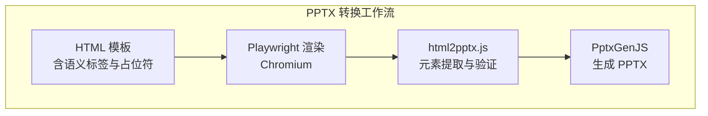
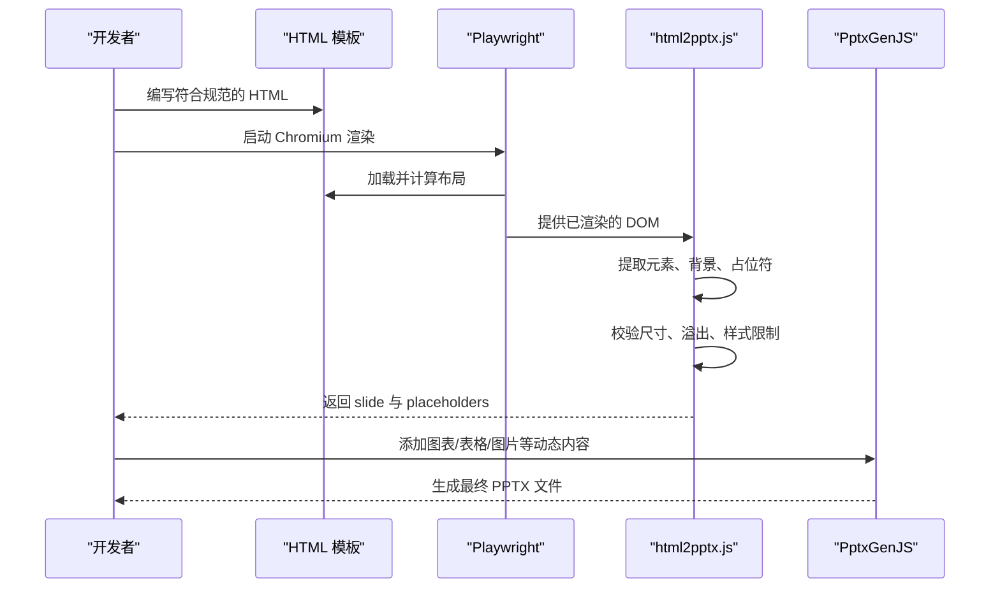
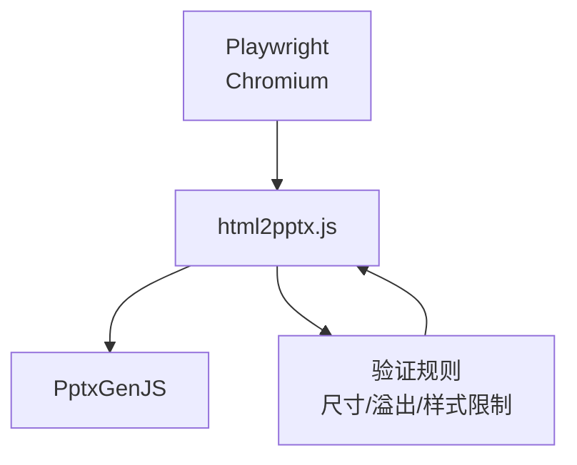

# HTML 模板设计与规范

<cite>
**本文引用的文件**
- [html2pptx.js](file://skills/pptx/scripts/html2pptx.js)
- [html2pptx.md](file://skills/pptx/html2pptx.md)
- [SKILL.md](file://skills/pptx/SKILL.md)
- [viewer.html](file://skills/algorithmic-art/templates/viewer.html)
</cite>

## 目录
1. [简介](#简介)
2. [项目结构](#项目结构)
3. [核心组件](#核心组件)
4. [架构总览](#架构总览)
5. [详细组件分析](#详细组件分析)
6. [依赖关系分析](#依赖关系分析)
7. [性能考量](#性能考量)
8. [故障排查指南](#故障排查指南)
9. [结论](#结论)
10. [附录](#附录)

## 简介
本文件面向需要创建符合 PPTX 转换要求的 HTML 模板的开发者与设计师，系统阐述如何构建满足以下要求的 HTML 模板：
- 文档结构与语义化元素使用规范（p、h1-h6、ul、ol 等）
- CSS 样式与布局设计原则
- 占位符区域标记方法（class="placeholder"）
- 图片与图标的最佳实践
- 16:9 幻灯片尺寸设置与响应式设计考虑
- 可访问性要求
- 完整的 HTML 模板示例与不同内容类型的布局方案

本规范以 html2pptx 工具链为核心，确保 HTML 内容在转换为 PowerPoint 时能够保持精确的位置与样式一致性。

## 项目结构
围绕 HTML 模板设计与规范，本仓库中与 PPTX 转换直接相关的核心文件如下：
- 技术实现：scripts/html2pptx.js（浏览器渲染、元素提取、验证与输出）
- 使用指南：skills/pptx/html2pptx.md（HTML 到 PPTX 的完整使用说明与规则）
- 设计原则：skills/pptx/SKILL.md（颜色、排版、布局与工作流建议）
- 示例模板：skills/algorithmic-art/templates/viewer.html（前端页面模板，可借鉴其结构与样式组织）

**图表来源**
- [html2pptx.js](file://skills/pptx/scripts/html2pptx.js#L896-L979)
- [html2pptx.md](file://skills/pptx/html2pptx.md#L183-L300)

**章节来源**
- [html2pptx.js](file://skills/pptx/scripts/html2pptx.js#L1-L120)
- [html2pptx.md](file://skills/pptx/html2pptx.md#L1-L60)
- [SKILL.md](file://skills/pptx/SKILL.md#L47-L170)

## 核心组件
- HTML 模板引擎（html2pptx.js）
  - 浏览器渲染与尺寸校验
  - 元素类型识别与样式解析
  - 验证错误收集与统一抛出
  - 输出 PowerPoint 幻灯片与占位符位置
- 使用指南（html2pptx.md）
  - 支持的元素与样式规则
  - 占位符区域标记与使用
  - 图标与渐变的预渲染流程
  - 示例与最佳实践
- 设计原则（SKILL.md）
  - 颜色与字体选择
  - 布局与视觉细节策略
  - 工作流与质量检查

**章节来源**
- [html2pptx.js](file://skills/pptx/scripts/html2pptx.js#L896-L979)
- [html2pptx.md](file://skills/pptx/html2pptx.md#L144-L181)
- [SKILL.md](file://skills/pptx/SKILL.md#L51-L170)

## 架构总览
html2pptx 的转换流程由“浏览器渲染 + 元素提取 + 验证 + 输出”四个阶段组成，确保 HTML 内容在转换为 PPTX 时具备准确的位置与样式。

**图表来源**
- [html2pptx.js](file://skills/pptx/scripts/html2pptx.js#L896-L979)
- [html2pptx.md](file://skills/pptx/html2pptx.md#L183-L300)

## 详细组件分析

### HTML 模板结构与元素规范
- 必须包含语义化文本容器：p、h1-h6、ul、ol
- 文本必须包裹在上述标签内，否则不会出现在 PPTX 中
- 不得在 div 或 span 中直接放置未包裹的文本
- 列表项不得手动添加符号（•、-、*），应使用 ul/ol
- 字体需使用通用安全字体，避免自定义字体导致渲染问题

**章节来源**
- [html2pptx.md](file://skills/pptx/html2pptx.md#L23-L61)
- [html2pptx.js](file://skills/pptx/scripts/html2pptx.js#L538-L555)

### CSS 样式与布局设计原则
- 使用 display: flex 在 body 上，防止外边距塌陷影响溢出检测
- 使用 margin 进行间距控制（padding 已计入尺寸）
- inline 格式化支持：<b>、<i>、<u> 或  搭配 CSS 属性（font-weight、font-style、text-decoration、color）
- 文本对齐：通过 CSS text-align 作为提示，帮助 PptxGenJS 更准确地格式化
- 形状样式（div）：仅 div 支持背景、边框、阴影；文本元素不支持
- 边框：支持统一边框与部分边框（渲染为线段形状）
- 圆角：支持 px 与 pt 单位，百分比按较小维度计算
- 阴影：仅支持外阴影（inset 将被忽略）

**章节来源**
- [html2pptx.md](file://skills/pptx/html2pptx.md#L50-L81)
- [html2pptx.js](file://skills/pptx/scripts/html2pptx.js#L615-L739)

### 占位符区域标记与使用
- 使用 class="placeholder" 标记图表/表格等动态内容区域
- 占位符会返回 { id, x, y, w, h }，用于后续在 PptxGenJS 中定位
- 建议在 HTML 中为占位符设置可见的背景以便调试布局

**章节来源**
- [html2pptx.md](file://skills/pptx/html2pptx.md#L34-L34)
- [html2pptx.js](file://skills/pptx/scripts/html2pptx.js#L557-L575)

### 图片与图标最佳实践
- 图片使用  标签，尺寸从渲染结果中提取
- 图标与渐变必须先通过 Sharp 预渲染为 PNG，再在 HTML 中引用
- 不要在 HTML 中直接使用 CSS 渐变（linear-gradient、radial-gradient）

**章节来源**
- [html2pptx.md](file://skills/pptx/html2pptx.md#L82-L142)
- [html2pptx.js](file://skills/pptx/scripts/html2pptx.js#L507-L526)

### 16:9 幻灯片尺寸与响应式设计
- 默认 16:9 尺寸：720pt × 405pt
- 4:3 与 16:10 尺寸也受支持
- 响应式：HTML 中的布局应基于固定尺寸与相对单位，避免依赖视口变化
- 底部留白：文本底部距离底部边缘至少 0.5 英寸，避免被裁切

**章节来源**
- [html2pptx.md](file://skills/pptx/html2pptx.md#L17-L22)
- [html2pptx.js](file://skills/pptx/scripts/html2pptx.js#L88-L118)

### 可访问性要求
- 文本与背景对比度：确保文本在背景上清晰可读
- 字体选择：优先使用通用安全字体，避免自定义字体导致不可读
- 结构清晰：使用语义化标签组织内容，避免纯图片或纯图标无文字描述

**章节来源**
- [SKILL.md](file://skills/pptx/SKILL.md#L59-L65)
- [html2pptx.md](file://skills/pptx/html2pptx.md#L46-L48)

### 完整 HTML 模板示例与布局方案
- 示例模板展示了两列布局（标题区 + 内容区）与占位符区域的使用方式
- 建议在包含图表/表格/图片的幻灯片中采用两列布局或全屏布局，避免垂直堆叠导致可读性差

**章节来源**
- [html2pptx.md](file://skills/pptx/html2pptx.md#L144-L181)
- [SKILL.md](file://skills/pptx/SKILL.md#L144-L148)
- [viewer.html](file://skills/algorithmic-art/templates/viewer.html#L1-L599)

## 依赖关系分析
html2pptx 工具链的关键依赖与交互如下：
- Playwright：负责在 Chromium 中加载并渲染 HTML，计算布局与尺寸
- html2pptx.js：解析 DOM，提取元素、背景、占位符，执行验证
- PptxGenJS：接收 html2pptx.js 的输出，添加图表、表格、图片等动态内容

**图表来源**
- [html2pptx.js](file://skills/pptx/scripts/html2pptx.js#L896-L979)

**章节来源**
- [html2pptx.js](file://skills/pptx/scripts/html2pptx.js#L28-L35)
- [html2pptx.md](file://skills/pptx/html2pptx.md#L185-L191)

## 性能考量
- 渲染性能：尽量减少复杂布局与重绘，避免在 HTML 中使用昂贵的 CSS 效果
- 预渲染：将图标与渐变提前转为 PNG，减少运行时处理开销
- 单次验证：html2pptx 会在转换前一次性收集所有验证错误，便于快速修复

**章节来源**
- [html2pptx.js](file://skills/pptx/scripts/html2pptx.js#L938-L963)
- [html2pptx.md](file://skills/pptx/html2pptx.md#L236-L246)

## 故障排查指南
常见问题与解决方案：
- 文本未显示：确认文本是否包裹在 p、h1-h6、ul、ol 中
- 手动符号：删除文本中的 •、-、*，改用 ul/ol
- 文本元素样式异常：文本元素不支持背景、边框、阴影，请使用 div 实现
- 占位符无效：检查 class 是否为 placeholder，且尺寸非 0
- 溢出与裁切：调整布局与间距，确保底部留白 ≥ 0.5 英寸
- 渐变与图标：使用 Sharp 预渲染为 PNG 后再引用

**章节来源**
- [html2pptx.js](file://skills/pptx/scripts/html2pptx.js#L538-L555)
- [html2pptx.js](file://skills/pptx/scripts/html2pptx.js#L557-L575)
- [html2pptx.js](file://skills/pptx/scripts/html2pptx.js#L938-L963)
- [html2pptx.md](file://skills/pptx/html2pptx.md#L82-L89)

## 结论
遵循本规范编写的 HTML 模板，能够在 html2pptx 工具链下实现高保真转换，确保文本、图表、图片与占位符在 PPTX 中的布局与样式准确一致。通过合理的结构、严格的样式约束与预渲染策略，可以显著提升生成演示的质量与效率。

## 附录
- 使用步骤概览
  1) 阅读并理解 html2pptx.md 与 SKILL.md 的全部内容
  2) 为每页幻灯片编写符合规范的 HTML（含语义标签、占位符与预渲染资源）
  3) 使用 html2pptx.js 转换为 PPTX 并添加图表/表格/图片
  4) 生成缩略图进行视觉校验，修正布局与对比度问题

**章节来源**
- [html2pptx.md](file://skills/pptx/html2pptx.md#L150-L170)
- [SKILL.md](file://skills/pptx/SKILL.md#L150-L170)