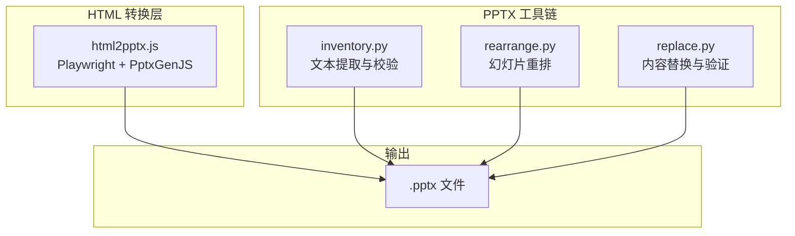
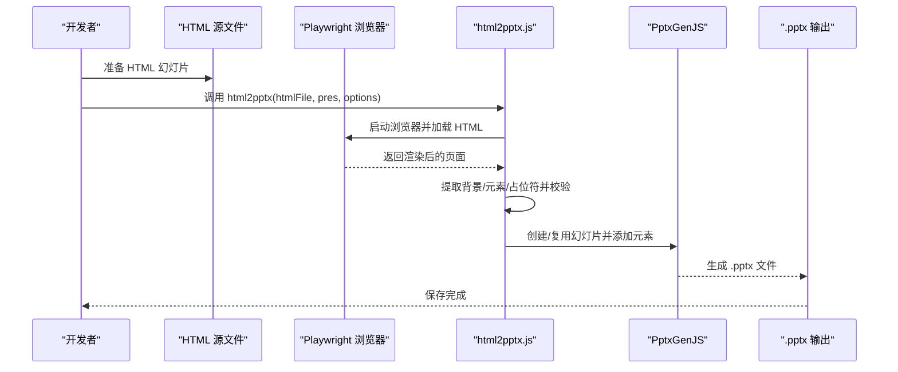
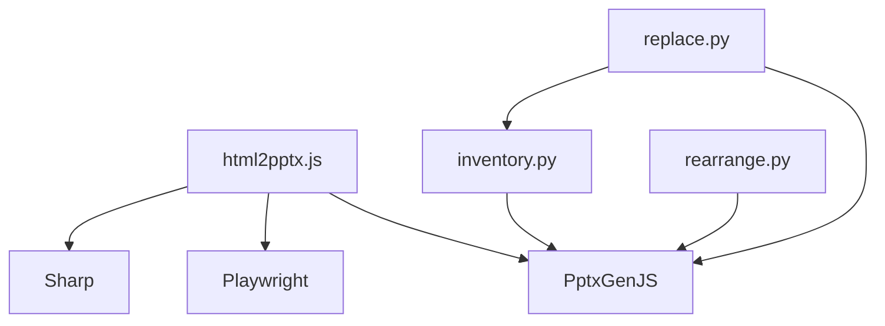

# JavaScript 转换与自动化

<cite>
**本文档引用的文件**
- [html2pptx.js](file://skills/pptx/scripts/html2pptx.js)
- [html2pptx.md](file://skills/pptx/html2pptx.md)
- [SKILL.md](file://skills/pptx/SKILL.md)
- [inventory.py](file://skills/pptx/scripts/inventory.py)
- [rearrange.py](file://skills/pptx/scripts/rearrange.py)
- [replace.py](file://skills/pptx/scripts/replace.py)
</cite>

## 目录
1. [简介](#简介)
2. [项目结构](#项目结构)
3. [核心组件](#核心组件)
4. [架构总览](#架构总览)
5. [详细组件分析](#详细组件分析)
6. [依赖关系分析](#依赖关系分析)
7. [性能考虑](#性能考虑)
8. [故障排除指南](#故障排除指南)
9. [结论](#结论)
10. [附录](#附录)

## 简介
本文件面向需要将 HTML 内容转换为 PowerPoint（.pptx）格式的开发者，系统性介绍 html2pptx.js 库的使用方法与 PptxGenJS API 集成实践。内容覆盖：
- 函数调用语法、参数配置与返回值处理
- HTML 到 PowerPoint 的转换流程与关键实现要点
- PptxGenJS 图表、表格、样式与动画的高级用法
- 错误处理、性能优化与内存管理的最佳实践
- 常见问题与解决方案

## 项目结构
该技能包围绕 PowerPoint 的“创建、编辑、分析”能力构建，其中与 JavaScript 转换直接相关的核心文件如下：
- html2pptx.js：基于 Playwright 渲染 HTML 并通过 PptxGenJS 输出 PowerPoint
- html2pptx.md：使用指南与 API 参考
- SKILL.md：技能使用说明与工作流
- inventory.py / rearrange.py / replace.py：对现有 PPTX 的文本提取、幻灯片重排与内容替换工具链

图示来源
- [html2pptx.js](file://skills/pptx/scripts/html2pptx.js#L896-L979)
- [inventory.py](file://skills/pptx/scripts/inventory.py#L1-L120)
- [rearrange.py](file://skills/pptx/scripts/rearrange.py#L1-L120)
- [replace.py](file://skills/pptx/scripts/replace.py#L1-L120)

章节来源
- [html2pptx.js](file://skills/pptx/scripts/html2pptx.js#L1-L120)
- [html2pptx.md](file://skills/pptx/html2pptx.md#L1-L120)
- [SKILL.md](file://skills/pptx/SKILL.md#L1-L120)

## 核心组件
- html2pptx.js：负责将 HTML 页面渲染为 PowerPoint 幻灯片，支持文本、图片、形状、列表、占位符区域等元素的提取与定位，并进行尺寸与溢出校验。
- PptxGenJS：用于添加动态内容（图表、表格、图像、形状等），并控制样式、颜色、布局与标题轴标签等。
- inventory.py / rearrange.py / replace.py：对已有 PPTX 进行文本提取、幻灯片顺序调整与内容替换，确保格式一致性与可维护性。

章节来源
- [html2pptx.js](file://skills/pptx/scripts/html2pptx.js#L896-L979)
- [html2pptx.md](file://skills/pptx/html2pptx.md#L211-L300)
- [SKILL.md](file://skills/pptx/SKILL.md#L150-L260)

## 架构总览
下图展示了从 HTML 到 .pptx 的端到端流程，以及与 PptxGenJS 的交互关系。

图示来源
- [html2pptx.js](file://skills/pptx/scripts/html2pptx.js#L896-L979)
- [html2pptx.md](file://skills/pptx/html2pptx.md#L192-L210)

## 详细组件分析

### html2pptx.js 组件详解
- 功能概述
  - 使用 Playwright 渲染 HTML，计算 body 尺寸与溢出，提取背景、图片、形状、列表与文本元素，生成占位符数组。
  - 对文本元素进行内联样式解析（粗体、斜体、下划线、颜色、字体、透明度、旋转、缩放等），并按 CSS 计算位置与尺寸。
  - 支持占位符（class="placeholder"）以供后续 PptxGenJS 添加图表或表格。
  - 执行多维度校验：HTML 尺寸与布局匹配、内容溢出、不支持的 CSS 特性（如文本元素的背景/边框/阴影）、手动符号（•、-、*）等。
  - 返回 { slide, placeholders }，便于后续扩展。

- 关键实现点
  - 单位换算：像素到英寸、英寸到 PowerPoint EMU 的换算常量与辅助函数。
  - 文本旋转与垂直文本：根据 writing-mode 与 transform 计算旋转角度与尺寸交换。
  - 内联格式解析：递归遍历 DOM 子节点，将 <b>/<i>/<u>/ 等映射为 PptxGenJS 文本运行（runs），并保留字体、颜色、透明度等属性。
  - 形状与阴影：DIV 元素的背景色、边框、圆角、外阴影转换为 PptxGenJS 形状；忽略内阴影以避免文件损坏。
  - 列表处理：将 <ul>/<ol> 解析为带缩进与断行的文本块，自动去除手工符号。
  - 校验与错误聚合：收集所有验证错误后一次性抛出，便于快速修复。

- API 与参数
  - 函数签名：`await html2pptx(htmlFile, pres, options)`
  - 参数
    - htmlFile：HTML 文件路径（绝对或相对）
    - pres：已设置布局的 PptxGenJS 实例
    - options：可选
      - tmpDir：临时目录（默认使用环境变量或 /tmp）
      - slide：复用的现有幻灯片对象（默认新建）
  - 返回值
    - slide：PptxGenJS 幻灯片对象
    - placeholders：占位符数组，包含 { id, x, y, w, h }

- 错误处理与校验
  - HTML 尺寸与布局不匹配
  - 内容溢出（水平/垂直）
  - 不支持的 CSS：文本元素的背景/边框/阴影、DIV 的背景图、手动符号等
  - 文本框距离底部过近（针对字号大于 12pt 的文本）

- 性能与内存
  - Playwright 启动与关闭浏览器实例，避免长时间占用资源。
  - 仅在必要时放大单行文本宽度，减少不必要的重绘。
  - 通过占位符机制延迟图表/表格绘制，降低一次性渲染压力。

章节来源
- [html2pptx.js](file://skills/pptx/scripts/html2pptx.js#L36-L118)
- [html2pptx.js](file://skills/pptx/scripts/html2pptx.js#L120-L241)
- [html2pptx.js](file://skills/pptx/scripts/html2pptx.js#L243-L894)
- [html2pptx.js](file://skills/pptx/scripts/html2pptx.js#L896-L979)

### PptxGenJS 集成与高级用法
- 颜色规范
  - PptxGenJS 不接受带 # 前缀的颜色值，否则可能导致文件损坏。应使用纯十六进制字符串（不含 #）。
- 图像
  - 基于实际图像宽高比计算尺寸，居中放置，避免裁剪。
- 文本
  - 支持富文本运行（runs），可分别设置粗体、斜体、下划线、颜色、字体、字号等。
- 形状
  - 支持矩形、圆角矩形、椭圆等，可设置填充、边框、圆角半径、阴影等。
- 图表
  - 必须提供类别轴与数值轴标题（catAxisTitle/valAxisTitle）。
  - 数据格式：单系列图表使用 labels 数组定义 X 轴，values 定义 Y 轴；多系列图表每个系列一个对象。
  - 时间序列数据需按时间跨度选择合适的粒度（日/月/年），避免仅一个数据点。
  - 常用配置：barDir、showLegend、valAxisMinVal/MaxVal、valAxisMajorUnit、catAxisLabelRotate、dataLabelPosition/Color、chartColors 等。
- 表格
  - 支持基础表格与自定义格式化（列宽、行高、边框、填充、对齐、垂直对齐、字号等）。
  - 支持合并单元格与跨页自动分页。

章节来源
- [html2pptx.md](file://skills/pptx/html2pptx.md#L302-L625)

### 工作流与最佳实践
- 无模板创建新 PPTX
  - 设计原则：主题一致、对比度良好、排版清晰、字体统一。
  - 步骤：准备 HTML 幻灯片（含占位符）、调用 html2pptx.js 转换、使用 PptxGenJS 添加图表/表格/图像、生成 .pptx。
  - 视觉验证：生成缩略图检查文本截断、重叠、边界距离不足等问题。
- 使用模板
  - 提取模板文本与缩略图网格，分析布局与占位符数量。
  - 使用 rearrange.py 重排模板幻灯片，再用 inventory.py 提取文本库存，最后通过 replace.py 应用替换并验证溢出与警告。
- 依赖与安装
  - 前端渲染：pptxgenjs、playwright
  - 图像处理：sharp（用于预渲染图标与渐变）
  - 文本提取：markitdown（pip 安装）
  - PDF 转换：LibreOffice、Poppler
  - Python 工具：pptx（Python 库）、defusedxml

章节来源
- [SKILL.md](file://skills/pptx/SKILL.md#L47-L170)
- [SKILL.md](file://skills/pptx/SKILL.md#L182-L484)

## 依赖关系分析

图示来源
- [html2pptx.js](file://skills/pptx/scripts/html2pptx.js#L28-L31)
- [inventory.py](file://skills/pptx/scripts/inventory.py#L33-L35)
- [rearrange.py](file://skills/pptx/scripts/rearrange.py#L18-L20)
- [replace.py](file://skills/pptx/scripts/replace.py#L17-L24)

章节来源
- [html2pptx.js](file://skills/pptx/scripts/html2pptx.js#L28-L31)
- [inventory.py](file://skills/pptx/scripts/inventory.py#L33-L35)
- [rearrange.py](file://skills/pptx/scripts/rearrange.py#L18-L20)
- [replace.py](file://skills/pptx/scripts/replace.py#L17-L24)

## 性能考虑
- Playwright 生命周期管理
  - 在每次转换后及时关闭浏览器实例，避免内存泄漏。
  - 仅在必要时设置视口大小，避免不必要的重排。
- 单行文本宽度微调
  - 对单行文本增加约 2% 的宽度，减少因浏览器估算误差导致的截断。
- 占位符优先策略
  - 将图表/表格放置在占位符区域内，减少复杂布局计算。
- 图像处理
  - 使用 Sharp 预先将 SVG/渐变转为 PNG，避免在浏览器端进行复杂渲染。
- 批量操作
  - 合理组织 HTML 结构，减少 DOM 层级与嵌套，提升 Playwright 渲染效率。

[本节为通用指导，无需特定文件引用]

## 故障排除指南
- HTML 尺寸与布局不匹配
  - 现象：抛出尺寸不匹配错误
  - 处理：确保 HTML body 的宽度/高度与 PptxGenJS 布局一致（例如 LAYOUT_16x9 对应 720pt × 405pt）
- 内容溢出
  - 现象：报告水平/垂直方向的溢出量
  - 处理：调整布局、减少内容或增大容器尺寸；注意底部留白（至少 0.5 英寸）
- 文本元素样式限制
  - 现象：文本元素出现背景/边框/阴影时报错
  - 处理：将背景/边框/阴影迁移到 DIV 容器上，而非直接作用于 
/<h1>-<h6>/<ul>/<ol>
- 手动符号与列表
  - 现象：文本开头出现 •、-、* 等符号报错
  - 处理：改用 <ul>/<ol> 列表，由解析器自动处理符号与缩进
- 颜色格式错误
  - 现象：# 前缀导致文件损坏
  - 处理：PptxGenJS API 中的颜色值不要加 # 前缀
- 占位符无效
  - 现象：占位符宽/高为 0 或未找到
  - 处理：检查 CSS 是否正确设置尺寸，确保 class="placeholder" 的元素可见且有尺寸

章节来源
- [html2pptx.js](file://skills/pptx/scripts/html2pptx.js#L36-L118)
- [html2pptx.js](file://skills/pptx/scripts/html2pptx.js#L243-L894)
- [html2pptx.md](file://skills/pptx/html2pptx.md#L236-L246)

## 结论
html2pptx.js 与 PptxGenJS 的组合提供了从 HTML 到 PowerPoint 的高效自动化方案。通过严格的校验与占位符机制，能够稳定地将复杂的 HTML 布局转换为高质量的演示文稿。配合 inventory.py / rearrange.py / replace.py 工具链，可以实现对既有 PPTX 的结构化编辑与批量替换，满足规模化内容生产与维护需求。

[本节为总结性内容，无需特定文件引用]

## 附录

### API 参考与示例路径
- html2pptx 函数签名与参数
  - [函数定义与参数](file://skills/pptx/scripts/html2pptx.js#L896-L901)
  - [返回值结构](file://skills/pptx/scripts/html2pptx.js#L970-L971)
- 基本使用示例
  - [基本用法与占位符使用](file://skills/pptx/html2pptx.md#L192-L210)
  - [完整示例（含图表）](file://skills/pptx/html2pptx.md#L260-L300)
- PptxGenJS 图表/表格/形状示例
  - [图表配置与数据格式](file://skills/pptx/html2pptx.md#L366-L482)
  - [表格基础与高级用法](file://skills/pptx/html2pptx.md#L541-L612)
  - [形状与颜色规范](file://skills/pptx/html2pptx.md#L306-L364)

### 工具链参考
- 文本提取与校验
  - [inventory.py 主要逻辑](file://skills/pptx/scripts/inventory.py#L1-L120)
- 幻灯片重排
  - [rearrange.py 主要逻辑](file://skills/pptx/scripts/rearrange.py#L1-L120)
- 内容替换与验证
  - [replace.py 主要逻辑](file://skills/pptx/scripts/replace.py#L1-L120)