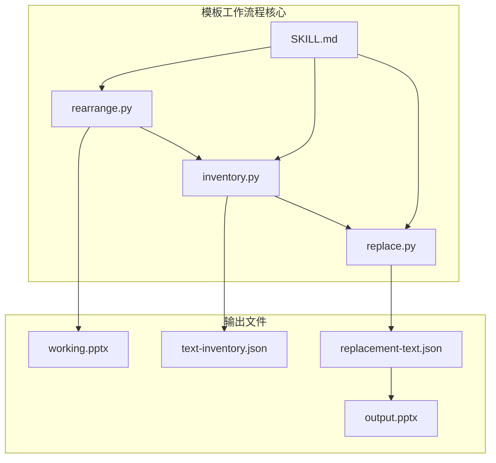
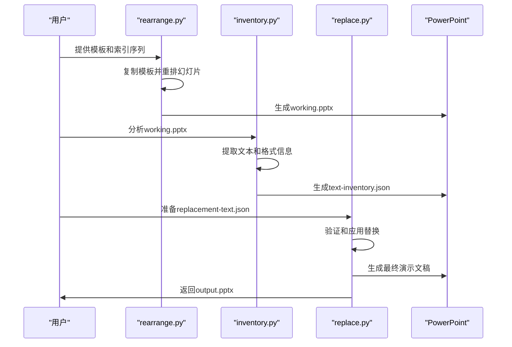
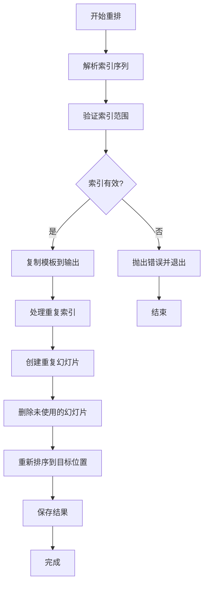
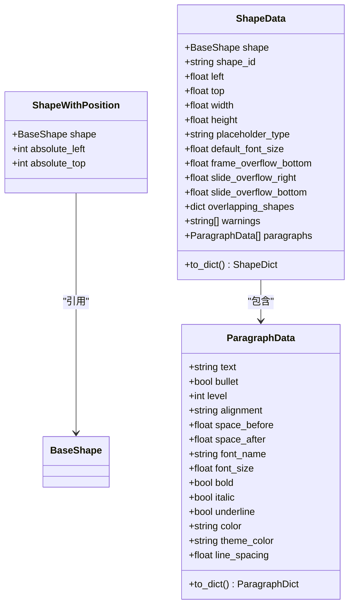
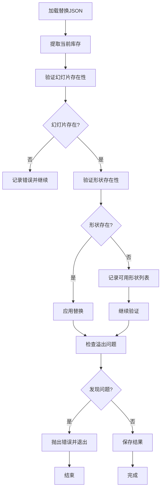
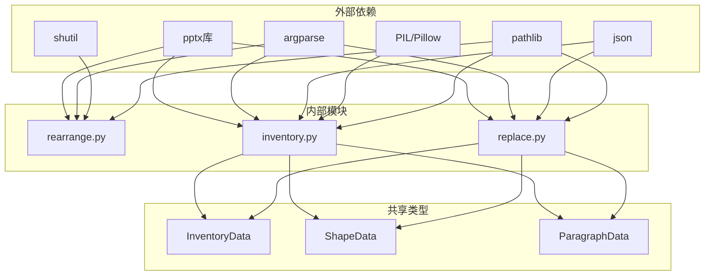

# 模板工作流程

<cite>
**本文档引用的文件**
- [rearrange.py](file://skills/pptx/scripts/rearrange.py)
- [inventory.py](file://skills/pptx/scripts/inventory.py)
- [replace.py](file://skills/pptx/scripts/replace.py)
- [SKILL.md](file://skills/pptx/SKILL.md)
</cite>

## 目录
1. [简介](#简介)
2. [项目结构](#项目结构)
3. [核心组件](#核心组件)
4. [架构概览](#架构概览)
5. [详细组件分析](#详细组件分析)
6. [依赖关系分析](#依赖关系分析)
7. [性能考虑](#性能考虑)
8. [故障排除指南](#故障排除指南)
9. [结论](#结论)
10. [附录](#附录)

## 简介

模板工作流程是一个完整的PowerPoint演示文稿自动化创建系统，基于现有的模板设计，通过一系列脚本实现从模板分析到最终内容替换的全流程自动化。该系统包含三个核心脚本：rearrange.py（幻灯片重排）、inventory.py（库存提取）和replace.py（内容替换），它们协同工作以实现高效的演示文稿生成。

该工作流程特别适用于需要大量重复创建相似结构演示文稿的场景，如企业培训材料、产品展示、报告模板等。通过模板化的方法，可以确保所有生成的演示文稿在视觉风格、布局结构和品牌一致性方面保持统一。

## 项目结构

模板工作流程位于`skills/pptx/scripts/`目录下，包含以下关键文件：



**图表来源**
- [rearrange.py](file://skills/pptx/scripts/rearrange.py#L1-L232)
- [inventory.py](file://skills/pptx/scripts/inventory.py#L1-L1021)
- [replace.py](file://skills/pptx/scripts/replace.py#L1-L386)

**章节来源**
- [SKILL.md](file://skills/pptx/SKILL.md#L186-L407)

## 核心组件

### 1. 幻灯片重排器 (rearrange.py)

rearrange.py是整个工作流程的起点，负责根据指定的索引序列重新排列PowerPoint幻灯片。它支持重复使用同一张幻灯片、删除不需要的幻灯片以及精确控制最终顺序。

**核心功能特性：**
- **索引管理**：支持0基索引的幻灯片选择
- **重复使用**：允许同一张幻灯片在序列中出现多次
- **自动删除**：删除不在目标序列中的幻灯片
- **智能重排**：按目标位置移动幻灯片，避免手动调整

### 2. 文本库存提取器 (inventory.py)

inventory.py负责从PowerPoint文件中提取所有文本内容和格式信息，生成结构化的JSON数据。该工具能够处理复杂的布局，包括嵌套形状组和绝对位置计算。

**提取能力：**
- **文本内容**：提取所有形状中的文本内容
- **格式信息**：保留段落格式（对齐、项目符号、字体、间距）
- **位置信息**：提供形状的绝对位置和尺寸（英寸）
- **问题检测**：识别文本溢出和形状重叠问题
- **分组支持**：正确处理嵌套形状组的绝对位置

### 3. 内容替换器 (replace.py)

replace.py将提取的库存数据转换为实际的演示文稿内容。它验证替换数据的有效性，应用格式设置，并确保不会产生新的布局问题。

**替换机制：**
- **批量更新**：支持同时更新多个形状的内容
- **格式保持**：严格保持原始格式设置
- **验证规则**：确保所有引用的形状都存在
- **错误处理**：提供详细的错误信息和修复建议

**章节来源**
- [rearrange.py](file://skills/pptx/scripts/rearrange.py#L22-L232)
- [inventory.py](file://skills/pptx/scripts/inventory.py#L1-L1021)
- [replace.py](file://skills/pptx/scripts/replace.py#L1-L386)

## 架构概览

整个模板工作流程采用流水线式架构，每个阶段都有明确的输入和输出：



**图表来源**
- [SKILL.md](file://skills/pptx/SKILL.md#L186-L407)

## 详细组件分析

### 幻灯片重排组件 (rearrange.py)

#### 核心算法流程



**图表来源**
- [rearrange.py](file://skills/pptx/scripts/rearrange.py#L149-L227)

#### 幻灯片操作函数

rearrange.py提供了三个核心的幻灯片操作函数：

1. **duplicate_slide()**：复制指定索引的幻灯片，保留所有格式和媒体资源
2. **delete_slide()**：删除指定索引的幻灯片，正确处理关系引用
3. **reorder_slides()**：将幻灯片从当前位置移动到目标位置

#### 使用示例

基本用法：
```bash
python scripts/rearrange.py template.pptx working.pptx 0,34,34,50,52
```

这个命令会：
- 使用模板.pptx作为基础
- 创建working.pptx文件
- 包含幻灯片：0号、34号（重复两次）、50号、52号
- 按照指定顺序排列

**章节来源**
- [rearrange.py](file://skills/pptx/scripts/rearrange.py#L22-L232)

### 文本库存提取组件 (inventory.py)

#### 数据结构设计

inventory.py采用了面向对象的设计模式，定义了两个核心类：



**图表来源**
- [inventory.py](file://skills/pptx/scripts/inventory.py#L128-L740)

#### JSON结构规范

提取的库存数据遵循严格的JSON结构：

```json
{
  "slide-0": {
    "shape-0": {
      "placeholder_type": "TITLE",
      "left": 1.5,
      "top": 2.0,
      "width": 7.5,
      "height": 1.2,
      "paragraphs": [
        {
          "text": "段落文本",
          "bullet": true,
          "level": 0,
          "alignment": "CENTER",
          "space_before": 10.0,
          "space_after": 6.0,
          "line_spacing": 22.4,
          "font_name": "Arial",
          "font_size": 14.0,
          "bold": true,
          "italic": false,
          "underline": false,
          "color": "FF0000"
        }
      ]
    }
  }
}
```

**章节来源**
- [inventory.py](file://skills/pptx/scripts/inventory.py#L1-L1021)

### 内容替换组件 (replace.py)

#### 替换验证机制

replace.py实现了多层次的验证机制来确保替换操作的安全性：



**图表来源**
- [replace.py](file://skills/pptx/scripts/replace.py#L214-L354)

#### 格式应用策略

replace.py使用专门的函数来应用各种格式属性：

1. **apply_paragraph_properties()**：处理段落级别的格式设置
2. **apply_font_properties()**：应用字体相关的格式属性
3. **clear_paragraph_bullets()**：清理现有的项目符号格式

**章节来源**
- [replace.py](file://skills/pptx/scripts/replace.py#L1-L386)

## 依赖关系分析

### 组件间依赖关系



**图表来源**
- [rearrange.py](file://skills/pptx/scripts/rearrange.py#L12-L19)
- [inventory.py](file://skills/pptx/scripts/inventory.py#L25-L36)
- [replace.py](file://skills/pptx/scripts/replace.py#L12-L24)

### 数据流依赖

工作流程中的数据流向如下：

1. **rearrange.py** → **inventory.py**：重排后的演示文稿作为库存提取的输入
2. **inventory.py** → **replace.py**：库存JSON作为替换操作的输入
3. **replace.py** → **最终输出**：替换后的演示文稿

**章节来源**
- [SKILL.md](file://skills/pptx/SKILL.md#L186-L407)

## 性能考虑

### 时间复杂度分析

1. **rearrange.py**：
   - 重排操作：O(n)，其中n是幻灯片数量
   - 重复处理：O(m)，其中m是重复索引的数量
   - 删除操作：O(n²)，由于需要维护索引映射

2. **inventory.py**：
   - 形状收集：O(s)，其中s是形状总数
   - 重叠检测：O(s²)，用于比较所有形状对
   - 文本测量：O(p)，其中p是段落数量

3. **replace.py**：
   - 验证操作：O(s)，其中s是形状数量
   - 格式应用：O(p)，其中p是段落数量

### 内存优化策略

1. **延迟加载**：inventory.py使用生成器模式处理大型演示文稿
2. **增量处理**：rearrange.py在处理过程中逐步清理不需要的数据
3. **临时文件**：replace.py使用临时文件避免内存溢出

## 故障排除指南

### 常见错误及解决方案

#### 1. 索引超出范围错误

**症状**：`ValueError: Slide index X out of range (0-Y)`

**原因**：提供的索引超出了模板幻灯片的实际数量

**解决方案**：
- 检查模板的总幻灯片数量
- 确认索引是从0开始的
- 验证索引范围是否正确

#### 2. 形状不存在错误

**症状**：`ERROR: Invalid shapes in replacement JSON:`

**原因**：
- 替换JSON中引用了不存在的形状
- 幻灯片索引或形状索引不匹配
- 库存文件与演示文稿不一致

**解决方案**：
- 重新运行库存提取
- 检查库存JSON中的形状ID
- 确保替换数据与当前演示文稿结构匹配

#### 3. 文本溢出问题

**症状**：`ERROR: Replacement text made overflow worse in these shapes:`

**原因**：替换后的文本超出了形状边界

**解决方案**：
- 增大形状尺寸
- 减少文本内容长度
- 调整字体大小或行距
- 使用更合适的布局

#### 4. 格式应用失败

**症状**：某些格式属性没有正确应用

**原因**：
- 颜色值格式不正确
- 字体名称不存在
- 段落级别设置错误

**解决方案**：
- 检查颜色值格式（RGB十六进制）
- 验证字体名称的有效性
- 确保项目符号级别设置正确

**章节来源**
- [replace.py](file://skills/pptx/scripts/replace.py#L162-L242)
- [rearrange.py](file://skills/pptx/scripts/rearrange.py#L167-L171)

## 结论

模板工作流程提供了一个完整、自动化且可扩展的PowerPoint演示文稿创建解决方案。通过rearrange.py、inventory.py和replace.py三个核心组件的协同工作，用户可以：

1. **高效重排**：快速组织和重新排列幻灯片，支持重复使用和精确控制
2. **精确提取**：全面捕获文本内容和格式信息，包括复杂的布局细节
3. **安全替换**：在保持格式一致性的同时进行批量内容更新

该系统特别适合需要大规模生成相似结构演示文稿的场景，如企业培训、产品展示、报告模板等。通过标准化的工作流程和严格的验证机制，确保了输出质量的一致性和可靠性。

## 附录

### 最佳实践指南

#### 1. 模板准备
- 确保模板具有清晰的布局结构
- 避免过度复杂的嵌套形状组
- 使用标准的占位符类型

#### 2. 库存分析
- 仔细检查库存JSON中的形状ID
- 记录每个形状的用途和预期内容
- 验证形状尺寸和位置信息

#### 3. 替换策略
- 先创建基础内容，再添加格式
- 保持格式的一致性
- 测试不同内容长度的影响

#### 4. 错误处理
- 建立完善的错误检查机制
- 准备回滚方案
- 定期备份中间文件

### 扩展建议

1. **批量处理**：可以扩展系统以支持批量处理多个模板
2. **自定义验证**：添加特定业务逻辑的验证规则
3. **可视化界面**：开发图形用户界面简化操作流程
4. **版本控制**：集成版本控制系统跟踪变更历史