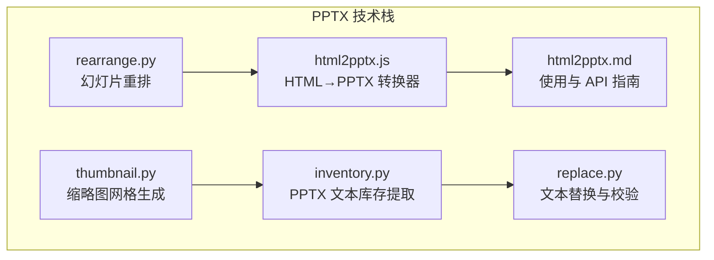
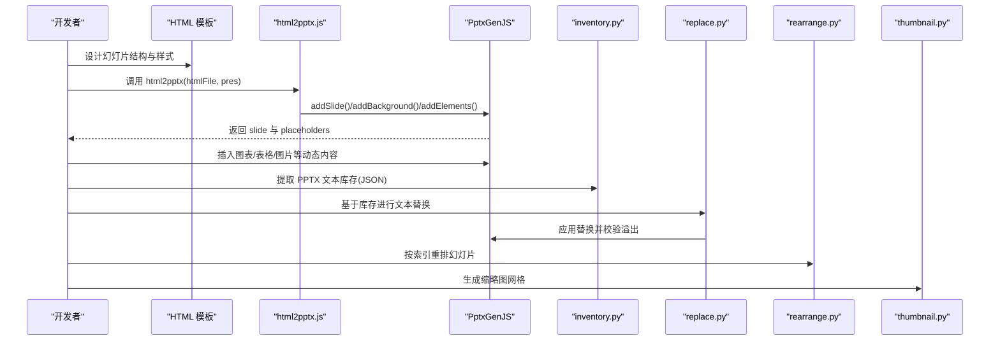
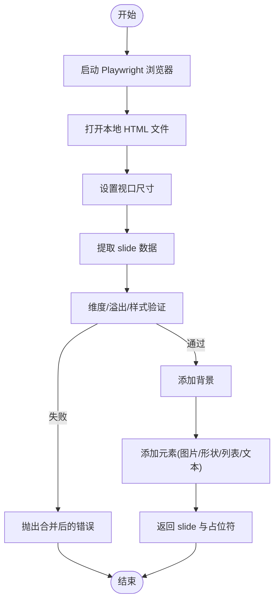
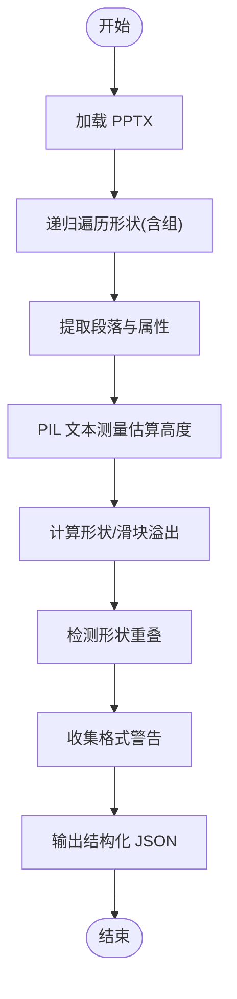
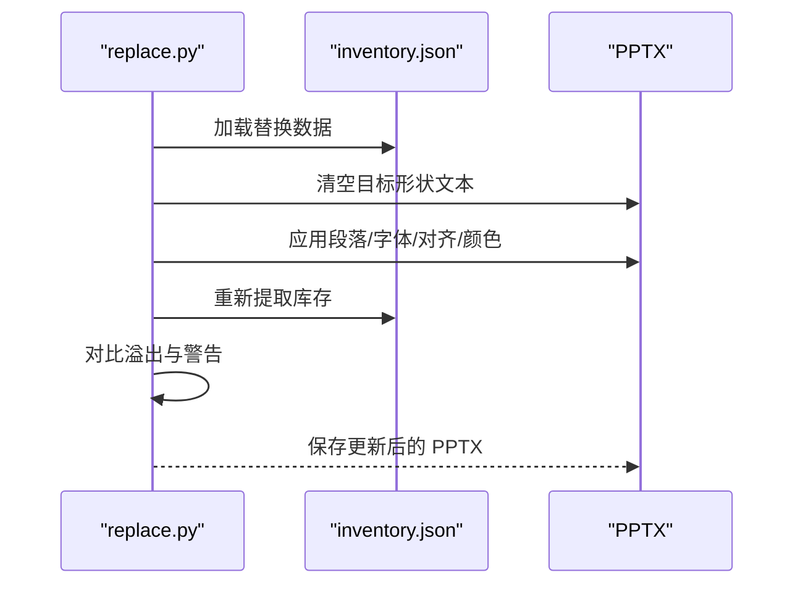
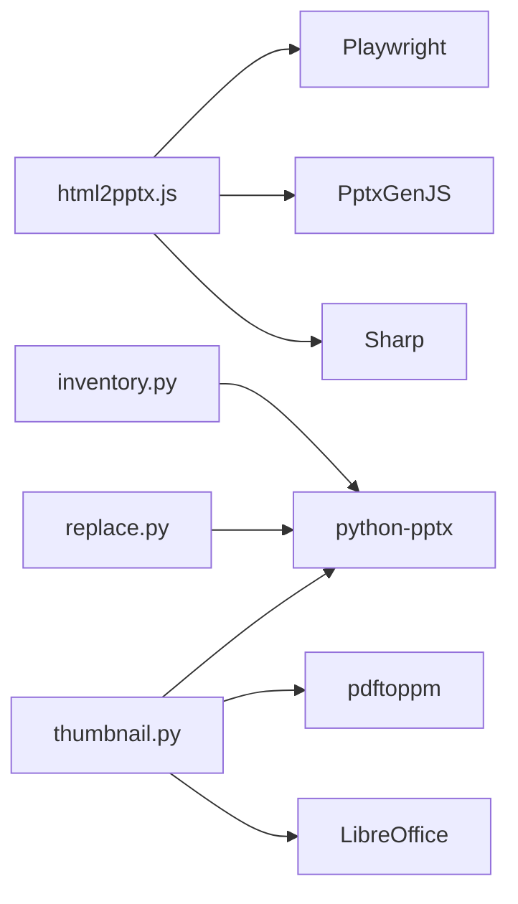

# 演示文稿创建与编辑

<cite>
**本文引用的文件**
- [html2pptx.js](file://skills/pptx/scripts/html2pptx.js)
- [html2pptx.md](file://skills/pptx/html2pptx.md)
- [inventory.py](file://skills/pptx/scripts/inventory.py)
- [rearrange.py](file://skills/pptx/scripts/rearrange.py)
- [replace.py](file://skills/pptx/scripts/replace.py)
- [thumbnail.py](file://skills/pptx/scripts/thumbnail.py)
</cite>

## 目录
1. [简介](#简介)
2. [项目结构](#项目结构)
3. [核心组件](#核心组件)
4. [架构总览](#架构总览)
5. [详细组件分析](#详细组件分析)
6. [依赖关系分析](#依赖关系分析)
7. [性能考量](#性能考量)
8. [故障排查指南](#故障排查指南)
9. [结论](#结论)
10. [附录](#附录)

## 简介
本文件面向希望从零开始创建与编辑 PowerPoint 演示文稿的开发者与设计师，系统性介绍基于 HTML 到 PPTX 的转换工作流：从 HTML 模板设计、JavaScript 脚本规范，到 PptxGenJS 图表与元素渲染、验证与错误提示、以及后续的排版、替换与缩略图生成等全流程。文档同时给出颜色搭配策略、字体选择原则、版式设计技巧、图表与表格嵌入方法，并提供可直接参考的代码片段路径与最佳实践。

## 项目结构
该技能模块位于 skills/pptx 下，包含：
- html2pptx.js：将 HTML 幻灯片转换为 PptxGenJS 幻灯片的核心库
- html2pptx.md：使用指南与 API 参考
- inventory.py：从 PPTX 中提取文本库存（含溢出检测）
- rearrange.py：按索引序列重排 PPTX 幻灯片
- replace.py：基于 inventory 输出对 PPTX 文本进行批量替换
- thumbnail.py：生成 PPTX 幻灯片缩略图网格

**图表来源**
- [html2pptx.js](file://skills/pptx/scripts/html2pptx.js#L1-L979)
- [html2pptx.md](file://skills/pptx/html2pptx.md#L1-L625)
- [inventory.py](file://skills/pptx/scripts/inventory.py#L1-L1021)
- [rearrange.py](file://skills/pptx/scripts/rearrange.py#L1-L232)
- [replace.py](file://skills/pptx/scripts/replace.py#L1-L386)
- [thumbnail.py](file://skills/pptx/scripts/thumbnail.py#L1-L451)

**章节来源**
- [html2pptx.js](file://skills/pptx/scripts/html2pptx.js#L1-L979)
- [html2pptx.md](file://skills/pptx/html2pptx.md#L1-L625)

## 核心组件
- html2pptx.js：负责通过 Playwright 渲染 HTML，解析元素位置与样式，生成背景、图片、形状、列表与文本块，并返回占位符信息供后续图表插入。
- html2pptx.md：定义 HTML 模板规范、PptxGenJS 使用规则、图表与表格参数、颜色与字体建议、图标与渐变预渲染流程。
- inventory.py：从 PPTX 中提取文本形状、计算溢出与重叠、识别占位符问题，输出结构化 JSON。
- rearrange.py：按指定索引序列复制/删除/重排幻灯片，保留布局与媒体关系。
- replace.py：基于 inventory 的结构化数据对 PPTX 文本进行替换，严格校验格式与溢出变化。
- thumbnail.py：将 PPTX 转 PDF 再转图像，生成缩略图网格，支持占位符区域高亮。

**章节来源**
- [html2pptx.js](file://skills/pptx/scripts/html2pptx.js#L896-L979)
- [html2pptx.md](file://skills/pptx/html2pptx.md#L183-L625)
- [inventory.py](file://skills/pptx/scripts/inventory.py#L1-L1021)
- [rearrange.py](file://skills/pptx/scripts/rearrange.py#L1-L232)
- [replace.py](file://skills/pptx/scripts/replace.py#L1-L386)
- [thumbnail.py](file://skills/pptx/scripts/thumbnail.py#L1-L451)

## 架构总览
整体工作流分为“HTML 设计→转换→渲染→后处理”四个阶段，配合“库存→替换→重排→缩略图”的质量保障链路。

**图表来源**
- [html2pptx.js](file://skills/pptx/scripts/html2pptx.js#L896-L979)
- [html2pptx.md](file://skills/pptx/html2pptx.md#L183-L625)
- [inventory.py](file://skills/pptx/scripts/inventory.py#L1-L1021)
- [replace.py](file://skills/pptx/scripts/replace.py#L1-L386)
- [rearrange.py](file://skills/pptx/scripts/rearrange.py#L1-L232)
- [thumbnail.py](file://skills/pptx/scripts/thumbnail.py#L1-L451)

## 详细组件分析

### 组件一：HTML 到 PPTX 转换器（html2pptx.js）
- 功能要点
  - 使用 Playwright 打开本地 HTML 文件，设置视口尺寸，读取 body 尺寸与滚动尺寸，检测溢出。
  - 解析页面元素：背景、图片、形状（div 背景/边框/圆角/阴影）、列表、文本块（含内联格式）。
  - 计算旋转与定位：支持 CSS transform/writing-mode，将浏览器渲染的矩形映射到 PowerPoint 的英寸坐标。
  - 验证规则：维度匹配、溢出检测、不支持的样式（文本元素的背景/边框/阴影、DIV 背景图片、手动符号等）。
  - 输出：slide 对象与占位符数组，供 PptxGenJS 后续添加图表/表格/图片。

- 关键流程（简化）
  - 启动浏览器→加载 HTML→获取 body 尺寸→设置视口→提取 slide 数据→验证→添加背景与元素→返回结果

**图表来源**
- [html2pptx.js](file://skills/pptx/scripts/html2pptx.js#L36-L979)

**章节来源**
- [html2pptx.js](file://skills/pptx/scripts/html2pptx.js#L1-L979)

### 组件二：PptxGenJS 使用与最佳实践（html2pptx.md）
- HTML 模板规范
  - 必须设置 body 宽高（如 16:9 720pt×405pt），使用 display:flex 防止 margin collapse 影响溢出检测。
  - 文本必须包裹在 p/h1-h6/ul/ol 标签中；禁止手动符号（•、-、*），必须使用语义化列表。
  - 字体仅限通用安全字体；颜色使用十六进制字符串（无 # 前缀）。
- 形状与阴影
  - DIV 元素支持背景色、统一边框、部分边框（转为线段）、圆角（px/pt/%）、外阴影；不支持内阴影。
- 图标与渐变
  - 不支持 CSS 渐变；需先用 Sharp 预渲染为 PNG 再引用。
- PptxGenJS 规则
  - 颜色不要加 # 前缀；图片宽高按实际像素比例计算；文本富文本 runs；图表数据格式与轴标签必填；时间序列聚合粒度按周期选择。

**章节来源**
- [html2pptx.md](file://skills/pptx/html2pptx.md#L13-L625)

### 组件三：PPTX 文本库存与溢出检测（inventory.py）
- 功能要点
  - 递归遍历组形状，计算绝对位置；提取段落属性（对齐、缩进、间距、字体、颜色、行距）。
  - 使用 PIL 近似文本高度，判断形状内溢出；检测右/底边界溢出；识别手动符号等格式问题。
  - 输出结构化 JSON，包含每页每形状的位置、尺寸、段落数组及溢出/重叠/警告信息。

**图表来源**
- [inventory.py](file://skills/pptx/scripts/inventory.py#L1-L1021)

**章节来源**
- [inventory.py](file://skills/pptx/scripts/inventory.py#L1-L1021)

### 组件四：文本替换与校验（replace.py）
- 功能要点
  - 读取 inventory.json，校验目标形状是否存在；清理原文本，按段落应用对齐、缩进、行距、字体与颜色。
  - 替换后重新提取库存，对比溢出是否恶化或新增警告，若异常则报错并终止保存。
  - 支持主题色与 RGB 颜色；自动处理列表层级与悬挂缩进。

**图表来源**
- [replace.py](file://skills/pptx/scripts/replace.py#L1-L386)
- [inventory.py](file://skills/pptx/scripts/inventory.py#L1-L1021)

**章节来源**
- [replace.py](file://skills/pptx/scripts/replace.py#L1-L386)

### 组件五：幻灯片重排（rearrange.py）
- 功能要点
  - 复制重复出现的幻灯片以满足序列需求；删除未使用的幻灯片；按最终顺序重排。
  - 保持布局一致与媒体关系正确；避免占位符重复导致的异常。

**章节来源**
- [rearrange.py](file://skills/pptx/scripts/rearrange.py#L1-L232)

### 组件六：缩略图网格生成（thumbnail.py）
- 功能要点
  - 将 PPTX 转 PDF 再转图像，处理隐藏幻灯片占位；按列数分组生成网格；可选高亮占位符区域。
  - 自动计算网格尺寸与标签位置，输出多文件网格（超过容量时拆分）。

**章节来源**
- [thumbnail.py](file://skills/pptx/scripts/thumbnail.py#L1-L451)

## 依赖关系分析
- 运行时依赖
  - Playwright：用于无头渲染 HTML，获取精确布局与尺寸
  - PptxGenJS：生成与写入 PPTX
  - Sharp：预渲染图标与渐变为 PNG
  - Python 生态：pptx、pillow、six、pdftoppm、soffice（LibreOffice）

**图表来源**
- [html2pptx.js](file://skills/pptx/scripts/html2pptx.js#L28-L31)
- [html2pptx.md](file://skills/pptx/html2pptx.md#L185-L191)
- [inventory.py](file://skills/pptx/scripts/inventory.py#L33-L36)
- [thumbnail.py](file://skills/pptx/scripts/thumbnail.py#L219-L243)

**章节来源**
- [html2pptx.js](file://skills/pptx/scripts/html2pptx.js#L28-L31)
- [html2pptx.md](file://skills/pptx/html2pptx.md#L185-L191)
- [inventory.py](file://skills/pptx/scripts/inventory.py#L33-L36)
- [thumbnail.py](file://skills/pptx/scripts/thumbnail.py#L219-L243)

## 性能考量
- Playwright 渲染成本
  - 单次渲染耗时与 HTML 复杂度、资源加载量成正比；建议控制 DOM 体量与外部资源数量。
- Sharp 预渲染
  - 渐变与图标预渲染一次即可复用，减少运行时开销。
- PIL 文本测量
  - inventory 的文本高度估算使用默认字体，复杂字体建议提前安装对应字体文件以提升准确性。
- 缩略图生成
  - PDF→图像转换可能较慢，建议在 CI 或离线环境下执行；合理设置 DPI 与列数平衡清晰度与体积。

[本节为通用指导，无需特定文件引用]

## 故障排查指南
- HTML 维度不匹配
  - 现象：报告 HTML 尺寸与布局不一致
  - 处理：确保 body 宽高与 PptxGenJS 布局一致；检查 CSS 是否覆盖了尺寸
- 内容溢出
  - 现象：报告水平/垂直方向溢出，建议留足底部边距
  - 处理：调整内容尺寸或布局，避免超出 body
- 文本元素样式违规
  - 现象：文本元素带有背景/边框/阴影
  - 处理：将背景/边框/阴影迁移到 DIV 容器；文本元素仅允许内联样式
- DIV 包含未包装文本
  - 现象：DIV 内有裸露文本
  - 处理：将文本放入 p/h1-h6/ul/ol
- 手动符号
  - 现象：文本开头出现手动符号
  - 处理：改用语义化列表
- 颜色前缀错误
  - 现象：PptxGenJS 报错或文件损坏
  - 处理：移除颜色值中的 # 前缀
- 替换后溢出恶化
  - 现象：替换导致形状内溢出增加
  - 处理：回退或调整替换内容，必要时重新设计布局

**章节来源**
- [html2pptx.js](file://skills/pptx/scripts/html2pptx.js#L36-L118)
- [html2pptx.md](file://skills/pptx/html2pptx.md#L236-L246)
- [replace.py](file://skills/pptx/scripts/replace.py#L307-L344)

## 结论
通过 html2pptx.js 的高保真转换、严格的 HTML 模板规范、PptxGenJS 的丰富渲染能力，以及 inventory/replace/rearrange/thumbnail 的质量保障链路，可以构建从设计到交付的一体化演示文稿工作流。遵循本文的颜色与字体策略、版式与图表嵌入规范，可显著提升专业度与一致性。

[本节为总结性内容，无需特定文件引用]

## 附录

### A. 颜色搭配策略
- 主题色：选择 2-3 个主色，辅以中性灰；确保与背景对比度充足
- 图表配色：单系列用单一主色；多系列采用相邻色或分组色，避免红绿组合
- 文本与背景：深色背景用浅色文本，浅色背景用深色文本；避免纯黑/纯白

[本节为通用指导，无需特定文件引用]

### B. 字体选择原则
- 优先使用通用安全字体（如 Arial、Times New Roman、Helvetica 等）
- 避免自定义字体，防止跨平台渲染差异
- 标题与正文区分字号与字重，保证可读性

[本节为通用指导，无需特定文件引用]

### C. 版式设计技巧
- 使用栅格与对齐：统一左/右/居中对齐策略
- 控制行距与段间距：避免密度过大或过稀
- 限制每行字符数：提升阅读体验

[本节为通用指导，无需特定文件引用]

### D. 图表与表格嵌入方法
- 图表：按时间跨度选择合适粒度；轴标签必填；控制最大/最小值与刻度密度
- 表格：优先基础表格；复杂场景使用合并单元格与自定义列宽/行高；注意边框与填充

**章节来源**
- [html2pptx.md](file://skills/pptx/html2pptx.md#L366-L625)

### E. 代码示例路径参考
- HTML 模板示例：见“示例”章节
- 基础使用：见“基本使用”章节
- 图表与表格：见“添加图表/添加表格”章节
- 颜色与字体：见“颜色/字体/布局”章节
- 图标与渐变预渲染：见“图标与渐变”章节

**章节来源**
- [html2pptx.md](file://skills/pptx/html2pptx.md#L144-L625)