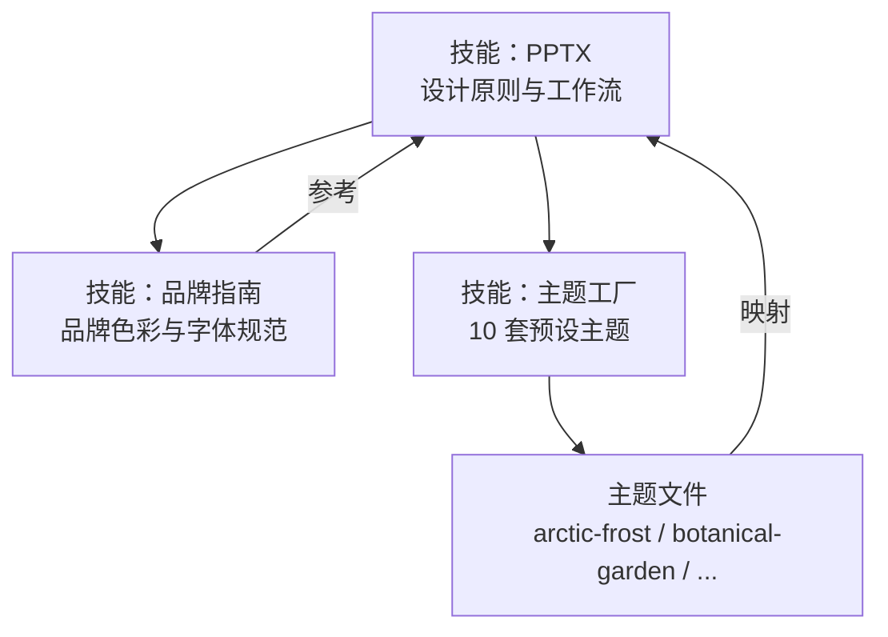
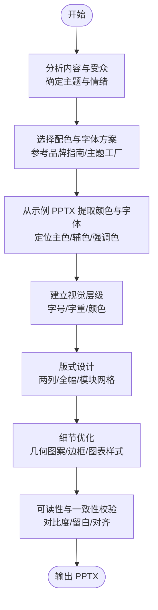
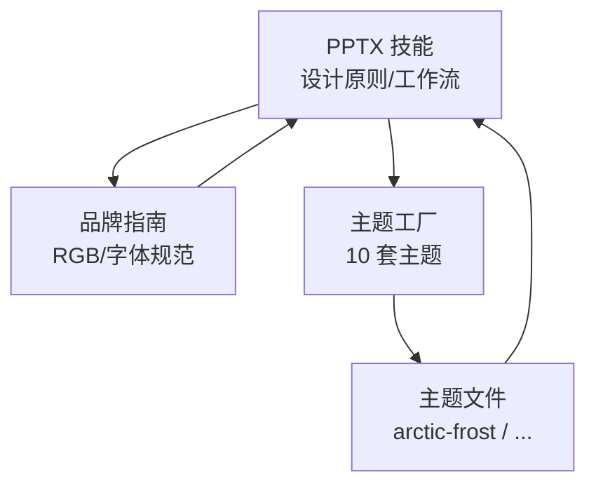

# 设计原则与视觉规范

<cite>
**本文引用的文件**
- [技能：PPTX](file://skills/pptx/SKILL.md)
- [技能：品牌指南](file://skills/brand-guidelines/SKILL.md)
- [技能：主题工厂](file://skills/theme-factory/SKILL.md)
- [主题：北极寒霜](file://skills/theme-factory/themes/arctic-frost.md)
- [主题：植物花园](file://skills/theme-factory/themes/botanical-garden.md)
- [主题：沙漠玫瑰](file://skills/theme-factory/themes/desert-rose.md)
- [主题：森林树冠](file://skills/theme-factory/themes/forest-canopy.md)
- [主题：金色时刻](file://skills/theme-factory/themes/golden-hour.md)
- [主题：午夜银河](file://skills/theme-factory/themes/midnight-galaxy.md)
- [主题：现代极简](file://skills/theme-factory/themes/modern-minimalist.md)
- [主题：海洋深度](file://skills/theme-factory/themes/ocean-depths.md)
- [主题：夕阳大道](file://skills/theme-factory/themes/sunset-boulevard.md)
- [主题：科技革新](file://skills/theme-factory/themes/tech-innovation.md)
</cite>

## 目录
1. [引言](#引言)
2. [项目结构](#项目结构)
3. [核心组件](#核心组件)
4. [架构总览](#架构总览)
5. [详细组件分析](#详细组件分析)
6. [依赖关系分析](#依赖关系分析)
7. [性能考虑](#性能考虑)
8. [故障排查指南](#故障排查指南)
9. [结论](#结论)
10. [附录](#附录)

## 引言
本文件面向需要创建高质量 PPTX 演示文稿的开发者与设计者，系统化阐述设计理念、视觉标准与实施流程。内容覆盖色彩搭配策略、字体选择原则、版式设计技巧，并提供 18 组推荐配色方案及其适用场景；明确可读性与对比度要求、一致性原则与设计决策框架，帮助在不同主题内容下做出合适的设计选择。

## 项目结构
围绕 PPTX 演示文稿的设计与实现，仓库中与“设计原则与视觉规范”直接相关的核心资源分布如下：
- 技能：PPTX
  - 提供 PPTX 创建、编辑、分析的全流程规范，包含设计原则、颜色与字体提取方法、布局建议与工作流。
- 技能：品牌指南
  - 提供企业级品牌色彩与字体规范，强调可读性、对比度与一致性。
- 技能：主题工厂
  - 提供 10 套预设主题，每套主题包含完整的色彩与字体组合，便于快速应用到演示文稿中。
- 主题文件
  - 以独立 Markdown 文件形式呈现各主题的色彩、字体与适用场景，便于查阅与复用。

图表来源
- [技能：PPTX](file://skills/pptx/SKILL.md#L51-L170)
- [技能：品牌指南](file://skills/brand-guidelines/SKILL.md#L15-L74)
- [技能：主题工厂](file://skills/theme-factory/SKILL.md#L28-L60)

章节来源
- [技能：PPTX](file://skills/pptx/SKILL.md#L1-L484)
- [技能：品牌指南](file://skills/brand-guidelines/SKILL.md#L1-L74)
- [技能：主题工厂](file://skills/theme-factory/SKILL.md#L1-L60)

## 核心组件
- 设计原则与视觉标准
  - 色彩策略：从内容出发，匹配主题情绪与受众，构建主色、辅色与强调色的三段式体系；确保文本与背景具备足够对比度。
  - 字体规范：优先使用 web-safe 字体，保证跨平台一致性；通过字号、字重与颜色建立清晰的视觉层级。
  - 版式设计：采用两列布局或全幅布局提升图表/表格可读性；避免垂直堆叠导致阅读困难。
- 颜色方案与应用场景
  - 提供 18 组推荐配色方案，覆盖经典、暖色、深色、自然、科技等风格，适配不同行业与场合。
- 主题工厂与品牌指南
  - 通过 10 套预设主题快速落地视觉风格；品牌指南提供企业级色彩与字体规范，确保一致性与可读性。

章节来源
- [技能：PPTX](file://skills/pptx/SKILL.md#L51-L170)
- [技能：品牌指南](file://skills/brand-guidelines/SKILL.md#L15-L74)
- [技能：主题工厂](file://skills/theme-factory/SKILL.md#L28-L60)

## 架构总览
以下图展示“设计原则与视觉规范”的落地路径：从内容分析与主题选择，到色彩与字体提取，再到版式与细节处理，最终输出一致、可读、美观的演示文稿。

图表来源
- [技能：PPTX](file://skills/pptx/SKILL.md#L51-L170)
- [技能：品牌指南](file://skills/brand-guidelines/SKILL.md#L15-L74)
- [技能：主题工厂](file://skills/theme-factory/SKILL.md#L28-L60)

## 详细组件分析

### 色彩搭配策略与 18 组推荐配色
- 策略要点
  - 从主题内容出发，结合行业属性、目标受众与情绪基调，选择主色、辅色与强调色。
  - 控制色板规模（3-5 色），确保主色占主导、辅色提供平衡、强调色用于关键信息。
  - 严格校验文本与背景的对比度，确保可读性。
- 18 组推荐配色方案
  - 经典蓝、泰尔珊瑚、浓烈红、暖粉、深红酒、深紫翠绿、奶油森林绿、粉紫、酸橙梅子、黑金、鼠尾草陶土、焦炭红、活力橙、森林绿、复古彩虹、复古大地、海岸玫瑰、橙绿薄荷。
- 应用建议
  - 不同行业与场合可参考主题文件中的“最佳用途”描述，或依据内容情绪选择相近风格的配色组合。

章节来源
- [技能：PPTX](file://skills/pptx/SKILL.md#L66-L95)
- [主题：北极寒霜](file://skills/theme-factory/themes/arctic-frost.md#L17-L20)
- [主题：植物花园](file://skills/theme-factory/themes/botanical-garden.md#L17-L20)
- [主题：沙漠玫瑰](file://skills/theme-factory/themes/desert-rose.md#L17-L20)
- [主题：森林树冠](file://skills/theme-factory/themes/forest-canopy.md#L17-L20)
- [主题：金色时刻](file://skills/theme-factory/themes/golden-hour.md#L17-L20)
- [主题：午夜银河](file://skills/theme-factory/themes/midnight-galaxy.md#L17-L20)
- [主题：现代极简](file://skills/theme-factory/themes/modern-minimalist.md#L17-L20)
- [主题：海洋深度](file://skills/theme-factory/themes/ocean-depths.md#L17-L20)
- [主题：夕阳大道](file://skills/theme-factory/themes/sunset-boulevard.md#L17-L20)
- [主题：科技革新](file://skills/theme-factory/themes/tech-innovation.md#L17-L20)

### 字体选择原则与 web-safe 字体
- 字体原则
  - 优先使用 web-safe 字体，确保在不同设备与系统上的一致显示。
  - 通过字号、字重与颜色建立清晰的视觉层级，标题与正文形成明显区分。
- 可用字体清单
  - Arial、Helvetica、Times New Roman、Georgia、Courier New、Verdana、Tahoma、Trebuchet MS、Impact。
- 实践建议
  - 标题使用较大字号与较粗字重，正文保持适中字号与高可读性字体。
  - 在技术类内容中可选用等宽字体以增强数据可读性。

章节来源
- [技能：PPTX](file://skills/pptx/SKILL.md#L60-L64)
- [技能：PPTX](file://skills/pptx/SKILL.md#L113-L119)
- [技能：品牌指南](file://skills/brand-guidelines/SKILL.md#L32-L36)
- [技能：品牌指南](file://skills/brand-guidelines/SKILL.md#L40-L52)

### 视觉层次构建与对比度要求
- 层次构建
  - 使用字号差异（如标题 72pt 与正文 11pt）与字重变化强化主次关系。
  - 通过颜色与留白控制信息密度，避免拥挤。
- 对比度要求
  - 文本与背景之间应满足可读性对比度阈值，尤其在远距离观看与投影环境下。
  - 在浅色背景上使用深色文字，在深色背景上使用浅色文字。
- 一致性原则
  - 全篇统一主色、辅色与强调色使用规则；统一字号、字重与颜色规范；统一版式与留白策略。

章节来源
- [技能：PPTX](file://skills/pptx/SKILL.md#L59-L65)
- [技能：品牌指南](file://skills/brand-guidelines/SKILL.md#L69-L74)

### 版式设计技巧与布局建议
- 布局策略
  - 图表/表格类内容优先采用两列布局或全幅布局，避免垂直堆叠导致阅读困难。
  - 使用不等宽分栏（如 40%/60%）优化信息承载与视觉平衡。
- 细节处理
  - 几何图案、边框与背景纹理可提升视觉层次，但需保持克制，避免干扰信息传达。
  - 图表样式建议采用单色主调加一个强调色，减少视觉噪音。

章节来源
- [技能：PPTX](file://skills/pptx/SKILL.md#L144-L149)
- [技能：PPTX](file://skills/pptx/SKILL.md#L96-L143)

### 设计决策思考框架
- 内容为先：明确主题、受众与目标，据此选择色彩与版式。
- 品牌与一致性：优先参考品牌指南或主题工厂，确保风格统一。
- 可读性优先：始终验证对比度与字号，保证远距离观看效果。
- 迭代校验：生成缩略图或图像进行可视化检查，及时修正文本截断、重叠与定位问题。

章节来源
- [技能：PPTX](file://skills/pptx/SKILL.md#L51-L65)
- [技能：PPTX](file://skills/pptx/SKILL.md#L171-L170)

### 从示例 PPTX 提取颜色与字体
- 工作流程
  - 解包 PPTX，读取主题与幻灯片 XML，定位颜色方案与字体使用情况。
  - 使用模式搜索颜色与字体引用，形成可复用的配色与字体清单。
- 输出建议
  - 将提取结果整理为配色表与字体清单，作为后续设计的依据。

章节来源
- [技能：PPTX](file://skills/pptx/SKILL.md#L41-L46)

### 主题工厂与品牌指南的应用
- 主题工厂
  - 展示 10 套主题的配色与字体组合，按场景分类，便于快速选择。
- 品牌指南
  - 提供企业级品牌色彩与字体规范，强调可读性与一致性，适合正式场合与品牌传播。

章节来源
- [技能：主题工厂](file://skills/theme-factory/SKILL.md#L28-L60)
- [技能：品牌指南](file://skills/brand-guidelines/SKILL.md#L15-L74)

## 依赖关系分析
- 设计规范与工具链
  - PPTX 技能定义了设计原则与工作流；品牌指南与主题工厂提供可复用的色彩与字体资源。
- 数据与资源映射
  - 主题文件以 Markdown 形式组织，便于检索与复用；品牌指南提供精确的 RGB 值与应用方式。

图表来源
- [技能：PPTX](file://skills/pptx/SKILL.md#L51-L170)
- [技能：品牌指南](file://skills/brand-guidelines/SKILL.md#L15-L74)
- [技能：主题工厂](file://skills/theme-factory/SKILL.md#L28-L60)

章节来源
- [技能：PPTX](file://skills/pptx/SKILL.md#L51-L170)
- [技能：品牌指南](file://skills/brand-guidelines/SKILL.md#L15-L74)
- [技能：主题工厂](file://skills/theme-factory/SKILL.md#L28-L60)

## 性能考虑
- 可读性优先于复杂装饰：在投影环境中，简洁的配色与清晰的层级更有利于信息传递。
- 一致性降低认知负担：统一的字体、字号与颜色策略可减少阅读中断，提升整体效率。
- 工具链与自动化：利用脚本与模板减少重复劳动，提高产出质量与速度。

## 故障排查指南
- 常见问题
  - 文本被裁切或遮挡：检查缩略图或图像预览，调整留白与定位。
  - 文本重叠：重新分配内容区域，避免密集布局。
  - 对比度不足：更换背景色或文本色，确保可读性。
- 处理步骤
  - 生成缩略图网格进行快速审查。
  - 根据问题逐一调整配色、字号与版式。
  - 重复验证直至所有幻灯片达到预期效果。

章节来源
- [技能：PPTX](file://skills/pptx/SKILL.md#L161-L169)

## 结论
通过系统化的色彩策略、字体规范与版式设计，结合品牌指南与主题工厂的资源，可以在不同主题与场景下高效产出一致、可读、美观的演示文稿。建议在每次创作前完成内容分析与主题选择，并以可读性与一致性为核心准则，持续迭代优化。

## 附录
- 推荐配色方案索引
  - 经典蓝、泰尔珊瑚、浓烈红、暖粉、深红酒、深紫翠绿、奶油森林绿、粉紫、酸橙梅子、黑金、鼠尾草陶土、焦炭红、活力橙、森林绿、复古彩虹、复古大地、海岸玫瑰、橙绿薄荷。
- 主题文件索引
  - 北极寒霜、植物花园、沙漠玫瑰、森林树冠、金色时刻、午夜银河、现代极简、海洋深度、夕阳大道、科技革新。