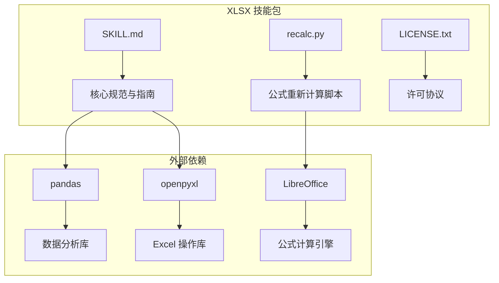
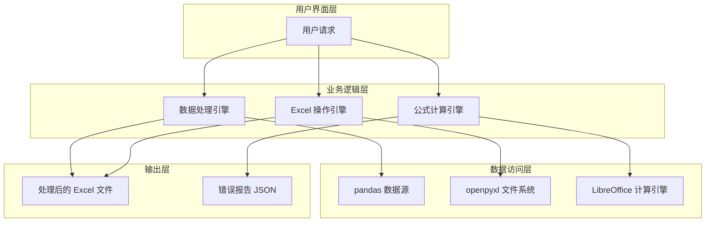
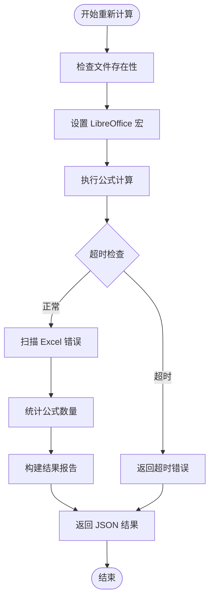
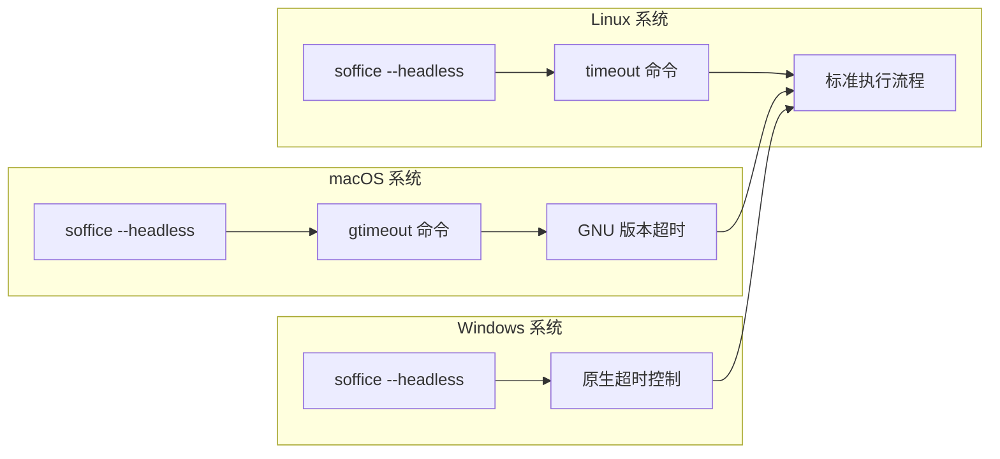
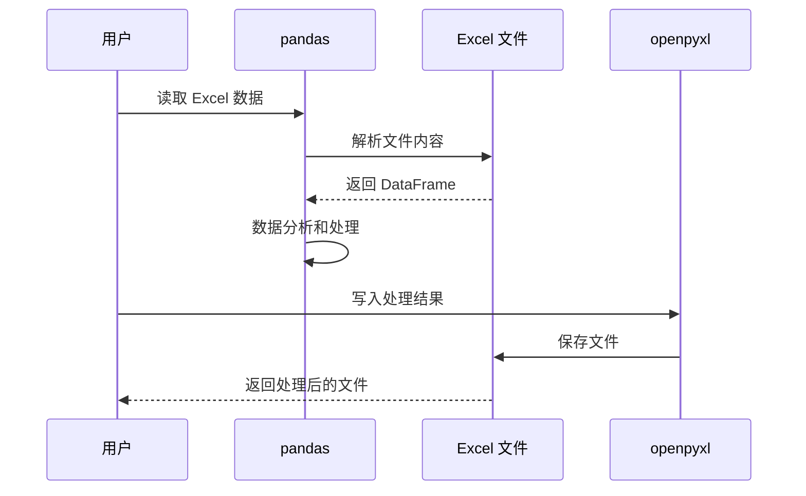
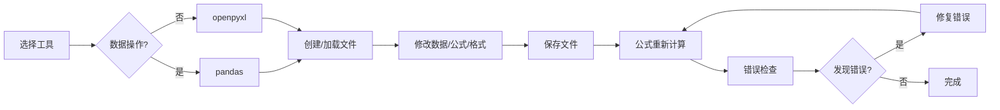
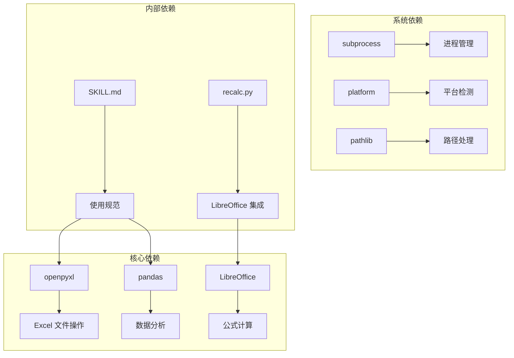
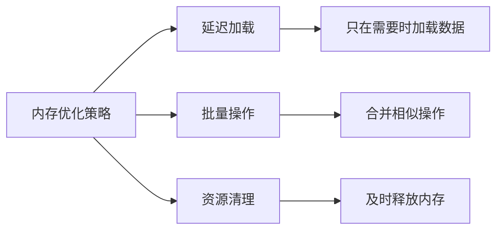
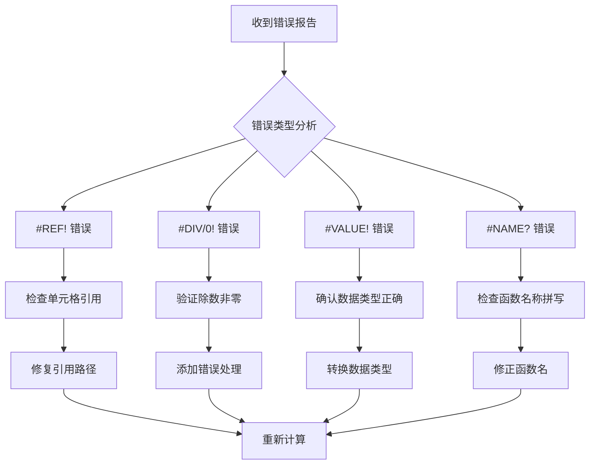

# XLSX 电子表格处理

<cite>
**本文档引用的文件**
- [SKILL.md](file://skills/xlsx/SKILL.md)
- [recalc.py](file://skills/xlsx/recalc.py)
- [LICENSE.txt](file://skills/xlsx/LICENSE.txt)
</cite>

## 目录
1. [简介](#简介)
2. [项目结构](#项目结构)
3. [核心组件](#核心组件)
4. [架构概览](#架构概览)
5. [详细组件分析](#详细组件分析)
6. [依赖关系分析](#依赖关系分析)
7. [性能考虑](#性能考虑)
8. [故障排除指南](#故障排除指南)
9. [结论](#结论)

## 简介

XLSX 电子表格处理技能是一个专门设计用于处理 Excel 电子表格的强大工具集。该技能专注于提供全面的电子表格创建、编辑、分析和处理功能，特别强调公式计算、数据分析和处理、报表生成等方面的能力。

该技能的核心价值在于其独特的双工具策略：结合了 pandas 的强大数据分析能力和 openpyxl 的专业 Excel 功能。通过这种组合，用户可以实现从简单的数据导入导出到复杂的财务建模和报表生成的全方位电子表格处理需求。

## 项目结构

XLSX 技能包采用简洁而高效的设计，主要包含以下核心组件：

**图表来源**
- [SKILL.md](file://skills/xlsx/SKILL.md#L1-L289)
- [recalc.py](file://skills/xlsx/recalc.py#L1-L178)

**章节来源**
- [SKILL.md](file://skills/xlsx/SKILL.md#L1-L289)
- [LICENSE.txt](file://skills/xlsx/LICENSE.txt#L1-L31)

## 核心组件

### 1. 数据分析组件（pandas）

pandas 是该技能包中最重要的数据分析工具，提供了以下关键功能：

- **灵活的数据读取**：支持多种 Excel 格式（.xlsx, .xlsm, .csv, .tsv）
- **强大的数据操作**：提供丰富的数据转换、过滤和聚合功能
- **统计分析能力**：内置描述性统计、分组分析等高级功能
- **可视化支持**：与 matplotlib 等可视化库无缝集成

### 2. Excel 操作组件（openpyxl）

openpyxl 提供了专业的 Excel 文件操作能力：

- **公式支持**：完整的 Excel 公式语法支持
- **格式化功能**：字体、颜色、边框、填充等丰富格式选项
- **工作表管理**：多工作表创建、删除和管理
- **单元格操作**：精确的单元格定位和批量操作

### 3. 公式重新计算组件（recalc.py）

这是该技能包的独特创新，专门解决 Excel 公式计算问题：

- **自动化 LibreOffice 集成**：自动配置和使用 LibreOffice 进行公式计算
- **错误检测系统**：全面扫描 Excel 错误类型（#REF!, #DIV/0!, #VALUE! 等）
- **详细报告输出**：提供结构化的错误位置和数量统计
- **跨平台支持**：同时支持 Linux 和 macOS 系统

**章节来源**
- [SKILL.md](file://skills/xlsx/SKILL.md#L75-L92)
- [SKILL.md](file://skills/xlsx/SKILL.md#L148-L202)
- [recalc.py](file://skills/xlsx/recalc.py#L1-L178)

## 架构概览

该技能包采用了模块化架构设计，将不同的功能职责清晰分离：

**图表来源**
- [SKILL.md](file://skills/xlsx/SKILL.md#L129-L147)
- [recalc.py](file://skills/xlsx/recalc.py#L53-L156)

该架构的核心优势在于：

1. **职责分离**：每个组件专注于特定的功能领域
2. **可扩展性**：新的功能可以轻松添加到现有架构中
3. **错误隔离**：单个组件的问题不会影响其他组件
4. **性能优化**：可以根据需要选择最适合的工具

## 详细组件分析

### 公式重新计算系统

#### 核心算法流程

**图表来源**
- [recalc.py](file://skills/xlsx/recalc.py#L53-L156)

#### 错误检测机制

系统能够识别和报告以下七种主要的 Excel 错误类型：

| 错误类型 | 描述 | 常见原因 |
|---------|------|----------|
| #REF! | 引用无效单元格 | 删除了被引用的单元格或工作表 |
| #DIV/0! | 除零错误 | 分母为零的数学运算 |
| #VALUE! | 数据类型错误 | 公式中使用了不兼容的数据类型 |
| #NAME? | 公式名称未知 | 使用了未定义的函数或名称 |
| #NULL! | 空值错误 | 使用了无效的区域交集 |
| #NUM! | 数值错误 | 计算结果超出 Excel 范围 |
| #N/A | 无可用数据 | 函数无法找到所需数据 |

#### 平台适配策略

**图表来源**
- [recalc.py](file://skills/xlsx/recalc.py#L78-L91)

**章节来源**
- [recalc.py](file://skills/xlsx/recalc.py#L16-L51)
- [recalc.py](file://skills/xlsx/recalc.py#L53-L156)

### 数据分析工作流程

#### pandas 集成模式

**图表来源**
- [SKILL.md](file://skills/xlsx/SKILL.md#L75-L92)

#### 最佳实践指导

该技能包提供了详细的使用最佳实践：

1. **避免硬编码值**：始终使用 Excel 公式而不是在 Python 中计算后硬编码
2. **模板保持**：修改现有模板时要严格匹配现有的格式和样式
3. **颜色编码标准**：建立统一的颜色编码约定来标识不同类型的单元格
4. **数字格式标准**：制定严格的数字格式规则以确保一致性

**章节来源**
- [SKILL.md](file://skills/xlsx/SKILL.md#L96-L127)
- [SKILL.md](file://skills/xlsx/SKILL.md#L148-L202)

### Excel 文件操作模式

#### 工作流管理

**图表来源**
- [SKILL.md](file://skills/xlsx/SKILL.md#L129-L147)

#### 多工作表处理

系统支持复杂的工作表管理功能：

- **工作表遍历**：自动检测和处理所有工作表
- **跨表引用**：支持工作表间的公式链接
- **批量操作**：对多个工作表进行统一处理

**章节来源**
- [SKILL.md](file://skills/xlsx/SKILL.md#L177-L202)

## 依赖关系分析

### 外部依赖关系

**图表来源**
- [recalc.py](file://skills/xlsx/recalc.py#L7-L13)
- [SKILL.md](file://skills/xlsx/SKILL.md#L71-L72)

### 内部组件交互

该技能包的内部组件具有清晰的交互层次：

1. **规范层**：SKILL.md 提供使用指导和最佳实践
2. **工具层**：pandas 和 openpyxl 提供具体的数据操作功能
3. **执行层**：recalc.py 实现公式重新计算的具体逻辑

**章节来源**
- [recalc.py](file://skills/xlsx/recalc.py#L1-L178)
- [SKILL.md](file://skills/xlsx/SKILL.md#L1-L289)

## 性能考虑

### 大文件处理优化

对于大型 Excel 文件，系统提供了专门的性能优化策略：

1. **只读模式**：使用 `read_only=True` 参数读取大文件
2. **写入优化**：使用 `write_only=True` 参数进行快速写入
3. **内存管理**：合理使用 `data_only=True` 参数避免不必要的计算
4. **批处理操作**：尽量减少对文件的重复读写操作

### 公式计算性能

LibreOffice 公式计算的性能优化：

- **超时控制**：通过命令行参数设置合理的超时时间
- **错误快速检测**：及时发现和报告计算错误
- **增量更新**：只重新计算受影响的单元格区域

### 内存使用优化

## 故障排除指南

### 常见问题诊断

#### 公式错误排查

#### 系统环境问题

| 问题症状 | 可能原因 | 解决方案 |
|---------|----------|----------|
| LibreOffice 启动失败 | 未安装或权限不足 | 安装 LibreOffice 并设置执行权限 |
| 超时错误 | 计算量过大或系统性能不足 | 增加超时时间或优化公式结构 |
| 权限错误 | 文件访问权限不足 | 检查文件读写权限 |
| 编码错误 | 字符编码不兼容 | 指定正确的文件编码格式 |

### 调试工具使用

#### 递归计算脚本调试

系统提供了详细的调试输出和错误报告机制：

1. **JSON 输出格式**：标准化的错误报告格式便于解析
2. **位置信息**：提供精确的错误单元格位置
3. **计数统计**：显示各类错误的总数
4. **公式统计**：报告文件中的公式数量

**章节来源**
- [recalc.py](file://skills/xlsx/recalc.py#L158-L178)
- [SKILL.md](file://skills/xlsx/SKILL.md#L246-L260)

## 结论

XLSX 电子表格处理技能包代表了现代电子表格处理技术的先进水平。通过精心设计的架构和专业的工具组合，该技能包实现了以下目标：

### 主要成就

1. **功能完整性**：涵盖了从基础数据操作到复杂财务建模的全方位需求
2. **技术先进性**：结合了 pandas 的数据分析能力和 openpyxl 的专业 Excel 功能
3. **用户体验**：提供了清晰的使用规范和错误处理机制
4. **可维护性**：模块化的架构设计便于未来的功能扩展和维护

### 应用场景

该技能包特别适用于以下应用场景：

- **财务建模**：复杂的财务预测和估值模型
- **数据分析**：大规模数据集的统计分析和可视化
- **报表生成**：自动化的企业报表和报告生成
- **数据迁移**：不同格式数据之间的转换和处理

### 发展前景

随着企业数字化转型的深入，电子表格处理技能将继续发展和完善。未来可能的发展方向包括：

- **云端集成**：与云存储和协作平台的深度集成
- **实时协作**：支持多人实时编辑和版本控制
- **AI 辅助**：利用人工智能技术提供智能数据处理建议
- **移动支持**：开发移动端应用以支持随时随地的电子表格操作

通过持续的技术创新和功能完善，XLSX 电子表格处理技能包必将在企业级应用中发挥越来越重要的作用。