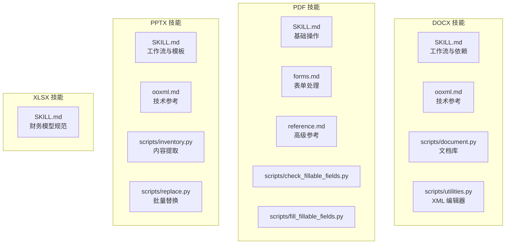
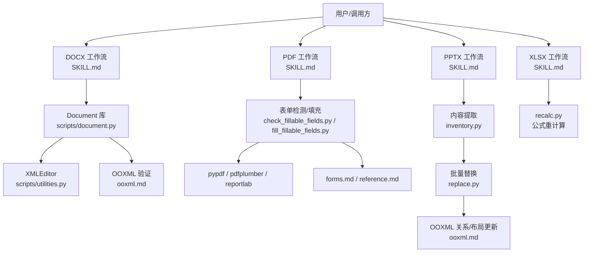
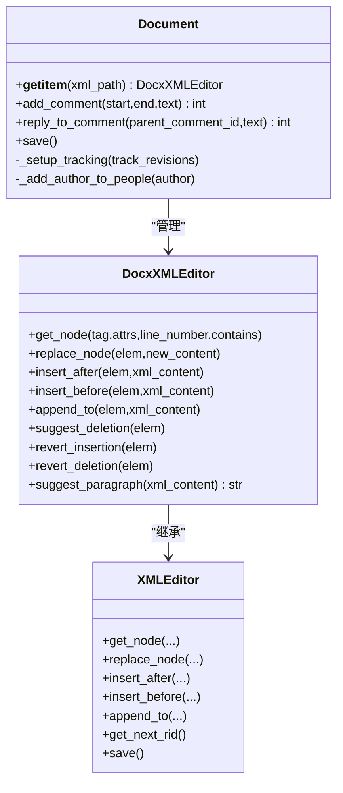
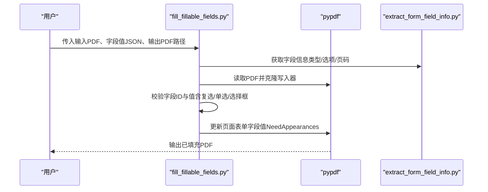
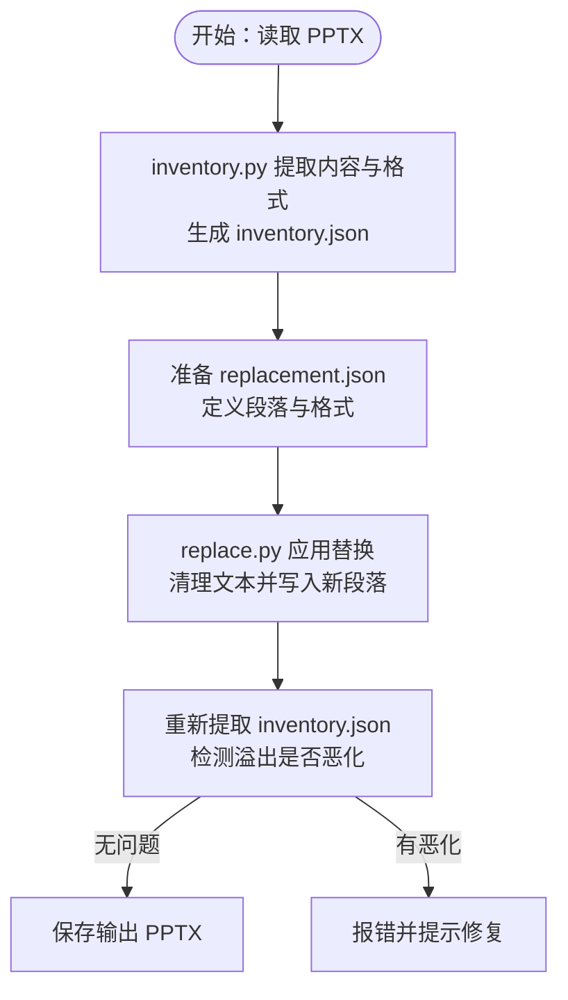
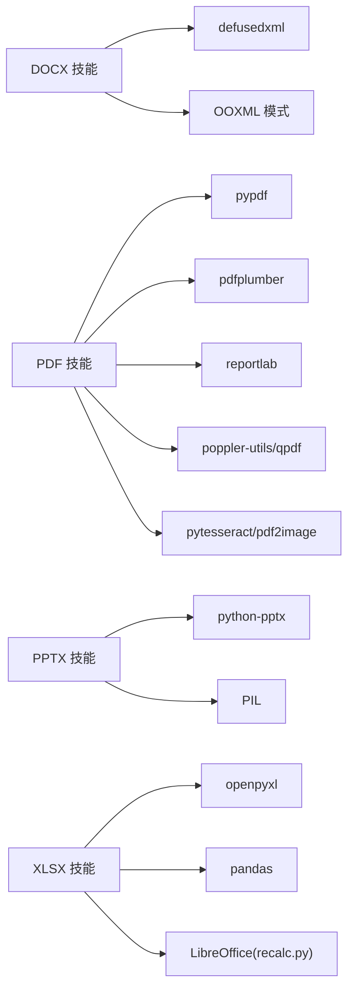

# 文档处理技能

<cite>
**本文引用的文件**
- [skills/docx/SKILL.md](file://skills/docx/SKILL.md)
- [skills/docx/ooxml.md](file://skills/docx/ooxml.md)
- [skills/docx/scripts/document.py](file://skills/docx/scripts/document.py)
- [skills/docx/scripts/utilities.py](file://skills/docx/scripts/utilities.py)
- [skills/pdf/SKILL.md](file://skills/pdf/SKILL.md)
- [skills/pdf/forms.md](file://skills/pdf/forms.md)
- [skills/pdf/reference.md](file://skills/pdf/reference.md)
- [skills/pdf/scripts/check_fillable_fields.py](file://skills/pdf/scripts/check_fillable_fields.py)
- [skills/pdf/scripts/fill_fillable_fields.py](file://skills/pdf/scripts/fill_fillable_fields.py)
- [skills/pptx/SKILL.md](file://skills/pptx/SKILL.md)
- [skills/pptx/ooxml.md](file://skills/pptx/ooxml.md)
- [skills/pptx/scripts/inventory.py](file://skills/pptx/scripts/inventory.py)
- [skills/pptx/scripts/replace.py](file://skills/pptx/scripts/replace.py)
- [skills/xlsx/SKILL.md](file://skills/xlsx/SKILL.md)
</cite>

## 目录
1. [简介](#简介)
2. [项目结构](#项目结构)
3. [核心组件](#核心组件)
4. [架构总览](#架构总览)
5. [详细组件分析](#详细组件分析)
6. [依赖关系分析](#依赖关系分析)
7. [性能考虑](#性能考虑)
8. [故障排查指南](#故障排查指南)
9. [结论](#结论)
10. [附录](#附录)

## 简介
本综合文档面向多格式文档处理技能，覆盖 DOCX、PDF、PPTX、XLSX 的处理能力与最佳实践，重点包括：
- OOXML 处理：DOCX、PPTX 的结构化编辑、跟踪修订、批注、图片与链接插入等
- 文本提取：Markdown 转换、布局保留、表格与图像抽取
- 表单处理：PDF 可填写字段与非可填写字段的标注填充流程
- 工作流与工具链：命令行工具、Python 库、JavaScript 库的组合使用
- 实际用法与适用场景：根据业务需求选择合适的工具与方法

## 项目结构
该项目以“技能”为单位组织，每个技能（docx、pdf、pptx、xlsx）提供：
- 技能说明文档（SKILL.md），概述能力、工作流与依赖
- 技术参考文档（如 ooxml.md），详述 OOXML 结构与模式
- 脚本与工具（scripts/），用于打包/解包、验证、内容提取与替换
- 针对特定任务的子文档（如 forms.md、html2pptx.md）

图表来源
- [skills/docx/SKILL.md](file://skills/docx/SKILL.md#L1-L197)
- [skills/docx/ooxml.md](file://skills/docx/ooxml.md#L1-L610)
- [skills/pdf/SKILL.md](file://skills/pdf/SKILL.md#L1-L295)
- [skills/pdf/forms.md](file://skills/pdf/forms.md#L1-L206)
- [skills/pptx/SKILL.md](file://skills/pptx/SKILL.md#L1-L484)
- [skills/pptx/ooxml.md](file://skills/pptx/ooxml.md#L1-L427)
- [skills/xlsx/SKILL.md](file://skills/xlsx/SKILL.md#L1-L289)

章节来源
- [skills/docx/SKILL.md](file://skills/docx/SKILL.md#L1-L197)
- [skills/pdf/SKILL.md](file://skills/pdf/SKILL.md#L1-L295)
- [skills/pptx/SKILL.md](file://skills/pptx/SKILL.md#L1-L484)
- [skills/xlsx/SKILL.md](file://skills/xlsx/SKILL.md#L1-L289)

## 核心组件
- DOCX
  - 文档库（Document 类）：自动设置基础设施（people.xml、RSID、settings.xml）、支持跟踪修订、批注、插入/删除、图片插入、节点查找与保存
  - XML 编辑器（XMLEditor）：基于行号定位节点、属性过滤、文本包含过滤、DOM 替换/插入
- PDF
  - 基础库（pypdf、pdfplumber、reportlab）：合并/拆分、文本与表格提取、创建 PDF、水印、加密
  - 表单处理：可填写字段检测、字段信息提取、值校验与填充；非可填写字段通过可视化标注方式填充
  - 高级参考：pypdfium2、pdf-lib、pdfjs-dist 的使用示例
- PPTX
  - 内容提取（inventory.py）：递归遍历形状、计算绝对位置、提取段落格式、检测溢出与重叠、导出结构化 JSON
  - 批量替换（replace.py）：按 inventory.json 的结构进行文本与格式替换，自动校验溢出是否恶化
  - 技术参考（ooxml.md）：幻灯片结构、文本框、列表、形状、图片、表格、布局与关系更新
- XLSX
  - 规范与最佳实践：公式优先、颜色编码标准、数字格式规则、模板保留、公式错误预防与校验
  - 公式重计算：recalc.py 使用 LibreOffice 自动重算并返回错误摘要

章节来源
- [skills/docx/scripts/document.py](file://skills/docx/scripts/document.py#L1-L800)
- [skills/docx/scripts/utilities.py](file://skills/docx/scripts/utilities.py#L1-L375)
- [skills/pdf/SKILL.md](file://skills/pdf/SKILL.md#L1-L295)
- [skills/pdf/forms.md](file://skills/pdf/forms.md#L1-L206)
- [skills/pdf/reference.md](file://skills/pdf/reference.md#L1-L612)
- [skills/pptx/scripts/inventory.py](file://skills/pptx/scripts/inventory.py#L1-L800)
- [skills/pptx/scripts/replace.py](file://skills/pptx/scripts/replace.py#L1-L386)
- [skills/pptx/ooxml.md](file://skills/pptx/ooxml.md#L1-L427)
- [skills/xlsx/SKILL.md](file://skills/xlsx/SKILL.md#L1-L289)

## 架构总览
下图展示各格式处理的总体架构与关键交互：

图表来源
- [skills/docx/SKILL.md](file://skills/docx/SKILL.md#L1-L197)
- [skills/docx/ooxml.md](file://skills/docx/ooxml.md#L1-L610)
- [skills/pdf/SKILL.md](file://skills/pdf/SKILL.md#L1-L295)
- [skills/pdf/forms.md](file://skills/pdf/forms.md#L1-L206)
- [skills/pdf/reference.md](file://skills/pdf/reference.md#L1-L612)
- [skills/pptx/SKILL.md](file://skills/pptx/SKILL.md#L1-L484)
- [skills/pptx/ooxml.md](file://skills/pptx/ooxml.md#L1-L427)
- [skills/xlsx/SKILL.md](file://skills/xlsx/SKILL.md#L1-L289)

## 详细组件分析

### DOCX 组件分析
- 文档库（Document）
  - 自动初始化临时解包目录、复制原始 DOCX 作为验证基线、生成 RSID、设置作者与初始缩写
  - 提供 add_comment、reply_to_comment、suggest_deletion、revert_insertion、revert_deletion 等方法
  - 支持图片插入：复制到 word/media、更新关系与内容类型、插入 drawing 节点
- XML 编辑器（XMLEditor）
  - 基于 defusedxml 解析，记录元素原始行列位置，支持按行号、属性、文本内容过滤
  - 提供 replace_node、insert_after、insert_before、append_to 等 DOM 操作
- OOXML 模式
  - 列表、表格、文本格式、超链接、书签、图片等结构与样式
  - 跟踪修订（插入/删除）的最小化原则与嵌套策略

图表来源
- [skills/docx/scripts/document.py](file://skills/docx/scripts/document.py#L612-L800)
- [skills/docx/scripts/utilities.py](file://skills/docx/scripts/utilities.py#L41-L375)

章节来源
- [skills/docx/scripts/document.py](file://skills/docx/scripts/document.py#L1-L800)
- [skills/docx/scripts/utilities.py](file://skills/docx/scripts/utilities.py#L1-L375)
- [skills/docx/ooxml.md](file://skills/docx/ooxml.md#L266-L610)

### PDF 组件分析
- 基础操作
  - pypdf：合并/拆分、旋转、提取元数据、加水印、加密
  - pdfplumber：保留布局的文本与表格提取、坐标调试
  - reportlab：从零创建 PDF、多页文档、表格与样式
- 表单处理
  - 可填写字段：检测、字段信息提取（含复选框/单选组/选择框）、值校验、批量填充
  - 非可填写字段：转图片、人工标注边界、生成验证图、添加文本注释
- 高级参考
  - pypdfium2：渲染页面为图像、快速提取文本
  - pdf-lib（JavaScript）：加载/修改现有 PDF、创建复杂 PDF、合并/拆分
  - pdfjs-dist：浏览器端渲染与文本提取

图表来源
- [skills/pdf/scripts/fill_fillable_fields.py](file://skills/pdf/scripts/fill_fillable_fields.py#L1-L115)
- [skills/pdf/scripts/check_fillable_fields.py](file://skills/pdf/scripts/check_fillable_fields.py#L1-L13)
- [skills/pdf/forms.md](file://skills/pdf/forms.md#L1-L206)

章节来源
- [skills/pdf/SKILL.md](file://skills/pdf/SKILL.md#L1-L295)
- [skills/pdf/forms.md](file://skills/pdf/forms.md#L1-L206)
- [skills/pdf/reference.md](file://skills/pdf/reference.md#L1-L612)
- [skills/pdf/scripts/check_fillable_fields.py](file://skills/pdf/scripts/check_fillable_fields.py#L1-L13)
- [skills/pdf/scripts/fill_fillable_fields.py](file://skills/pdf/scripts/fill_fillable_fields.py#L1-L115)

### PPTX 组件分析
- 内容提取（inventory.py）
  - 递归遍历 GroupShape，计算绝对位置，提取段落文本与格式（对齐、缩进、字体、颜色、间距）
  - 检测文本溢出（形状内高度不足）、滑块溢出（超出幻灯片边界）、重叠形状、手动符号列表问题
  - 导出结构化 JSON，包含占位符类型、默认字号、溢出与警告信息
- 批量替换（replace.py）
  - 读取 inventory.json，清理所有形状文本，仅对指定形状应用“段落”定义
  - 应用段落属性（对齐、缩进、项目符号、字体、颜色、间距），自动校验替换后溢出是否恶化
- 技术参考（ooxml.md）
  - 幻灯片树结构、文本框/形状、列表、图片、表格、布局与关系更新、幻灯片操作（新增/复制/重排/删除）

图表来源
- [skills/pptx/scripts/inventory.py](file://skills/pptx/scripts/inventory.py#L1-L800)
- [skills/pptx/scripts/replace.py](file://skills/pptx/scripts/replace.py#L1-L386)
- [skills/pptx/ooxml.md](file://skills/pptx/ooxml.md#L1-L427)

章节来源
- [skills/pptx/scripts/inventory.py](file://skills/pptx/scripts/inventory.py#L1-L800)
- [skills/pptx/scripts/replace.py](file://skills/pptx/scripts/replace.py#L1-L386)
- [skills/pptx/ooxml.md](file://skills/pptx/ooxml.md#L1-L427)

### XLSX 组件分析
- 规范与最佳实践
  - 公式优先：避免在 Python 中硬编码计算结果，保持动态可更新
  - 颜色编码：输入/计算/链接/外部链接/关键假设的统一配色
  - 数字格式：年份文本、货币、百分比、倍数、负数括号等
  - 错误预防：单元格引用正确性、范围一致性、边缘测试、循环引用检查
- 公式重计算
  - 使用 recalc.py 调用 LibreOffice 自动重算，扫描全表单错误并返回 JSON 摘要
  - 依据摘要逐项修复后再重算，直至无错误

章节来源
- [skills/xlsx/SKILL.md](file://skills/xlsx/SKILL.md#L1-L289)

## 依赖关系分析
- DOCX
  - 依赖：defusedxml（安全解析）、ooxml 脚本（打包/验证）、OOXML 模式（schema 合规）
- PDF
  - 依赖：pypdf、pdfplumber、reportlab、poppler-utils、qpdf、pytesseract（OCR）
- PPTX
  - 依赖：python-pptx（读写）、PIL（文本测量与溢出检测）、OOXML 模式
- XLSX
  - 依赖：openpyxl（公式与格式）、pandas（数据分析）、LibreOffice（公式重计算）

图表来源
- [skills/docx/SKILL.md](file://skills/docx/SKILL.md#L189-L197)
- [skills/pdf/SKILL.md](file://skills/pdf/SKILL.md#L269-L295)
- [skills/pptx/SKILL.md](file://skills/pptx/SKILL.md#L467-L484)
- [skills/xlsx/SKILL.md](file://skills/xlsx/SKILL.md#L69-L72)

章节来源
- [skills/docx/SKILL.md](file://skills/docx/SKILL.md#L189-L197)
- [skills/pdf/SKILL.md](file://skills/pdf/SKILL.md#L269-L295)
- [skills/pptx/SKILL.md](file://skills/pptx/SKILL.md#L467-L484)
- [skills/xlsx/SKILL.md](file://skills/xlsx/SKILL.md#L69-L72)

## 性能考虑
- 大型 PDF：优先使用命令行工具（qpdf、pdftotext）或 pypdfium2 渲染，避免一次性加载整页内存
- 文本提取：纯文本优先 pdftotext -bbox-layout；结构化表格使用 pdfplumber
- 图像提取：pdfimages 更快；需要高分辨率时再采用渲染
- PPTX：inventory.py 使用 PIL 进行文本测量，建议在大批量时控制 DPI 与字体回退
- XLSX：使用 read_only/write_only 模式处理大文件；recalc.py 在 Linux/macOS 上稳定运行

## 故障排查指南
- DOCX
  - 验证失败：使用 Document.save() 的自动验证；检查 RSID、命名空间声明、tracked changes 结构
  - 文本溢出/格式异常：遵循最小化修订原则，避免在他人插入/删除中直接改内容
- PDF
  - 加密/损坏：qpdf 检查与修复；密码保护需先解密
  - OCR 扫描版：pdf2image + pytesseract，注意图像质量与 DPI
  - 表单字段：先用 check_fillable_fields.py 检测；若无可填写字段，按 forms.md 的可视化标注流程执行
- PPTX
  - 模板复制：注意 notesSlides 引用、媒体资源清理、slideLayout 声明
  - 溢出恶化：replace.py 会检测并报错，需调整内容长度或段落属性
- XLSX
  - 公式错误：#REF!/#DIV/0!/#VALUE!/#NAME?，使用 recalc.py 输出摘要逐项修复

章节来源
- [skills/docx/ooxml.md](file://skills/docx/ooxml.md#L554-L610)
- [skills/pdf/reference.md](file://skills/pdf/reference.md#L567-L612)
- [skills/pdf/forms.md](file://skills/pdf/forms.md#L1-L206)
- [skills/pptx/ooxml.md](file://skills/pptx/ooxml.md#L413-L427)
- [skills/pptx/scripts/replace.py](file://skills/pptx/scripts/replace.py#L329-L344)
- [skills/xlsx/SKILL.md](file://skills/xlsx/SKILL.md#L204-L289)

## 结论
该技能体系围绕 Office Open XML 与 PDF 技术栈，提供了从内容提取、格式化、表单处理到自动化替换的完整工具链。通过标准化的工作流与严格的验证机制，能够高效、可靠地完成专业文档的创建、编辑与分析任务。针对不同格式与场景，应优先选择对应的最佳工具与模式，并严格遵循规范以确保兼容性与可维护性。

## 附录
- 快速参考
  - DOCX：使用 pandoc 提取 Markdown；必要时解包/打包；通过 Document 库进行跟踪修订与批注
  - PDF：pypdf 基础操作；pdfplumber 表格与布局；reportlab 创建；表单优先使用可填写字段
  - PPTX：inventory.py + replace.py 实现批量内容与格式替换；OOXML 模式指导布局与关系
  - XLSX：公式优先、颜色编码与格式规范；recalc.py 保证无公式错误