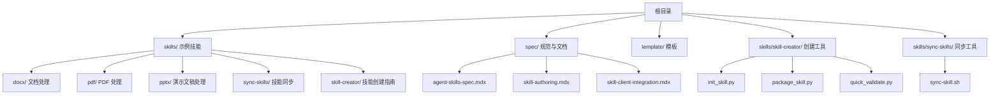
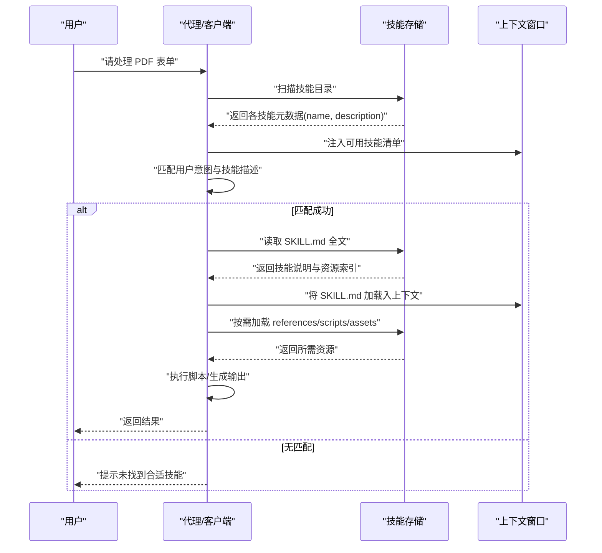
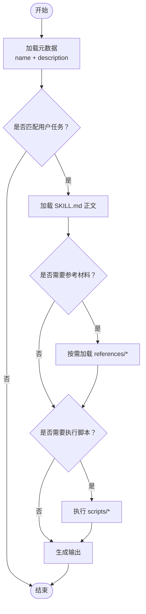
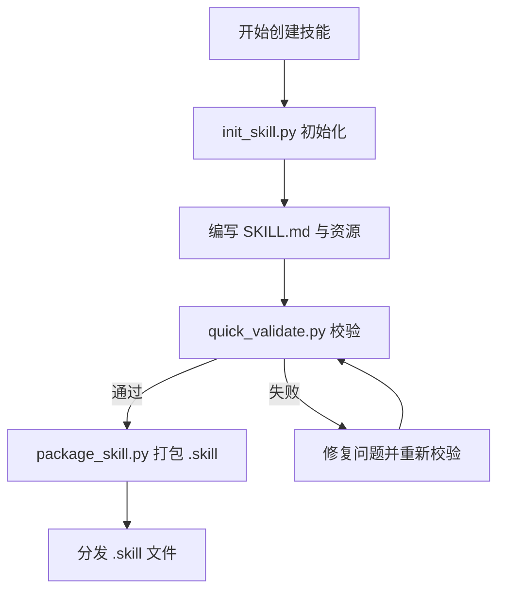
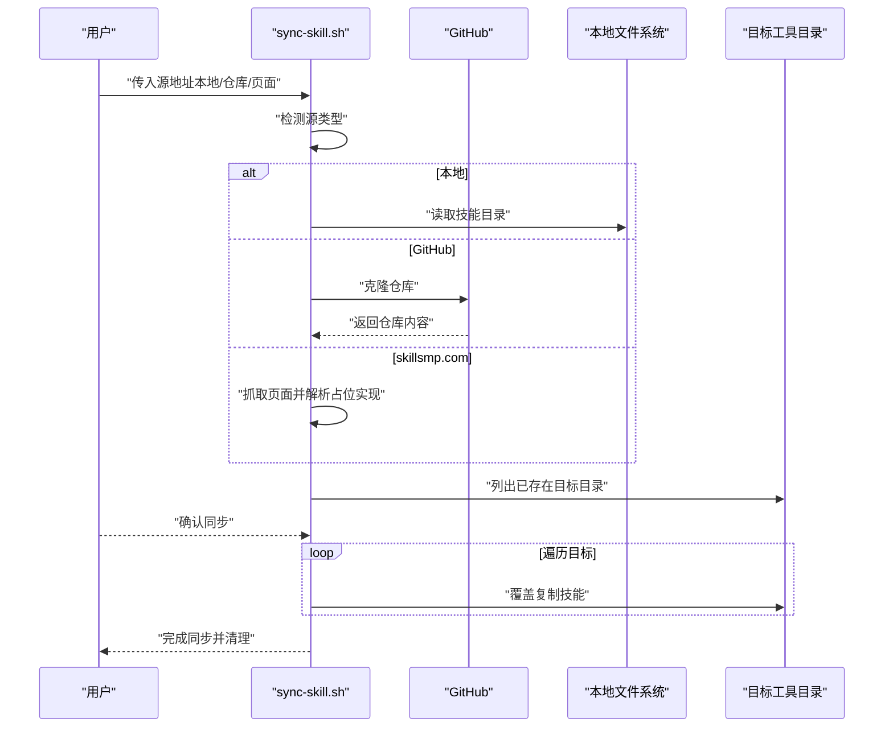
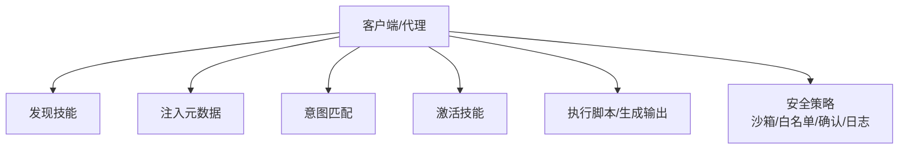

# 什么是技能

<cite>
**本文引用的文件**
- [README.md](file://README.md)
- [template/SKILL.md](file://template/SKILL.md)
- [spec/skill-authoring.mdx](file://spec/skill-authoring.mdx)
- [spec/skill-client-integration.mdx](file://spec/skill-client-integration.mdx)
- [spec/agent-skills-spec.mdx](file://spec/agent-skills-spec.mdx)
- [skills/docx/SKILL.md](file://skills/docx/SKILL.md)
- [skills/pdf/SKILL.md](file://skills/pdf/SKILL.md)
- [skills/pptx/SKILL.md](file://skills/pptx/SKILL.md)
- [skills/sync-skills/SKILL.md](file://skills/sync-skills/SKILL.md)
- [skills/sync-skills/sync-skill.sh](file://skills/sync-skills/sync-skill.sh)
- [skills/skill-creator/SKILL.md](file://skills/skill-creator/SKILL.md)
- [skills/skill-creator/scripts/init_skill.py](file://skills/skill-creator/scripts/init_skill.py)
- [skills/skill-creator/scripts/package_skill.py](file://skills/skill-creator/scripts/package_skill.py)
- [skills/skill-creator/scripts/quick_validate.py](file://skills/skill-creator/scripts/quick_validate.py)
- [skills/pdf/forms.md](file://skills/pdf/forms.md)
</cite>

## 目录
1. [引言](#引言)
2. [项目结构](#项目结构)
3. [核心组件](#核心组件)
4. [架构总览](#架构总览)
5. [详细组件分析](#详细组件分析)
6. [依赖关系分析](#依赖关系分析)
7. [性能考量](#性能考量)
8. [故障排查指南](#故障排查指南)
9. [结论](#结论)
10. [附录](#附录)

## 引言
技能是面向 Claude 的“可装载能力包”，它通过一组结构化的说明、脚本与资源，让 Claude 能在特定任务上更稳定、可复现地完成工作。技能系统强调“按需加载”的渐进披露机制：启动时仅加载技能元数据（名称与描述），当用户任务与技能匹配时才把完整说明与资源拉入上下文，从而在有限的上下文窗口内最大化扩展能力。

技能适用于三类场景：
- 重复性工作：如批量处理 PDF、Word、PPTX 文档，自动提取文本、表格、表单字段，或生成报告。
- 专业任务执行：如法律/财务/合规领域的格式化文档编辑、带批注的审阅流程、严格的 OOXML 编辑。
- 自动化流程：如从本地文件夹、GitHub 仓库或第三方页面同步技能到多款 AI 编程工具目录，统一分发与更新。

## 项目结构
该仓库包含三类内容：
- 技能示例：skills 目录下覆盖创意设计、开发技术、企业沟通与文档处理等主题的技能。
- 规范与文档：spec 目录提供技能格式、客户端集成与作者最佳实践的权威说明。
- 模板与工具：template 提供标准化的 SKILL.md 模板；skills/skill-creator 提供初始化、打包与校验工具；skills/sync-skills 提供跨工具目录的同步脚本。

图示来源
- [README.md](file://README.md#L24-L27)
- [spec/agent-skills-spec.mdx](file://spec/agent-skills-spec.mdx#L8-L19)
- [skills/skill-creator/SKILL.md](file://skills/skill-creator/SKILL.md#L47-L62)

章节来源
- [README.md](file://README.md#L12-L27)
- [spec/agent-skills-spec.mdx](file://spec/agent-skills-spec.mdx#L8-L19)

## 核心组件
- SKILL.md：技能的“说明书”。包含 YAML 前言（name、description 等）与正文说明。前言用于发现与匹配，正文仅在激活时加载。
- 可选资源目录：
  - scripts/：可执行脚本（Python/Bash/JS 等），适合重复性强、确定性高的操作。
  - references/：按需加载的参考文档（如 API 文档、领域知识、工作流细节）。
  - assets/：输出使用的静态资源（模板、图标、字体、样例文件）。
- 渐进披露：启动时仅加载元数据（约 100 字），激活后加载 SKILL.md（建议小于 5000 字），再按需加载资源文件。
- 客户端集成：支持两类集成方式——文件系统型代理（具备计算机环境，直接读取文件）与工具型代理（通过工具触发技能与访问资源）。

章节来源
- [spec/skill-authoring.mdx](file://spec/skill-authoring.mdx#L16-L26)
- [spec/agent-skills-spec.mdx](file://spec/agent-skills-spec.mdx#L21-L229)
- [spec/skill-client-integration.mdx](file://spec/skill-client-integration.mdx#L9-L26)

## 架构总览
技能系统采用“发现-激活-执行”的三段式流程，结合“元数据→说明→资源”的渐进披露策略，既保证初始响应速度，又能在需要时提供足够的上下文与能力。

图示来源
- [spec/skill-client-integration.mdx](file://spec/skill-client-integration.mdx#L19-L25)
- [spec/skill-authoring.mdx](file://spec/skill-authoring.mdx#L16-L26)

章节来源
- [spec/skill-client-integration.mdx](file://spec/skill-client-integration.mdx#L17-L72)
- [spec/skill-authoring.mdx](file://spec/skill-authoring.mdx#L16-L26)

## 详细组件分析

### 组件一：技能定义与渐进披露
- 结构与约束：每个技能是一个目录，至少包含 SKILL.md；可选包含 scripts/、references/、assets/。前言字段受严格约束（长度、字符集、命名规则等）。
- 渐进披露模式：
  - 元数据：name、description（启动即加载）
  - 说明：SKILL.md 正文（激活时加载）
  - 资源：按需加载（scripts、references、assets）
- 设计原则：SKILL.md 保持精炼，复杂细节放入 references；脚本可不加载入上下文而直接执行，提高效率。

图示来源
- [spec/agent-skills-spec.mdx](file://spec/agent-skills-spec.mdx#L197-L206)
- [spec/skill-authoring.mdx](file://spec/skill-authoring.mdx#L16-L26)

章节来源
- [spec/agent-skills-spec.mdx](file://spec/agent-skills-spec.mdx#L21-L168)
- [spec/skill-authoring.mdx](file://spec/skill-authoring.mdx#L28-L55)

### 组件二：技能示例（PDF/DOCX/PPTX）
- PDF 技能：提供基础与高级操作（合并/拆分/旋转/加水印/OCR/加密）、命令行与 Python 库示例，并给出“下一步”参考链接。
- DOCX 技能：涵盖文本提取、原始 XML 访问、docx-js 新建文档、Document 库编辑、红lining 审阅流程与图像转换。
- PPTX 技能：涵盖文本提取、原始 XML 访问、HTML→PPTX 流程、OOXML 编辑、模板复用与占位符替换、缩略图与图像转换。

这些示例展示了：
- 明确的工作流决策树与步骤
- 对复杂任务的“渐进披露”组织（先概览，再深入细节）
- 将脚本与参考文档分离，减少上下文占用

章节来源
- [skills/pdf/SKILL.md](file://skills/pdf/SKILL.md#L1-L295)
- [skills/docx/SKILL.md](file://skills/docx/SKILL.md#L1-L197)
- [skills/pptx/SKILL.md](file://skills/pptx/SKILL.md#L1-L484)

### 组件三：技能创建与打包（skill-creator）
- 初始化：通过 init_skill.py 生成标准目录结构与模板 SKILL.md，便于快速起步。
- 校验：quick_validate.py 进行最小化校验（前言存在、字段类型与长度、命名规范等）。
- 打包：package_skill.py 将技能目录打包为 .skill 文件（zip），便于分发与安装。

图示来源
- [skills/skill-creator/SKILL.md](file://skills/skill-creator/SKILL.md#L202-L212)
- [skills/skill-creator/scripts/init_skill.py](file://skills/skill-creator/scripts/init_skill.py#L18-L103)
- [skills/skill-creator/scripts/quick_validate.py](file://skills/skill-creator/scripts/quick_validate.py#L12-L86)
- [skills/skill-creator/scripts/package_skill.py](file://skills/skill-creator/scripts/package_skill.py#L19-L82)

章节来源
- [skills/skill-creator/SKILL.md](file://skills/skill-creator/SKILL.md#L202-L357)
- [skills/skill-creator/scripts/init_skill.py](file://skills/skill-creator/scripts/init_skill.py#L18-L103)
- [skills/skill-creator/scripts/quick_validate.py](file://skills/skill-creator/scripts/quick_validate.py#L12-L86)
- [skills/skill-creator/scripts/package_skill.py](file://skills/skill-creator/scripts/package_skill.py#L19-L82)

### 组件四：技能同步（sync-skills）
- 场景：将技能从本地文件夹、GitHub 仓库或 skillsmp.com 页面同步到多个 AI 编程工具的技能目录。
- 流程：检测来源类型 → 准备技能内容 → 列出已存在的目标目录 → 用户确认 → 执行复制/克隆 → 清理临时文件。
- 策略：覆盖式同步，冲突时直接覆盖并记录日志；对 GitHub 支持子目录查找；对 skillsmp.com 提供解析框架。

图示来源
- [skills/sync-skills/SKILL.md](file://skills/sync-skills/SKILL.md#L128-L144)
- [skills/sync-skills/sync-skill.sh](file://skills/sync-skills/sync-skill.sh#L27-L261)

章节来源
- [skills/sync-skills/SKILL.md](file://skills/sync-skills/SKILL.md#L1-L305)
- [skills/sync-skills/sync-skill.sh](file://skills/sync-skills/sync-skill.sh#L1-L264)

### 组件五：模板与最佳实践（template/SKILL.md）
- 模板提供了完整的结构建议：概览、使用场景、工作流、资源与目录指南、最佳实践、依赖项等。
- 强调“渐进披露”“简洁性原则”“上下文敏感”“精确指令”“错误处理”等设计原则，帮助作者写出高质量技能。

章节来源
- [template/SKILL.md](file://template/SKILL.md#L1-L59)

## 依赖关系分析
- 技能依赖于客户端的“发现-激活-执行”流程；客户端负责：
  - 发现：扫描配置目录中的技能
  - 元数据注入：将 name/description 注入系统提示
  - 匹配：根据用户任务与技能描述进行匹配
  - 激活：加载 SKILL.md 并按需加载资源
  - 执行：运行脚本或生成输出
- 安全考虑：脚本执行需沙箱化、白名单、用户确认与审计日志。

图示来源
- [spec/skill-client-integration.mdx](file://spec/skill-client-integration.mdx#L19-L25)
- [spec/skill-client-integration.mdx](file://spec/skill-client-integration.mdx#L74-L81)

章节来源
- [spec/skill-client-integration.mdx](file://spec/skill-client-integration.mdx#L19-L81)

## 性能考量
- 上下文窗口管理：通过渐进披露控制 token 使用量，避免一次性加载过多内容。
- 脚本优先：将重复性强、确定性高的逻辑下沉到脚本，减少上下文占用。
- 分层加载：SKILL.md 控制在 500 行以内，复杂细节放入 references；仅在需要时加载。
- 资源隔离：assets 不加载入上下文，仅在输出中使用，降低 token 成本。

章节来源
- [spec/agent-skills-spec.mdx](file://spec/agent-skills-spec.mdx#L197-L206)
- [skills/skill-creator/SKILL.md](file://skills/skill-creator/SKILL.md#L114-L127)

## 故障排查指南
- 常见问题与修复
  - 元数据缺失：确认 SKILL.md 前言存在且符合规范（name、description、长度与字符集）。
  - 命名不合法：name 必须为小写、数字与短横线组成，不可以短横线开头/结尾或包含连续短横线。
  - 描述过长或包含非法字符：description 最大 1024 字符，不得包含尖括号。
  - 资源引用错误：确保相对路径正确，避免深层嵌套引用链。
  - 同步冲突：覆盖式同步会直接覆盖已有同名技能，若需保留历史请自行管理版本控制。
- 排错工具
  - 使用 quick_validate.py 进行最小化校验，定位前言字段与命名问题。
  - 使用 package_skill.py 打包前自动校验，确保结构完整。
  - 使用 sync-skill.sh 的确认流程，避免误操作覆盖重要技能。

章节来源
- [skills/skill-creator/scripts/quick_validate.py](file://skills/skill-creator/scripts/quick_validate.py#L12-L86)
- [skills/skill-creator/scripts/package_skill.py](file://skills/skill-creator/scripts/package_skill.py#L47-L54)
- [skills/sync-skills/SKILL.md](file://skills/sync-skills/SKILL.md#L283-L304)

## 结论
技能系统通过“结构化说明 + 可执行脚本 + 按需资源”的组合，将 Claude 的通用能力扩展为可复现、可维护、可分发的专业能力。其核心在于：
- 渐进披露：在有限上下文中高效扩展能力
- 模块化组织：SKILL.md + scripts/references/assets 的清晰边界
- 可靠的生命周期：从创建、校验、打包到分发与同步
- 安全与可审计：脚本执行的安全策略与日志记录

对于初学者，建议从模板入手，先写 SKILL.md 的概览与工作流，再逐步补充脚本与参考文档；对于有经验的开发者，可在脚本与资源上做深度定制，并配合同步工具实现跨平台分发。

## 附录
- 使用场景与价值主张
  - 重复性工作：文档批量处理、表单填写、报表生成
  - 专业任务：合规审阅、格式化编辑、复杂 OOXML 操作
  - 自动化流程：技能分发与版本管理、跨工具目录同步
- 相关文件路径
  - 规范与作者指南：spec/agent-skills-spec.mdx、spec/skill-authoring.mdx、spec/skill-client-integration.mdx
  - 示例技能：skills/pdf/SKILL.md、skills/docx/SKILL.md、skills/pptx/SKILL.md、skills/sync-skills/SKILL.md
  - 创建与同步工具：skills/skill-creator/scripts/*、skills/sync-skills/sync-skill.sh
  - 模板：template/SKILL.md
  - PDF 表单填充参考：skills/pdf/forms.md