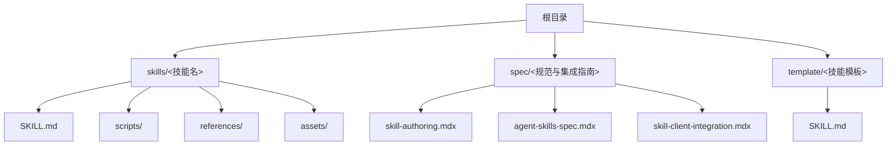
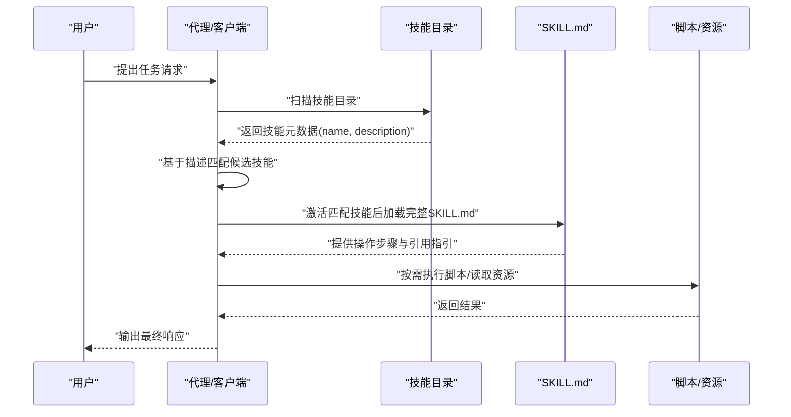
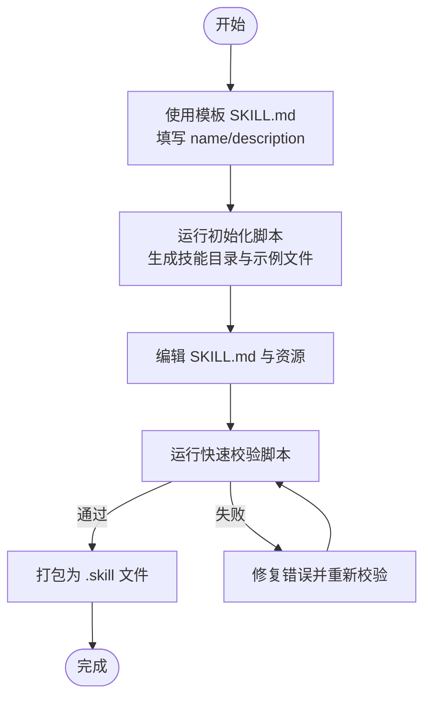
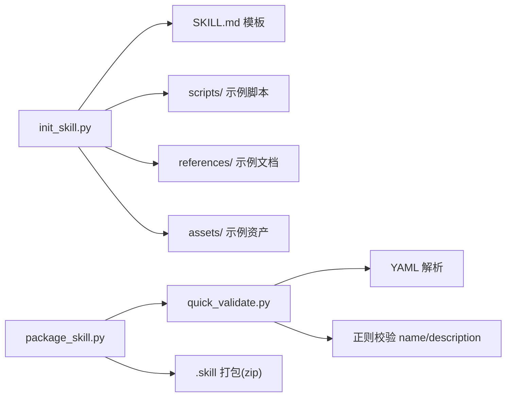

# 快速开始

<cite>
**本文引用的文件**
- [README.md](file://README.md)
- [template\SKILL.md](file://template/SKILL.md)
- [spec\skill-authoring.mdx](file://spec/skill-authoring.mdx)
- [spec\agent-skills-spec.mdx](file://spec/agent-skills-spec.mdx)
- [spec\skill-client-integration.mdx](file://spec/skill-client-integration.mdx)
- [skills\skill-creator\SKILL.md](file://skills/skill-creator/SKILL.md)
- [skills\skill-creator\scripts\init_skill.py](file://skills/skill-creator/scripts/init_skill.py)
- [skills\skill-creator\scripts\quick_validate.py](file://skills/skill-creator/scripts/quick_validate.py)
- [skills\skill-creator\scripts\package_skill.py](file://skills/skill-creator/scripts/package_skill.py)
- [skills\skill-creator\references\workflows.md](file://skills/skill-creator/references/workflows.md)
- [skills\skill-creator\references\output-patterns.md](file://skills/skill-creator/references/output-patterns.md)
- [skills\docx\SKILL.md](file://skills/docx/SKILL.md)
- [skills\pdf\SKILL.md](file://skills/pdf/SKILL.md)
- [skills\pptx\SKILL.md](file://skills/pptx/SKILL.md)
</cite>

## 目录
1. [简介](#简介)
2. [项目结构](#项目结构)
3. [核心组件](#核心组件)
4. [架构总览](#架构总览)
5. [详细组件分析](#详细组件分析)
6. [依赖关系分析](#依赖关系分析)
7. [性能考虑](#性能考虑)
8. [故障排除指南](#故障排除指南)
9. [结论](#结论)
10. [附录](#附录)

## 简介
本指南面向首次接触技能系统的用户，帮助你在 Claude Code、Claude.ai 和 Claude API 中快速完成技能的安装、配置、创建、测试与验证。你将学会：
- 准备环境与安装依赖
- 使用模板创建第一个简单技能
- 在不同平台中使用技能
- 基本的技能测试与验证方法
- 常见问题与故障排除

## 项目结构
该仓库包含示例技能、技能规范与技能创建工具。你可以直接参考示例技能了解最佳实践，或使用技能创建工具快速初始化新技能。

图表来源
- [README.md](file://README.md#L24-L27)
- [spec\agent-skills-spec.mdx](file://spec/agent-skills-spec.mdx#L8-L19)

章节来源
- [README.md](file://README.md#L24-L27)
- [spec\agent-skills-spec.mdx](file://spec/agent-skills-spec.mdx#L8-L19)

## 核心组件
- 技能规范与格式
  - 规范定义了技能的目录结构、SKILL.md 的 YAML frontmatter 字段、可选目录（scripts、references、assets）以及渐进披露机制。
- 技能创建工具链
  - 提供初始化脚本、快速校验脚本与打包脚本，帮助你从零构建、验证与分发技能。
- 示例技能
  - docx、pdf、pptx 等示例展示了如何组织 SKILL.md、引用脚本与资源，以及编写工作流与输出模式。

章节来源
- [spec\agent-skills-spec.mdx](file://spec/agent-skills-spec.mdx#L21-L168)
- [skills\skill-creator\SKILL.md](file://skills/skill-creator/SKILL.md#L47-L101)
- [skills\docx\SKILL.md](file://skills/docx/SKILL.md#L1-L197)
- [skills\pdf\SKILL.md](file://skills/pdf/SKILL.md#L1-L295)
- [skills\pptx\SKILL.md](file://skills/pptx/SKILL.md#L1-L484)

## 架构总览
技能系统采用“渐进披露”的加载策略：启动时仅加载每个技能的元数据（name、description），当任务匹配到技能描述时才加载完整 SKILL.md，按需访问脚本与资源。这种设计在保证上下文效率的同时，让技能具备扩展能力。

图表来源
- [spec\skill-authoring.mdx](file://spec/skill-authoring.mdx#L16-L26)
- [spec\skill-client-integration.mdx](file://spec/skill-client-integration.mdx#L19-L25)

章节来源
- [spec\skill-authoring.mdx](file://spec/skill-authoring.mdx#L16-L26)
- [spec\skill-client-integration.mdx](file://spec/skill-client-integration.mdx#L19-L25)

## 详细组件分析

### 安装与设置（环境准备、依赖安装、基本配置）
- Claude Code
  - 将仓库注册为插件市场并安装示例技能集，之后即可通过提及技能名称直接使用。
- Claude.ai
  - 已内置示例技能；也可上传自定义技能。
- Claude API
  - 支持使用预置技能与自定义技能，可通过 API 创建与管理技能。

章节来源
- [README.md](file://README.md#L29-L60)

### 创建你的第一个技能（使用模板与初始化脚本）
- 使用模板 SKILL.md 作为起点，填写 name 与 description，并补充概述、工作流与资源目录指南。
- 使用初始化脚本生成技能骨架，自动创建 SKILL.md 与示例资源目录（scripts、references、assets），便于后续定制。

图表来源
- [template\SKILL.md](file://template/SKILL.md#L1-L59)
- [skills\skill-creator\scripts\init_skill.py](file://skills/skill-creator/scripts/init_skill.py#L194-L270)
- [skills\skill-creator\scripts\quick_validate.py](file://skills/skill-creator/scripts/quick_validate.py#L12-L86)
- [skills\skill-creator\scripts\package_skill.py](file://skills/skill-creator/scripts/package_skill.py#L19-L82)

章节来源
- [template\SKILL.md](file://template/SKILL.md#L1-L59)
- [skills\skill-creator\scripts\init_skill.py](file://skills/skill-creator/scripts/init_skill.py#L194-L270)
- [skills\skill-creator\scripts\quick_validate.py](file://skills/skill-creator/scripts/quick_validate.py#L12-L86)
- [skills\skill-creator\scripts\package_skill.py](file://skills/skill-creator/scripts/package_skill.py#L19-L82)

### 在不同平台中使用技能
- Claude Code
  - 注册插件市场并安装示例技能；安装完成后直接提及技能名称即可触发。
- Claude.ai
  - 已内置示例技能；支持上传自定义技能。
- Claude API
  - 通过 API 创建与管理技能，支持上传自定义技能包。

章节来源
- [README.md](file://README.md#L29-L60)

### 基本技能测试与验证
- 快速校验
  - 检查 SKILL.md 是否存在、frontmatter 格式是否正确、name/description 是否满足规范。
- 打包验证
  - 打包前自动运行校验，确保命名、长度与字段约束符合规范。
- 示例技能参考
  - 参考 docx、pdf、pptx 等示例技能的工作流与资源组织方式，验证自身技能的可执行性与一致性。

章节来源
- [skills\skill-creator\scripts\quick_validate.py](file://skills/skill-creator/scripts/quick_validate.py#L12-L86)
- [skills\skill-creator\scripts\package_skill.py](file://skills/skill-creator/scripts/package_skill.py#L47-L54)
- [skills\docx\SKILL.md](file://skills/docx/SKILL.md#L1-L197)
- [skills\pdf\SKILL.md](file://skills/pdf/SKILL.md#L1-L295)
- [skills\pptx\SKILL.md](file://skills/pptx/SKILL.md#L1-L484)

### 技能规范与最佳实践
- 目录结构
  - 至少包含 SKILL.md；可选包含 scripts、references、assets。
- YAML frontmatter
  - 必填字段：name、description；可选字段：license、metadata、compatibility、allowed-tools。
  - name 与 description 的长度与字符约束，详见规范。
- 渐进披露
  - 元数据常驻上下文，SKILL.md 在激活时加载，资源按需加载。
- 输出与工作流
  - 使用工作流模式与输出模板提升一致性与质量。

章节来源
- [spec\agent-skills-spec.mdx](file://spec/agent-skills-spec.mdx#L21-L168)
- [spec\agent-skills-spec.mdx](file://spec/agent-skills-spec.mdx#L47-L157)
- [spec\agent-skills-spec.mdx](file://spec/agent-skills-spec.mdx#L197-L218)
- [skills\skill-creator\references\workflows.md](file://skills/skill-creator/references/workflows.md#L1-L28)
- [skills\skill-creator\references\output-patterns.md](file://skills/skill-creator/references/output-patterns.md#L1-L83)

## 依赖关系分析
技能创建工具链内部依赖关系如下：

图表来源
- [skills\skill-creator\scripts\init_skill.py](file://skills/skill-creator/scripts/init_skill.py#L189-L270)
- [skills\skill-creator\scripts\quick_validate.py](file://skills/skill-creator/scripts/quick_validate.py#L12-L86)
- [skills\skill-creator\scripts\package_skill.py](file://skills/skill-creator/scripts/package_skill.py#L19-L82)

章节来源
- [skills\skill-creator\scripts\init_skill.py](file://skills/skill-creator/scripts/init_skill.py#L189-L270)
- [skills\skill-creator\scripts\quick_validate.py](file://skills/skill-creator/scripts/quick_validate.py#L12-L86)
- [skills\skill-creator\scripts\package_skill.py](file://skills/skill-creator/scripts/package_skill.py#L19-L82)

## 性能考虑
- 控制上下文占用
  - SKILL.md 主体建议保持精炼，避免超过 500 行；将详细内容拆分到 references/ 并在 SKILL.md 中按需引用。
- 按需加载资源
  - scripts/ 与 assets/ 不会进入上下文窗口，仅在执行或使用时访问，有助于降低 token 消耗。
- 选择合适的自由度
  - 对于脆弱或高重复的任务，使用低自由度（具体脚本）；对于需要灵活性的场景，使用高自由度（文本指令）。

章节来源
- [spec\agent-skills-spec.mdx](file://spec/agent-skills-spec.mdx#L197-L218)
- [skills\skill-creator\SKILL.md](file://skills/skill-creator/SKILL.md#L25-L46)

## 故障排除指南
- frontmatter 缺失或格式错误
  - 确保 SKILL.md 顶部包含 YAML frontmatter，且 name 与 description 字段齐全。
- name/description 不符合规范
  - name 仅允许小写字母、数字与连字符，不可以连字符开头或结尾，不可有连续连字符；长度不超过 64；description 不得包含尖括号，长度不超过 1024。
- 目录结构不正确
  - 确保技能根目录与 name 字段一致；至少包含 SKILL.md；如需脚本与资源，请按需创建 scripts/、references/、assets/。
- 打包失败
  - 先运行快速校验修复错误后再尝试打包；检查资源路径与引用是否正确。

章节来源
- [skills\skill-creator\scripts\quick_validate.py](file://skills/skill-creator/scripts/quick_validate.py#L42-L86)
- [skills\skill-creator\scripts\package_skill.py](file://skills/skill-creator/scripts/package_skill.py#L47-L54)
- [spec\agent-skills-spec.mdx](file://spec/agent-skills-spec.mdx#L47-L157)

## 结论
通过本快速开始指南，你已掌握技能系统的安装与设置、模板使用、跨平台使用方法、基本测试与验证流程，以及常见问题的排查思路。建议在实际使用中结合示例技能与技能创建工具链，持续迭代优化技能结构与内容，确保在 Claude Code、Claude.ai 与 Claude API 中稳定高效地运行。

## 附录
- 示例技能参考
  - docx：文档创建、编辑与分析工作流
  - pdf：PDF 处理、表单填充与命令行工具
  - pptx：演示文稿创建、编辑与模板复用
- 技能作者指南
  - 渐进披露设计原则、工作流与输出模式的最佳实践

章节来源
- [skills\docx\SKILL.md](file://skills/docx/SKILL.md#L1-L197)
- [skills\pdf\SKILL.md](file://skills/pdf/SKILL.md#L1-L295)
- [skills\pptx\SKILL.md](file://skills/pptx/SKILL.md#L1-L484)
- [skills\skill-creator\references\workflows.md](file://skills/skill-creator/references/workflows.md#L1-L28)
- [skills\skill-creator\references\output-patterns.md](file://skills/skill-creator/references/output-patterns.md#L1-L83)