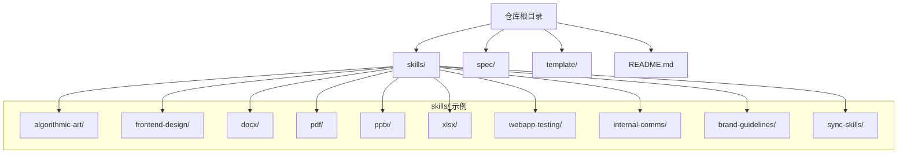
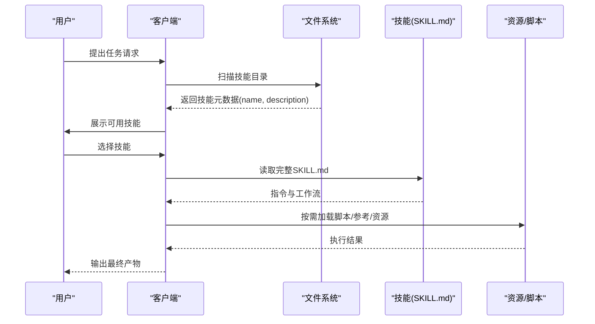
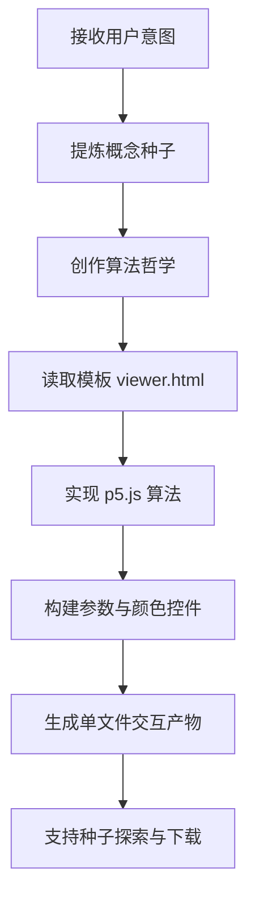
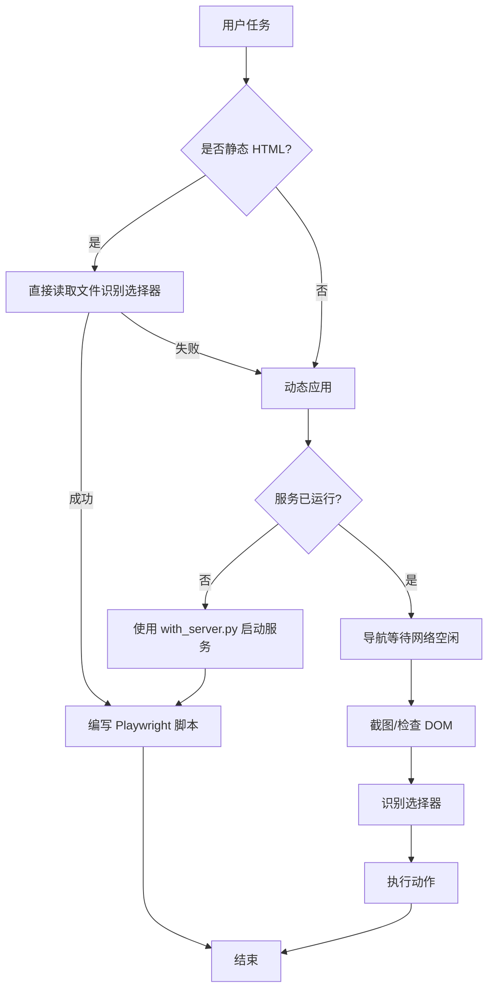
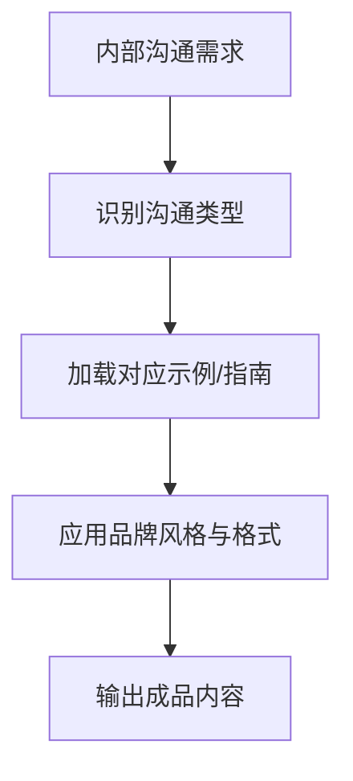
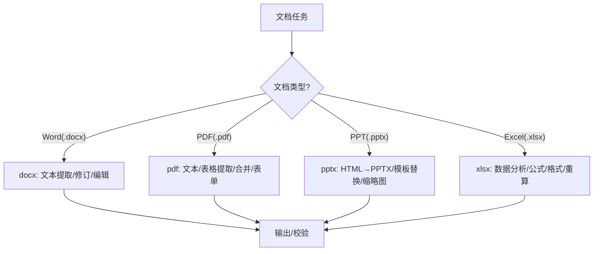
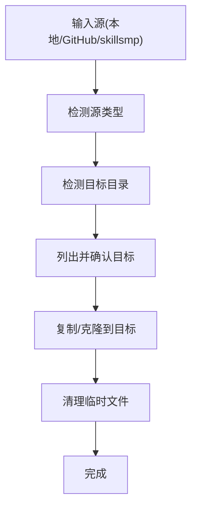
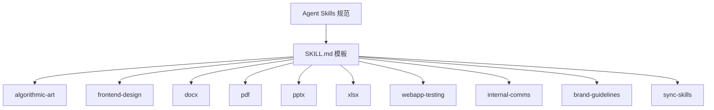

# 技能分类

<cite>
**本文引用的文件**
- [README.md](file://README.md)
- [template/SKILL.md](file://template/SKILL.md)
- [spec/skill-authoring.mdx](file://spec/skill-authoring.mdx)
- [spec/agent-skills-spec.mdx](file://spec/agent-skills-spec.mdx)
- [spec/skill-client-integration.mdx](file://spec/skill-client-integration.mdx)
- [skills/algorithmic-art/SKILL.md](file://skills/algorithmic-art/SKILL.md)
- [skills/frontend-design/SKILL.md](file://skills/frontend-design/SKILL.md)
- [skills/docx/SKILL.md](file://skills/docx/SKILL.md)
- [skills/pdf/SKILL.md](file://skills/pdf/SKILL.md)
- [skills/pptx/SKILL.md](file://skills/pptx/SKILL.md)
- [skills/xlsx/SKILL.md](file://skills/xlsx/SKILL.md)
- [skills/webapp-testing/SKILL.md](file://skills/webapp-testing/SKILL.md)
- [skills/internal-comms/SKILL.md](file://skills/internal-comms/SKILL.md)
- [skills/brand-guidelines/SKILL.md](file://skills/brand-guidelines/SKILL.md)
- [skills/sync-skills/SKILL.md](file://skills/sync-skills/SKILL.md)
</cite>

## 目录
1. [引言](#引言)
2. [项目结构](#项目结构)
3. [核心组件](#核心组件)
4. [架构总览](#架构总览)
5. [详细组件分析](#详细组件分析)
6. [依赖关系分析](#依赖关系分析)
7. [性能考量](#性能考量)
8. [故障排查指南](#故障排查指南)
9. [结论](#结论)
10. [附录](#附录)

## 引言
本仓库展示了基于 Agent Skills 规范的技能系统样例，涵盖创意设计、技术开发、企业应用与文档处理四类技能。每个技能以独立文件夹形式存在，包含一个用于加载与执行的 SKILL.md 文件以及可选的脚本、参考与资源目录。通过统一的元数据与工作流规范，技能系统能够帮助用户在不同领域快速定位并激活合适的技能，完成从创意生成到文档编辑、从前端界面构建到演示文稿与电子表格处理的多样化任务。

## 项目结构
- 根目录包含技能示例、规范说明与模板文件：
  - skills：各技能示例目录，每个技能以独立子目录存放，包含 SKILL.md 与可选的 scripts/references/assets
  - spec：Agent Skills 规范与集成指南
  - template：标准化的 SKILL.md 模板
  - README：项目概览与使用说明

图表来源
- [README.md](file://README.md#L24-L27)
- [spec/agent-skills-spec.mdx](file://spec/agent-skills-spec.mdx#L8-L19)

章节来源
- [README.md](file://README.md#L1-L95)
- [spec/agent-skills-spec.mdx](file://spec/agent-skills-spec.mdx#L8-L19)

## 核心组件
- 技能元数据与格式
  - SKILL.md 必须包含 YAML frontmatter（name、description）与 Markdown 指令体
  - 支持可选字段：license、compatibility、metadata、allowed-tools
  - 推荐采用渐进式披露：启动时仅加载元数据，激活后再加载完整指令
- 技能目录结构
  - 必需：SKILL.md
  - 可选：scripts/（可执行脚本）、references/（参考文档）、assets/（静态资源）
- 客户端集成要点
  - 发现：扫描配置目录发现技能
  - 加载元数据：解析 frontmatter
  - 注入上下文：将可用技能清单注入系统提示
  - 安全：对脚本执行进行沙箱、白名单、确认与审计

章节来源
- [spec/agent-skills-spec.mdx](file://spec/agent-skills-spec.mdx#L21-L55)
- [spec/agent-skills-spec.mdx](file://spec/agent-skills-spec.mdx#L170-L196)
- [spec/skill-client-integration.mdx](file://spec/skill-client-integration.mdx#L19-L72)

## 架构总览
技能系统采用“发现—加载—匹配—激活—执行”的流水线，结合渐进式披露控制上下文开销，并通过可选脚本与资源目录扩展能力。

图表来源
- [spec/skill-client-integration.mdx](file://spec/skill-client-integration.mdx#L19-L72)
- [spec/agent-skills-spec.mdx](file://spec/agent-skills-spec.mdx#L197-L206)

## 详细组件分析

### 创意设计技能
- 特点
  - 强调算法美学与交互探索，鼓励通过参数化与噪声系统生成可探索的艺术作品
  - 以模板为起点，强调一致的 UI 结构与品牌风格，同时允许算法层面的创造性表达
- 应用场景
  - 生成可交互的算法艺术（粒子系统、场动力学、递归结构等）
  - 将计算哲学转化为可视化体验，支持种子导航与参数调节
- 技术栈
  - 前端：p5.js（CDN 引入）、HTML/CSS/JavaScript
  - 模板与最佳实践：viewer.html、generator_template.js
- 代表性技能
  - algorithmic-art：从“算法哲学”到“交互式 HTML 产物”的完整工作流
- 功能概述
  - 算法哲学创作、参数化设计、种子导航、一键生成与导出

图表来源
- [skills/algorithmic-art/SKILL.md](file://skills/algorithmic-art/SKILL.md#L101-L383)

章节来源
- [skills/algorithmic-art/SKILL.md](file://skills/algorithmic-art/SKILL.md#L1-L405)

### 技术开发技能
- 特点
  - 面向本地 Web 应用测试与自动化，强调“侦察—行动”模式与浏览器截图、日志捕获
  - 提供服务器生命周期管理脚本，简化多服务协作场景
- 应用场景
  - 自动化 UI 测试、调试前端行为、验证交互元素
- 技术栈
  - Playwright（同步 API）、Python 辅助脚本（with_server.py）
- 代表性技能
  - webapp-testing：Playwright 测试与服务器管理
- 功能概述
  - 静态 HTML 与动态应用的不同处理路径、服务器编排、选择器识别与断言

图表来源
- [skills/webapp-testing/SKILL.md](file://skills/webapp-testing/SKILL.md#L16-L33)

章节来源
- [skills/webapp-testing/SKILL.md](file://skills/webapp-testing/SKILL.md#L1-L96)

### 企业应用技能
- 特点
  - 围绕企业内部沟通与品牌一致性，提供格式化与风格化能力
  - 内部通讯模板化，强调可复用的结构与语气
- 应用场景
  - 内部周报、领导层更新、FAQ、3P 更新、公司通讯等
- 技术栈
  - 基于指南文件的结构化写作，强调格式与语气的一致性
- 代表性技能
  - internal-comms：按类型加载相应示例与指南
  - brand-guidelines：品牌色彩与字体的自动应用
- 功能概述
  - 按类型选择模板、加载指南、输出符合企业风格的内容

图表来源
- [skills/internal-comms/SKILL.md](file://skills/internal-comms/SKILL.md#L17-L29)
- [skills/brand-guidelines/SKILL.md](file://skills/brand-guidelines/SKILL.md#L15-L74)

章节来源
- [skills/internal-comms/SKILL.md](file://skills/internal-comms/SKILL.md#L1-L33)
- [skills/brand-guidelines/SKILL.md](file://skills/brand-guidelines/SKILL.md#L1-L74)

### 文档处理技能
- 特点
  - 面向专业文档的创建、编辑与分析，强调跟踪修订、注释与格式保留
  - 提供多种工具链（pandoc、OOXML 解包/打包、docx-js、reportlab 等）以覆盖不同任务
- 应用场景
  - Word 文档文本提取、修订跟踪、批量化修改、转图片校验
  - PDF 文档文本/表格提取、合并拆分、表单填充、水印与加密
  - PowerPoint 演示文稿的 HTML→PPTX 转换、模板复用与批量替换
  - Excel 表格的数据分析、公式建模、格式规范与公式重算
- 技术栈
  - Python（pandas、openpyxl、defusedxml、pypdf、pdfplumber 等）
  - Node.js（docx、pptxgenjs、playwright、sharp 等）
  - 命令行工具（LibreOffice、Poppler、pdftotext、qpdf 等）
- 代表性技能
  - docx：OOXML 编辑、跟踪修订、批处理策略
  - pdf：文本/表格提取、命令行工具、表单处理参考
  - pptx：HTML→PPTX 转换、模板库存与替换、缩略图校验
  - xlsx：财务模型颜色编码、格式规范、公式重算与错误排查
- 功能概述
  - 文档读取与分析、新建与编辑、修订与注释、转换与导出、质量校验

图表来源
- [skills/docx/SKILL.md](file://skills/docx/SKILL.md#L13-L31)
- [skills/pdf/SKILL.md](file://skills/pdf/SKILL.md#L9-L13)
- [skills/pptx/SKILL.md](file://skills/pptx/SKILL.md#L9-L13)
- [skills/xlsx/SKILL.md](file://skills/xlsx/SKILL.md#L63-L68)

章节来源
- [skills/docx/SKILL.md](file://skills/docx/SKILL.md#L1-L197)
- [skills/pdf/SKILL.md](file://skills/pdf/SKILL.md#L1-L295)
- [skills/pptx/SKILL.md](file://skills/pptx/SKILL.md#L1-L484)
- [skills/xlsx/SKILL.md](file://skills/xlsx/SKILL.md#L1-L289)

### 技能分发与同步技能
- 特点
  - 支持从本地目录、GitHub 仓库、skillsmp.com 页面同步技能到多个 AI 编辑器的技能目录
  - 自动检测目标目录并进行用户确认后同步，覆盖现有同名技能
- 应用场景
  - 在多工具间批量分发技能、快速复制他人作品
- 技术栈
  - Shell 脚本与 Git/HTTP 工具
- 代表性技能
  - sync-skills：跨平台技能同步与冲突处理策略
- 功能概述
  - 源类型识别、目标目录检测、确认同步、覆盖策略与清理

图表来源
- [skills/sync-skills/SKILL.md](file://skills/sync-skills/SKILL.md#L34-L40)
- [skills/sync-skills/SKILL.md](file://skills/sync-skills/SKILL.md#L128-L140)

章节来源
- [skills/sync-skills/SKILL.md](file://skills/sync-skills/SKILL.md#L1-L305)

## 依赖关系分析
- 组件内聚与耦合
  - 每个技能围绕单一职责（如算法艺术、Web 测试、文档处理）构建，内聚度高
  - 通过 SKILL.md 的渐进式披露降低跨技能耦合，仅在激活时加载完整指令
- 外部依赖
  - 文档处理类技能依赖 Python/Node 工具链与系统工具（LibreOffice、Poppler、pandoc 等）
  - 前端与演示类技能依赖浏览器渲染与矢量图像处理工具
- 安全与审计
  - 脚本执行需沙箱化、白名单与用户确认，记录执行日志便于审计

图表来源
- [spec/agent-skills-spec.mdx](file://spec/agent-skills-spec.mdx#L21-L55)
- [template/SKILL.md](file://template/SKILL.md#L1-L59)

章节来源
- [spec/agent-skills-spec.mdx](file://spec/agent-skills-spec.mdx#L197-L206)
- [spec/skill-client-integration.mdx](file://spec/skill-client-integration.mdx#L74-L82)

## 性能考量
- 上下文控制
  - 元数据（name/description）轻量加载，完整指令按需加载，资源按需访问
- 代码与数据处理
  - 文档处理优先使用面向任务的工具链（pandas、pypdf、pdfplumber、openpyxl），避免重复解析
  - 对大文件采用分页/分片处理与增量校验
- 并发与稳定性
  - 多服务场景使用服务器生命周期管理脚本，减少启动与切换成本
- 可维护性
  - 通过模板与参考文件实现知识的渐进式披露，降低一次性上下文压力

## 故障排查指南
- 常见问题与修复
  - 文档处理：跟踪修订与注释未生效、XML 结构不一致、格式丢失
    - 检查 OOXML 解包/打包流程、使用参考文档核对节点结构
  - PDF 处理：OCR 识别失败、表单字段无法提取、加密文档解密
    - 确认依赖工具安装、调整分辨率与页面范围、检查密码与权限
  - PPTX 转换：布局错位、字体与颜色不匹配、缩略图异常
    - 使用模板库存与替换脚本、确保字体预装、验证渲染质量
  - Excel 公式：#REF!、#DIV/0!、#VALUE! 等错误
    - 使用 recalc.py 进行重算与错误定位，逐项修正引用与边界条件
  - Web 测试：DOM 未就绪、选择器失效
    - 确保等待网络空闲后再检查 DOM，使用稳定的选择器与断言
- 安全建议
  - 对脚本执行进行沙箱与白名单控制，必要时要求用户确认
  - 记录脚本执行日志，便于回溯与审计

章节来源
- [skills/docx/SKILL.md](file://skills/docx/SKILL.md#L75-L154)
- [skills/pdf/SKILL.md](file://skills/pdf/SKILL.md#L211-L295)
- [skills/pptx/SKILL.md](file://skills/pptx/SKILL.md#L408-L484)
- [skills/xlsx/SKILL.md](file://skills/xlsx/SKILL.md#L204-L289)
- [skills/webapp-testing/SKILL.md](file://skills/webapp-testing/SKILL.md#L78-L90)

## 结论
本技能系统以统一的 Agent Skills 规范为基础，围绕创意设计、技术开发、企业应用与文档处理四大方向提供了可复用的工作流与最佳实践。通过模板化的 SKILL.md、渐进式披露与可选脚本资源，用户可以快速定位并激活适合的技能，高效完成从算法艺术到企业文档的多样化任务。建议在实际部署中重视安全与上下文控制，结合参考文件与脚本工具，持续优化工作流与质量保障机制。

## 附录
- 设计理念与组织原则
  - 渐进式披露：最小化初始上下文，按需加载指令与资源
  - 模块化与可组合：每个技能聚焦单一能力，可与其他技能组合使用
  - 可审计与可维护：清晰的元数据、参考文件与脚本，便于审查与迭代
- 快速选择指南
  - 创意设计：algorithmic-art、frontend-design
  - 技术开发：webapp-testing
  - 企业应用：internal-comms、brand-guidelines
  - 文档处理：docx、pdf、pptx、xlsx
  - 分发同步：sync-skills

章节来源
- [README.md](file://README.md#L12-L27)
- [template/SKILL.md](file://template/SKILL.md#L46-L51)
- [spec/skill-authoring.mdx](file://spec/skill-authoring.mdx#L16-L26)