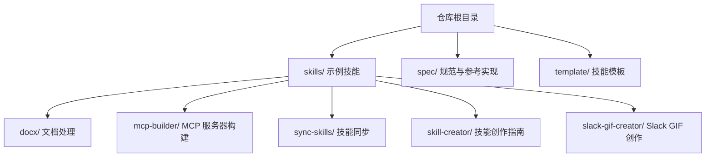
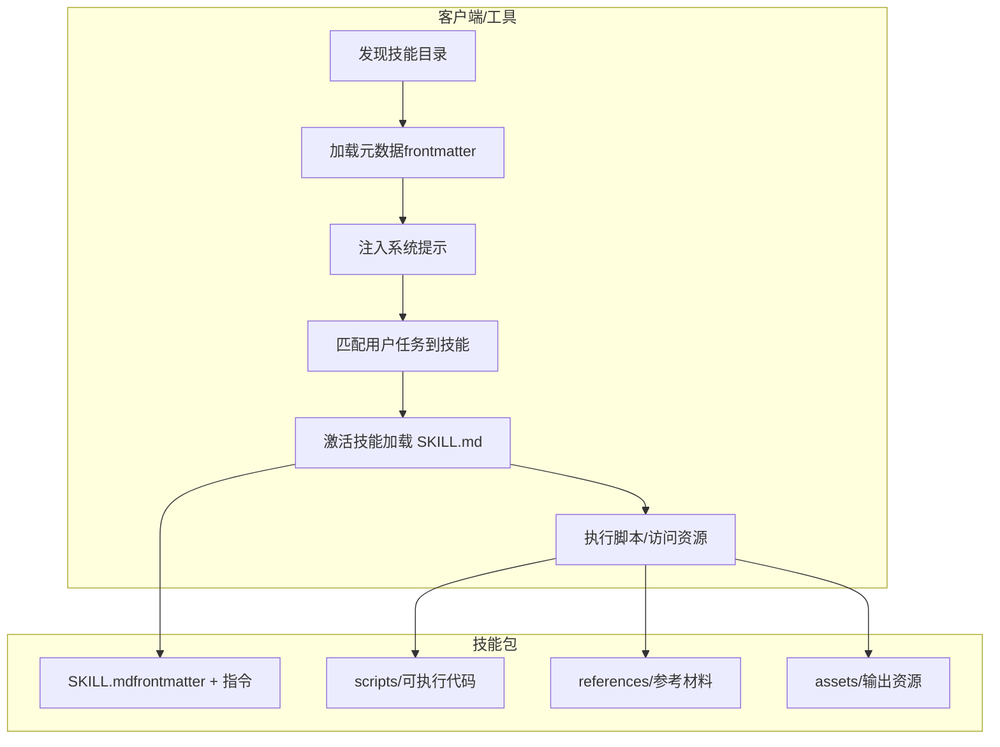
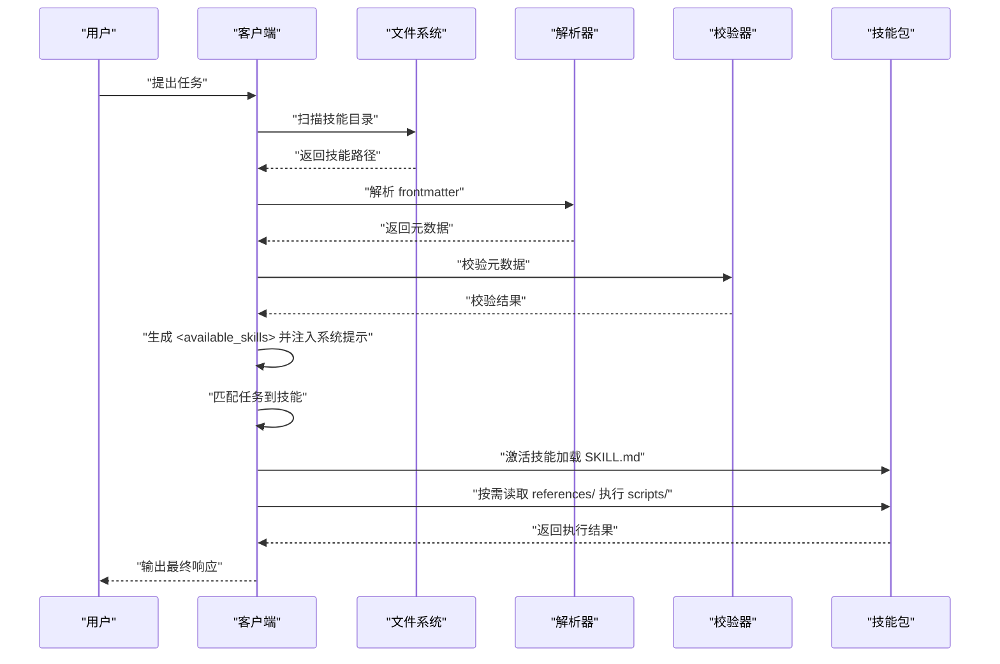
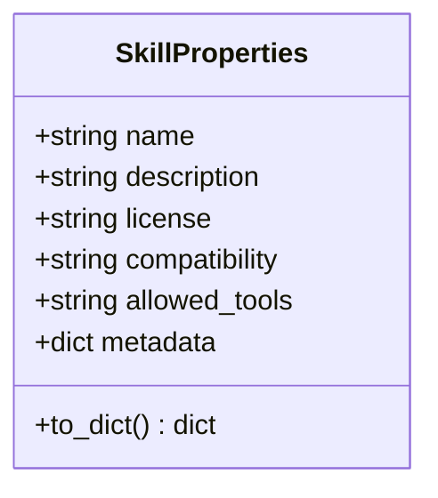
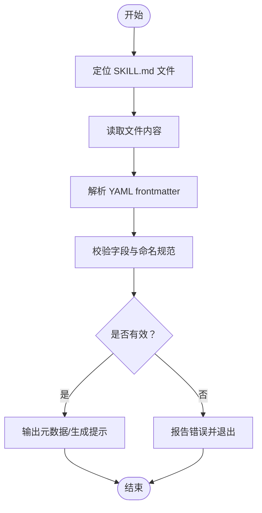
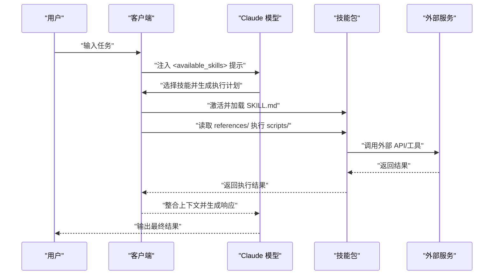
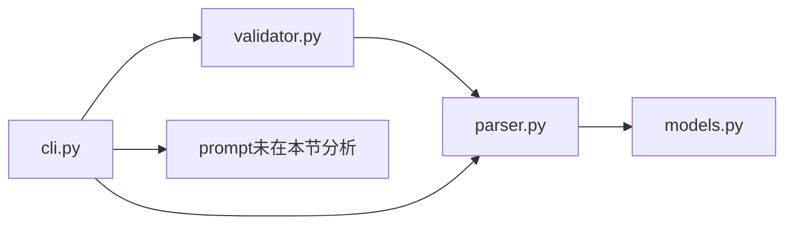

# 架构概览

<cite>
**本文引用的文件**
- [README.md](file://README.md)
- [template/SKILL.md](file://template/SKILL.md)
- [skills/docx/SKILL.md](file://skills/docx/SKILL.md)
- [skills/mcp-builder/SKILL.md](file://skills/mcp-builder/SKILL.md)
- [skills/sync-skills/SKILL.md](file://skills/sync-skills/SKILL.md)
- [skills/skill-creator/SKILL.md](file://skills/skill-creator/SKILL.md)
- [skills/slack-gif-creator/SKILL.md](file://skills/slack-gif-creator/SKILL.md)
- [spec/skill-authoring.mdx](file://spec/skill-authoring.mdx)
- [spec/skill-client-integration.mdx](file://spec/skill-client-integration.mdx)
- [spec/skills-ref/README.md](file://spec/skills-ref/README.md)
- [spec/skills-ref/src/skills_ref/models.py](file://spec/skills-ref/src/skills_ref/models.py)
- [spec/skills-ref/src/skills_ref/parser.py](file://spec/skills-ref/src/skills_ref/parser.py)
- [spec/skills-ref/src/skills_ref/validator.py](file://spec/skills-ref/src/skills_ref/validator.py)
- [spec/skills-ref/src/skills_ref/cli.py](file://spec/skills-ref/src/skills_ref/cli.py)
</cite>

## 目录
1. [引言](#引言)
2. [项目结构](#项目结构)
3. [核心组件](#核心组件)
4. [架构总览](#架构总览)
5. [详细组件分析](#详细组件分析)
6. [依赖分析](#依赖分析)
7. [性能考虑](#性能考虑)
8. [故障排查指南](#故障排查指南)
9. [结论](#结论)
10. [附录](#附录)

## 引言
本文件面向技能系统（Agent Skills）的架构设计与实现，聚焦以下主题：
- 技能发现机制与加载流程
- 执行环境与资源管理
- 技能与 Claude 助手的交互模式与数据流
- 技能的模块化设计与可扩展性
- 系统边界与与外部服务的集成点
- 系统架构图与组件关系说明

技能系统以“轻量、开放、可移植”的格式组织，通过统一的元数据与指令文件，实现对 Claude 的能力扩展，并支持在多种客户端与工具中复用。

## 项目结构
仓库采用按功能域划分的目录结构，包含示例技能、规范与参考实现库：
- skills：示例技能集合，每个技能为独立子目录，包含 SKILL.md 与可选的 scripts/references/assets
- spec：Agent Skills 规范与参考实现（skills-ref）
- template：技能模板，用于新技能初始化

图表来源
- [README.md](file://README.md#L24-L27)
- [skills/docx/SKILL.md](file://skills/docx/SKILL.md#L1-L5)
- [skills/mcp-builder/SKILL.md](file://skills/mcp-builder/SKILL.md#L1-L5)
- [skills/sync-skills/SKILL.md](file://skills/sync-skills/SKILL.md#L1-L5)
- [skills/skill-creator/SKILL.md](file://skills/skill-creator/SKILL.md#L1-L5)
- [skills/slack-gif-creator/SKILL.md](file://skills/slack-gif-creator/SKILL.md#L1-L5)

章节来源
- [README.md](file://README.md#L24-L27)

## 核心组件
- 技能包（Skill Package）
  - 结构：以 SKILL.md 为核心，可选 scripts/references/assets
  - 元数据：YAML frontmatter（name、description 等）
  - 指令：Markdown 主体，定义工作流与最佳实践
- 规范与参考实现（skills-ref）
  - 解析器：解析 SKILL.md frontmatter，提取元数据
  - 校验器：校验字段合法性、命名规范与长度限制
  - CLI：提供 validate/read-properties/to-prompt 命令
  - 提示生成：输出 <available_skills> XML，供模型系统提示注入
- 客户端集成（Client Integration）
  - 发现与加载：扫描配置目录，仅加载 frontmatter 元数据
  - 注入提示：将可用技能列表注入系统提示（推荐 XML 格式）
  - 执行：按需加载 SKILL.md 与资源，执行脚本或访问资产

章节来源
- [spec/skill-authoring.mdx](file://spec/skill-authoring.mdx#L6-L26)
- [spec/skill-client-integration.mdx](file://spec/skill-client-integration.mdx#L19-L25)
- [spec/skills-ref/README.md](file://spec/skills-ref/README.md#L53-L86)
- [spec/skills-ref/src/skills_ref/parser.py](file://spec/skills-ref/src/skills_ref/parser.py#L67-L113)
- [spec/skills-ref/src/skills_ref/validator.py](file://spec/skills-ref/src/skills-ref/validator.py#L150-L178)

## 架构总览
技能系统围绕“发现—加载—匹配—激活—执行—资源管理”形成闭环，客户端在启动时仅加载元数据，按需激活技能并执行脚本与资源。

图表来源
- [spec/skill-client-integration.mdx](file://spec/skill-client-integration.mdx#L19-L25)
- [spec/skill-authoring.mdx](file://spec/skill-authoring.mdx#L16-L26)
- [skills/docx/SKILL.md](file://skills/docx/SKILL.md#L54-L73)

## 详细组件分析

### 组件一：技能发现与加载流程
- 发现：扫描配置目录，定位包含 SKILL.md 的技能包
- 加载元数据：仅解析 frontmatter（name、description、license、metadata 等）
- 注入提示：生成 <available_skills> XML，包含技能名、描述与位置信息
- 匹配：根据用户请求与技能描述进行语义/关键词匹配
- 激活：命中后加载 SKILL.md 主体内容
- 执行：按需读取 references 与执行 scripts，访问 assets

图表来源
- [spec/skill-client-integration.mdx](file://spec/skill-client-integration.mdx#L27-L71)
- [spec/skills-ref/src/skills_ref/parser.py](file://spec/skills-ref/src/skills_ref/parser.py#L67-L113)
- [spec/skills-ref/src/skills_ref/validator.py](file://spec/skills-ref/src/skills-ref/validator.py#L150-L178)

章节来源
- [spec/skill-client-integration.mdx](file://spec/skill-client-integration.mdx#L19-L71)
- [spec/skills-ref/src/skills_ref/parser.py](file://spec/skills-ref/src/skills_ref/parser.py#L12-L27)
- [spec/skills-ref/src/skills_ref/validator.py](file://spec/skills-ref/src/skills-ref/validator.py#L150-L178)

### 组件二：技能元数据与数据模型
- 元数据字段：name、description、license、compatibility、allowed-tools、metadata
- 数据模型：SkillProperties，提供 to_dict 输出，便于 CLI 与提示生成
- 字段约束：长度限制、字符集与命名规则、必需字段校验

图表来源
- [spec/skills-ref/src/skills-ref/models.py](file://spec/skills-ref/src/skills_ref/models.py#L7-L40)

章节来源
- [spec/skills-ref/src/skills-ref/models.py](file://spec/skills-ref/src/skills-ref/models.py#L7-L40)
- [spec/skills-ref/src/skills_ref/validator.py](file://spec/skills-ref/src/skills-ref/validator.py#L14-L22)

### 组件三：解析与校验流程
- 解析：find_skill_md 定位 SKILL.md；parse_frontmatter 解析 YAML frontmatter
- 校验：validate 与 validate_metadata 对字段完整性、命名规范、长度限制进行检查
- CLI：skills-ref 提供 validate、read-properties、to-prompt 三个命令

图表来源
- [spec/skills-ref/src/skills_ref/parser.py](file://spec/skills-ref/src/skills_ref/parser.py#L12-L27)
- [spec/skills-ref/src/skills_ref/parser.py](file://spec/skills-ref/src/skills_ref/parser.py#L30-L64)
- [spec/skills-ref/src/skills_ref/validator.py](file://spec/skills-ref/src/skills-ref/validator.py#L150-L178)
- [spec/skills-ref/src/skills_ref/cli.py](file://spec/skills-ref/src/skills_ref/cli.py#L27-L51)

章节来源
- [spec/skills-ref/src/skills_ref/parser.py](file://spec/skills-ref/src/skills_ref/parser.py#L67-L113)
- [spec/skills-ref/src/skills-ref/validator.py](file://spec/skills-ref/src/skills-ref/validator.py#L25-L147)
- [spec/skills-ref/src/skills-ref/cli.py](file://spec/skills-ref/src/skills_ref/cli.py#L27-L101)

### 组件四：与 Claude 助手的交互模式与数据流
- 元数据注入：客户端将可用技能列表注入系统提示，帮助模型在推理时选择合适技能
- 激活触发：当用户请求与技能描述匹配时，客户端加载 SKILL.md 并按指令执行
- 资源访问：按需读取 references 中的参考文档，执行 scripts 中的脚本，使用 assets 中的模板/资源
- 外部服务：技能可通过脚本对接外部 API、工具链或服务（如 MCP 服务器）

图表来源
- [spec/skill-client-integration.mdx](file://spec/skill-client-integration.mdx#L49-L71)
- [skills/mcp-builder/SKILL.md](file://skills/mcp-builder/SKILL.md#L1-L10)

章节来源
- [spec/skill-client-integration.mdx](file://spec/skill-client-integration.mdx#L49-L71)
- [skills/mcp-builder/SKILL.md](file://skills/mcp-builder/SKILL.md#L1-L10)

### 组件五：模块化设计与可扩展性
- 结构化模块：scripts（确定性脚本）、references（按需加载参考）、assets（输出资源）
- 渐进披露：frontmatter 元数据始终在上下文中，SKILL.md 主体仅在激活时加载，references 与 scripts 按需读取
- 可扩展性：支持多语言脚本（Python/Node.js/Bash 等），可接入任意外部服务与工具链
- 模板与脚手架：template 与 skill-creator 提供标准化初始化与打包流程

章节来源
- [spec/skill-authoring.mdx](file://spec/skill-authoring.mdx#L16-L26)
- [template/SKILL.md](file://template/SKILL.md#L41-L51)
- [skills/skill-creator/SKILL.md](file://skills/skill-creator/SKILL.md#L47-L101)

### 组件六：系统边界与集成点
- 系统边界
  - 技能包：仅包含 SKILL.md 与可选资源，无运行时依赖声明
  - 客户端：负责发现、加载、匹配、激活与执行
- 集成点
  - 文件系统接口：文件系统代理（filesystem-based agents）直接读取 SKILL.md 与资源
  - 工具接口：工具代理（tool-based agents）通过工具调用触发技能与资源访问
  - 外部服务：MCP 服务器、API、CLI 工具等，由技能脚本或客户端适配器接入

章节来源
- [spec/skill-client-integration.mdx](file://spec/skill-client-integration.mdx#L9-L16)
- [skills/mcp-builder/SKILL.md](file://skills/mcp-builder/SKILL.md#L1-L10)

## 依赖分析
- 组件内聚与耦合
  - skills-ref 解析与校验逻辑内聚于 parser/validator，CLI 作为入口层，低耦合
  - 技能包与客户端通过统一的 frontmatter 接口解耦
- 外部依赖
  - YAML 解析（strictyaml）
  - CLI 框架（click）
  - 文件系统与路径操作（pathlib）

图表来源
- [spec/skills-ref/src/skills_ref/parser.py](file://spec/skills-ref/src/skills_ref/parser.py#L1-L10)
- [spec/skills-ref/src/skills_ref/validator.py](file://spec/skills-ref/src/skills_ref/validator.py#L1-L9)
- [spec/skills-ref/src/skills_ref/cli.py](file://spec/skills-ref/src/skills_ref/cli.py#L1-L13)

章节来源
- [spec/skills-ref/src/skills_ref/parser.py](file://spec/skills-ref/src/skills_ref/parser.py#L1-L10)
- [spec/skills-ref/src/skills-ref/validator.py](file://spec/skills-ref/src/skills-ref/validator.py#L1-L9)
- [spec/skills-ref/src/skills-ref/cli.py](file://spec/skills-ref/src/skills-ref/cli.py#L1-L13)

## 性能考虑
- 上下文控制
  - 仅加载 frontmatter 元数据，避免不必要的上下文占用
  - SKILL.md 主体与 references 仅在激活后按需加载
- 脚本执行安全
  - 建议沙箱化执行，限制资源与权限
  - 仅允许受信技能执行脚本
- I/O 与网络
  - 外部服务调用应具备重试与超时策略
  - 缓存常用参考文档，减少重复读取

## 故障排查指南
- 常见问题
  - 缺失 SKILL.md：校验失败，提示缺少必要文件
  - frontmatter 格式错误：解析异常，检查 YAML 语法与闭合标记
  - 字段缺失或非法：校验失败，检查 name、description 必填项与命名规范
- 排查步骤
  - 使用 skills-ref validate 校验技能目录
  - 使用 skills-ref read-properties 查看解析后的元数据
  - 使用 skills-ref to-prompt 生成提示 XML，核对技能注入是否正确
- 安全建议
  - 对脚本执行进行确认与审计
  - 限制脚本访问范围与权限

章节来源
- [spec/skills-ref/src/skills_ref/validator.py](file://spec/skills-ref/src/skills-ref/validator.py#L150-L178)
- [spec/skills-ref/src/skills_ref/parser.py](file://spec/skills-ref/src/skills_ref/parser.py#L30-L64)
- [spec/skills-ref/src/skills_ref/cli.py](file://spec/skills-ref/src/skills-ref/cli.py#L27-L101)
- [spec/skill-client-integration.mdx](file://spec/skill-client-integration.mdx#L74-L82)

## 结论
技能系统通过统一的元数据与指令格式，实现了对 Claude 的模块化扩展与高效执行。其核心优势在于：
- 渐进披露的数据加载策略，降低初始上下文开销
- 明确的模块化结构，便于脚本、参考与资源的组织
- 开放的集成方式，支持文件系统与工具两种客户端模式
- 完备的参考实现与校验工具，保障质量与一致性

## 附录
- 示例技能用途参考
  - docx：文档创建、编辑与分析，支持跟踪修订与注释
  - mcp-builder：构建 MCP 服务器，连接外部服务与工具
  - sync-skills：跨工具同步技能包
  - skill-creator：技能创作与打包流程
  - slack-gif-creator：Slack 优化的 GIF 创作工具集

章节来源
- [skills/docx/SKILL.md](file://skills/docx/SKILL.md#L1-L10)
- [skills/mcp-builder/SKILL.md](file://skills/mcp-builder/SKILL.md#L1-L10)
- [skills/sync-skills/SKILL.md](file://skills/sync-skills/SKILL.md#L1-L10)
- [skills/skill-creator/SKILL.md](file://skills/skill-creator/SKILL.md#L1-L10)
- [skills/slack-gif-creator/SKILL.md](file://skills/slack-gif-creator/SKILL.md#L1-L10)