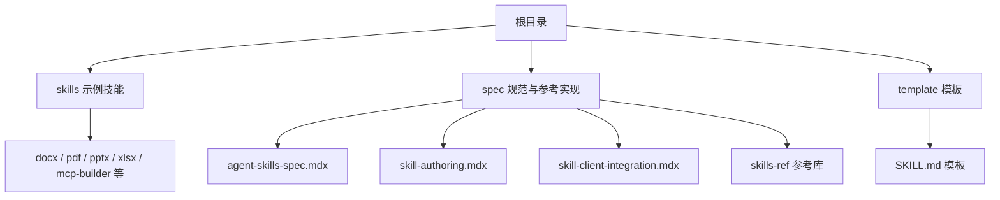
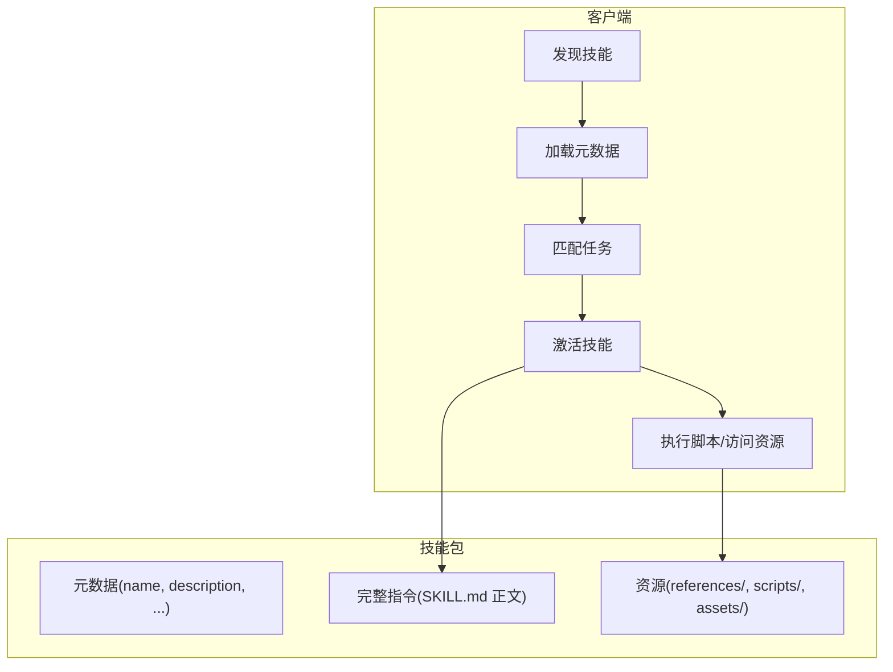
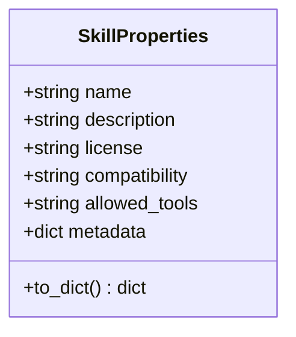
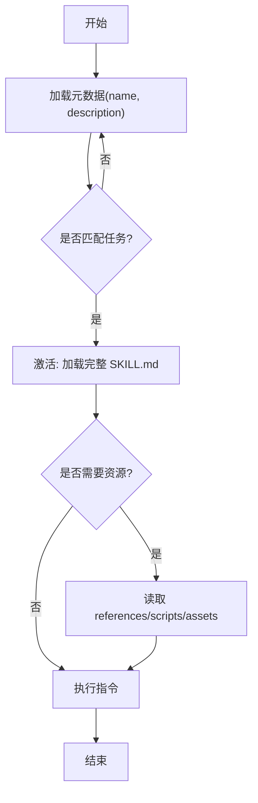
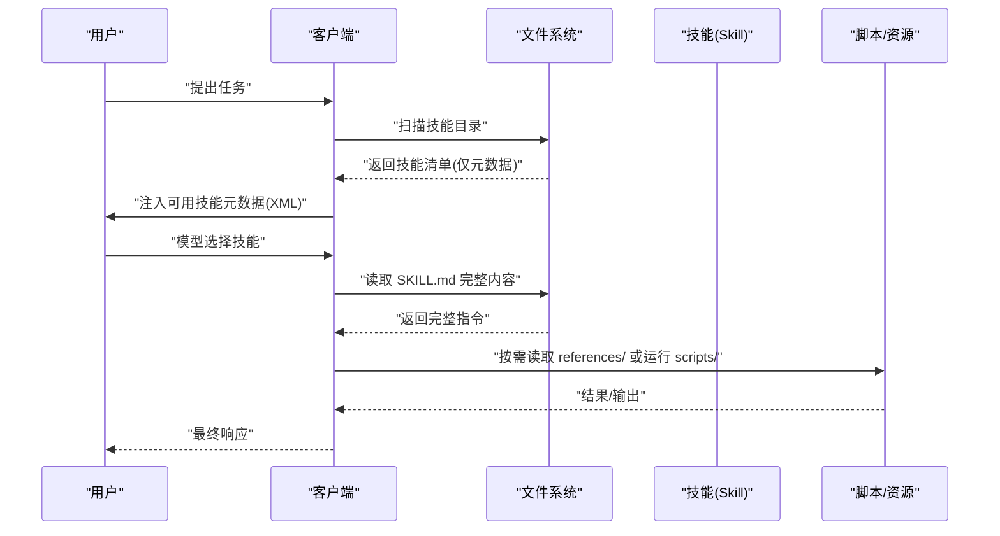
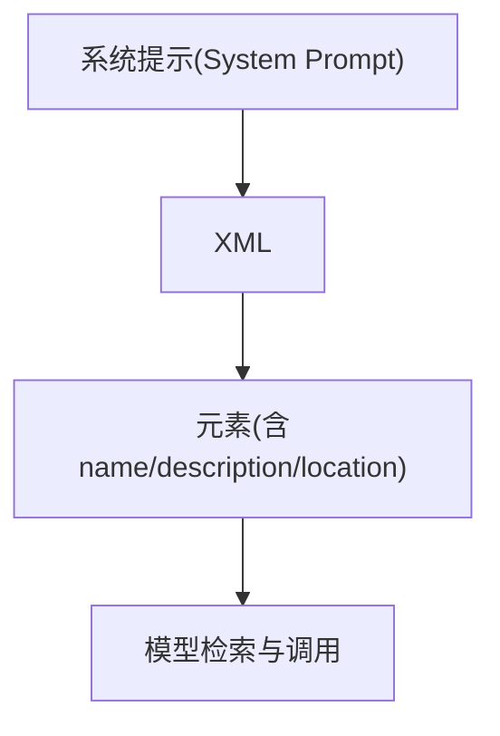
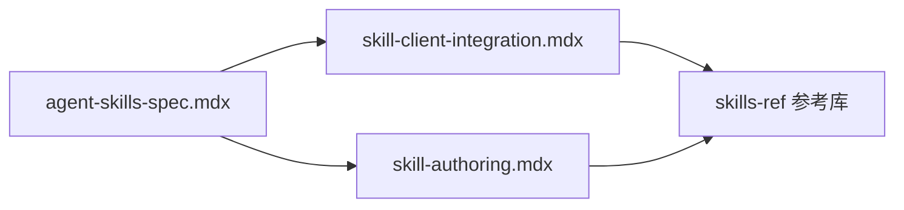

# 核心概念

<cite>
**本文引用的文件**   
- [README.md](file://README.md)
- [template\SKILL.md](file://template\SKILL.md)
- [spec\skill-authoring.mdx](file://spec\skill-authoring.mdx)
- [spec\skill-client-integration.mdx](file://spec\skill-client-integration.mdx)
- [spec\agent-skills-spec.mdx](file://spec\agent-skills-spec.mdx)
- [skills\docx\SKILL.md](file://skills\docx\SKILL.md)
- [skills\pdf\SKILL.md](file://skills\pdf\SKILL.md)
- [skills\pptx\SKILL.md](file://skills\pptx\SKILL.md)
- [skills\xlsx\SKILL.md](file://skills\xlsx\SKILL.md)
- [skills\mcp-builder\SKILL.md](file://skills\mcp-builder\SKILL.md)
- [spec\skills-ref\README.md](file://spec\skills-ref\README.md)
- [spec\skills-ref\src\skills_ref\models.py](file://spec\skills-ref\src\skills_ref\models.py)
- [spec\skills-ref\src\skills_ref\parser.py](file://spec\skills-ref\src\skills_ref\parser.py)
- [spec\skills-ref\src\skills_ref\validator.py](file://spec\skills-ref\src\skills_ref\validator.py)
</cite>

## 目录
1. [引言](#引言)
2. [项目结构](#项目结构)
3. [核心组件](#核心组件)
4. [架构总览](#架构总览)
5. [详细组件分析](#详细组件分析)
6. [依赖关系分析](#依赖关系分析)
7. [性能考量](#性能考量)
8. [故障排查指南](#故障排查指南)
9. [结论](#结论)
10. [附录](#附录)

## 引言
本文件面向技能系统的核心概念与实践，围绕以下主题展开：
- 技能的组成要素：SKILL.md 文件格式、元数据结构、指令编写规范
- 技能生命周期管理：从发现、匹配、激活到执行的完整流程
- 渐进式披露机制：如何在有限上下文中高效组织信息
- 与 Claude AI 助手的集成方式与通信协议要点
- 技能开发基础与最佳实践

## 项目结构
仓库包含三类内容：
- skills 示例技能：涵盖文档、演示文稿、电子表格、MCP 构建等场景
- spec 规范与参考实现：Agent Skills 标准、作者指南、客户端集成指南、参考库（skills-ref）
- template 模板：标准化的 SKILL.md 模板

章节来源
- file://README.md#L12-L27

## 核心组件
- SKILL.md 文件：技能的“说明书”，包含 YAML 前言（metadata）与 Markdown 指令正文
- 元数据字段：name、description、license、compatibility、metadata、allowed-tools 等
- 可选目录：scripts/（可执行脚本）、references/（参考材料）、assets/（静态资源）
- 渐进式披露：先加载元数据，再按需加载完整指令与资源
- 客户端集成：发现 → 加载元数据 → 匹配 → 激活 → 执行脚本/访问资源
- 参考库 skills-ref：解析、校验、生成可用技能 XML 提示

章节来源
- file://spec\agent-skills-spec.mdx#L21-L168
- file://spec\skill-client-integration.mdx#L19-L26
- file://spec\skills-ref\README.md#L53-L86

## 架构总览
技能系统围绕“文件即技能”的轻量格式构建，通过渐进式披露在性能与能力之间取得平衡。客户端在启动时仅加载每个技能的元数据，当任务与技能描述匹配时才加载完整指令；执行阶段可按需读取参考文件或运行脚本。

图表来源
- [spec\skill-client-integration.mdx](file://spec\skill-client-integration.mdx#L19-L26)
- [spec\agent-skills-spec.mdx](file://spec\agent-skills-spec.mdx#L197-L206)

章节来源
- file://spec\skill-client-integration.mdx#L19-L26
- file://spec\agent-skills-spec.mdx#L197-L206

## 详细组件分析

### SKILL.md 文件格式与元数据结构
- 必填前言字段：name、description
- 可选字段：license、compatibility、metadata、allowed-tools
- 正文：Markdown 指令，无强制结构，推荐包含步骤、示例、边界情况
- 参考库支持：解析 YAML 前言、读取属性、生成提示 XML

图表来源
- [spec\skills-ref\src\skills_ref\models.py](file://spec\skills-ref\src\skills_ref\models.py#L7-L40)

章节来源
- file://spec\agent-skills-spec.mdx#L25-L55
- file://spec\agent-skills-spec.mdx#L159-L168
- file://spec\skills-ref\src\skills_ref\models.py#L7-L40
- file://spec\skills-ref\src\skills_ref\parser.py#L67-L113

### 指令编写规范与渐进式披露
- 渐进式披露三阶段：元数据（~100 token）→ 指令（建议 <5000 token）→ 资源（按需）
- 主 SKILL.md 控制在 500 行以内，复杂参考放入 references/ 子文件
- 强调“必要信息”与“按需加载”，避免一次性塞满上下文
- 模板强调“渐进式披露”原则与资源目录使用指南

图表来源
- [spec\skill-authoring.mdx](file://spec\skill-authoring.mdx#L16-L26)
- [spec\agent-skills-spec.mdx](file://spec\agent-skills-spec.mdx#L197-L206)

章节来源
- file://template\SKILL.md#L41-L51
- file://spec\skill-authoring.mdx#L16-L26
- file://spec\agent-skills-spec.mdx#L197-L206

### 生命周期管理：从发现到执行
- 发现：扫描配置目录，识别包含 SKILL.md 的技能目录
- 加载元数据：仅解析前言，注入系统提示（推荐 XML 结构）
- 匹配：根据用户任务与技能描述进行匹配
- 激活：加载完整 SKILL.md 到上下文
- 执行：按需读取 references/ 中的参考文件，运行 scripts/ 中的脚本，访问 assets/ 资源
- 安全：沙箱、白名单、确认、审计日志

图表来源
- [spec\skill-client-integration.mdx](file://spec\skill-client-integration.mdx#L27-L72)
- [spec\agent-skills-spec.mdx](file://spec\agent-skills-spec.mdx#L159-L168)

章节来源
- file://spec\skill-client-integration.mdx#L19-L26
- file://spec\skill-client-integration.mdx#L35-L72

### 与 Claude AI 助手的集成方式与通信协议
- 元数据注入：通过 XML 结构将可用技能列表注入系统提示，便于模型检索与调用
- 位置信息：文件系统型客户端可提供绝对路径；工具型客户端可省略
- 上下文控制：每条技能元数据约 50-100 token，避免过度占用上下文
- 参考库：提供 to-prompt 命令生成标准 XML，便于集成

图表来源
- [spec\skill-client-integration.mdx](file://spec\skill-client-integration.mdx#L53-L71)
- [spec\skills-ref\README.md](file://spec\skills-ref\README.md#L88-L109)

章节来源
- file://spec\skill-client-integration.mdx#L53-L71
- file://spec\skills-ref\README.md#L88-L109

### 示例技能：文档、PDF、演示文稿、电子表格、MCP 构建
- docx：文本提取、原始 XML 访问、docx-js 创建、OOXML 编辑、审阅跟踪工作流
- pdf：pypdf、pdfplumber、reportlab、命令行工具的综合操作指南
- pptx：HTML→PPTX、OOXML 编辑、模板复用、替换占位符、缩略图生成
- xlsx：财务建模规范、公式优先、格式化标准、LibreOffice 重算
- mcp-builder：MCP 协议服务器开发流程、工具设计、测试评估

章节来源
- file://skills\docx\SKILL.md#L1-L197
- file://skills\pdf\SKILL.md#L1-L295
- file://skills\pptx\SKILL.md#L1-L484
- file://skills\xlsx\SKILL.md#L1-L289
- file://skills\mcp-builder\SKILL.md#L1-L237

## 依赖关系分析
- 规范层：agent-skills-spec.mdx 定义目录结构、SKILL.md 格式、字段约束
- 作者指南：skill-authoring.mdx 解释渐进式披露与 SKILL.md 组织方式
- 客户端集成：skill-client-integration.mdx 描述发现、加载、匹配、激活、执行流程
- 参考库：skills-ref 提供解析、校验、提示生成的 Python 实现与 CLI

图表来源
- [spec\agent-skills-spec.mdx](file://spec\agent-skills-spec.mdx#L1-L229)
- [spec\skill-authoring.mdx](file://spec\skill-authoring.mdx#L1-L72)
- [spec\skill-client-integration.mdx](file://spec\skill-client-integration.mdx#L1-L100)
- [spec\skills-ref\README.md](file://spec\skills-ref\README.md#L1-L113)

章节来源
- file://spec\agent-skills-spec.mdx#L1-L229
- file://spec\skill-authoring.mdx#L1-L72
- file://spec\skill-client-integration.mdx#L1-L100
- file://spec\skills-ref\README.md#L1-L113

## 性能考量
- 上下文占用控制：元数据阶段仅 ~100 token；激活后 SKILL.md 建议 <5000 token；资源按需加载
- 文件拆分：将长篇参考与复杂实现放入 references/ 与 scripts/，减少主文件体积
- 任务导向：仅在需要时读取子文件，避免一次性加载全部内容
- 客户端缓存：对已加载的元数据进行缓存，降低重复解析成本

## 故障排查指南
- 常见问题
  - 缺失 SKILL.md：检查大小写与存在性
  - YAML 前言格式错误：确认以三短横开头与闭合，且为映射类型
  - 字段超限或非法：name/description/compatibility 长度与字符约束
  - 目录名与 name 不一致：需保持一致
- 参考库工具
  - 校验：skills-ref validate
  - 读取属性：skills-ref read-properties
  - 生成提示 XML：skills-ref to-prompt

章节来源
- file://spec\skills-ref\README.md#L55-L86
- file://spec\skills-ref\src\skills_ref\validator.py#L150-L178
- file://spec\skills-ref\src\skills_ref\parser.py#L12-L27
- file://spec\skills-ref\src\skills_ref\parser.py#L30-L64

## 结论
技能系统以“文件即技能”的极简格式，结合渐进式披露与可选资源目录，实现了在有限上下文下的高效扩展。通过规范化的元数据与指令编写、严谨的客户端集成流程以及参考库的解析与校验能力，开发者可以快速构建高质量、可维护、可复用的技能，并与 Claude 等 AI 助手顺畅协作。

## 附录

### 字段定义与约束摘要
- name：必填，1-64 字符，小写字母、数字与连字符，不可连续连字符，需与目录名一致
- description：必填，1-1024 字符，描述技能做什么及何时使用
- license：可选，许可证名称或捆绑许可证文件名
- compatibility：可选，1-500 字符，环境要求说明
- metadata：可选，键值对，客户端特定属性
- allowed-tools：可选（实验），空格分隔的工具预批准列表

章节来源
- file://spec\agent-skills-spec.mdx#L47-L55
- file://spec\agent-skills-spec.mdx#L56-L158

### 模板与最佳实践要点
- 模板 SKILL.md 提供了结构化框架：概览、何时使用、工作流、资源与目录指南、最佳实践、依赖项
- 渐进式披露：主文件导航，复杂内容放入 references/
- 自适应自由度：核心流程严格，创意空间灵活
- 精确指令：使用“读取/运行/验证”等明确动词
- 错误处理：预判常见问题并提供解决路径

章节来源
- file://template\SKILL.md#L14-L51