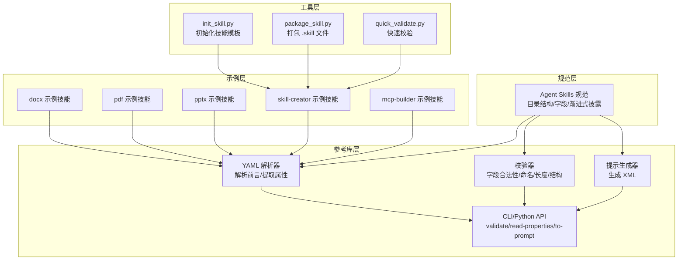
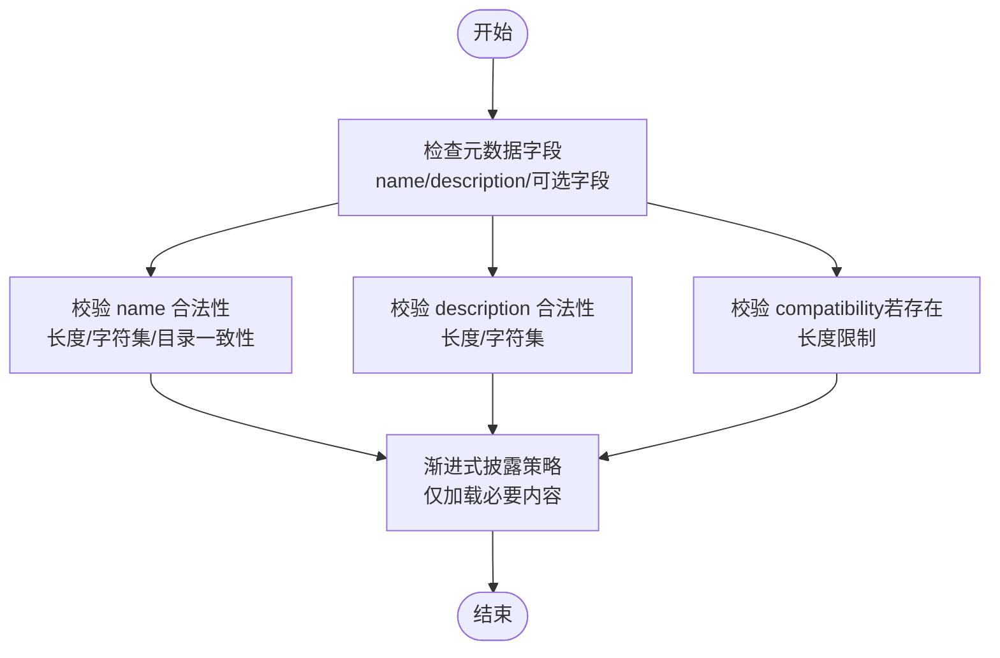
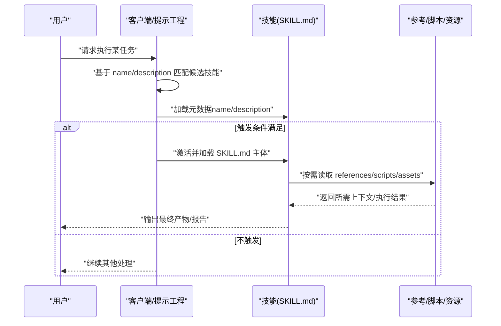
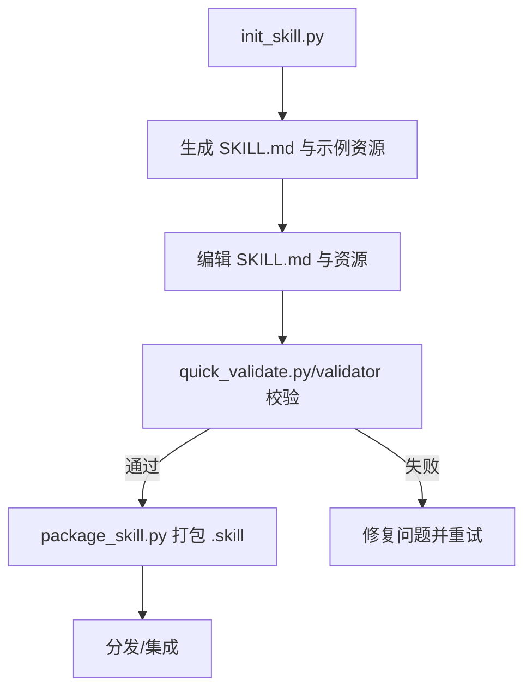

# 项目概述

<cite>
**本文引用的文件**
- [README.md](file://README.md)
- [template/SKILL.md](file://template/SKILL.md)
- [spec/skill-authoring.mdx](file://spec/skill-authoring.mdx)
- [spec/agent-skills-spec.mdx](file://spec/agent-skills-spec.mdx)
- [spec/skills-ref/README.md](file://spec/skills-ref/README.md)
- [spec/skills-ref/src/skills_ref/parser.py](file://spec/skills-ref/src/skills_ref/parser.py)
- [spec/skills-ref/src/skills_ref/models.py](file://spec/skills-ref/src/skills_ref/models.py)
- [spec/skills-ref/src/skills_ref/validator.py](file://spec/skills-ref/src/skills_ref/validator.py)
- [spec/skills-ref/src/skills_ref/cli.py](file://spec/skills-ref/src/skills_ref/cli.py)
- [skills/docx/SKILL.md](file://skills/docx/SKILL.md)
- [skills/pdf/SKILL.md](file://skills/pdf/SKILL.md)
- [skills/pptx/SKILL.md](file://skills/pptx/SKILL.md)
- [skills/skill-creator/SKILL.md](file://skills/skill-creator/SKILL.md)
- [skills/mcp-builder/SKILL.md](file://skills/mcp-builder/SKILL.md)
- [skills/skill-creator/scripts/init_skill.py](file://skills/skill-creator/scripts/init_skill.py)
- [skills/skill-creator/scripts/package_skill.py](file://skills/skill-creator/scripts/package_skill.py)
- [skills/skill-creator/scripts/quick_validate.py](file://skills/skill-creator/scripts/quick_validate.py)
</cite>

## 目录
1. [引言](#引言)
2. [项目结构](#项目结构)
3. [核心组件](#核心组件)
4. [架构总览](#架构总览)
5. [详细组件分析](#详细组件分析)
6. [依赖关系分析](#依赖关系分析)
7. [性能考虑](#性能考虑)
8. [故障排查指南](#故障排查指南)
9. [结论](#结论)
10. [附录](#附录)

## 引言
本项目是面向 Claude 的技能系统（Agent Skills）示例与参考实现集合，旨在通过“技能”这一轻量、可组合、可扩展的知识与工作流载体，帮助 AI 代理在特定领域或任务上具备确定性的专业能力。技能以文件夹形式组织，核心由 SKILL.md（包含 YAML 前言元数据与 Markdown 指令）构成，并可选地捆绑脚本、参考文档与资源文件。项目同时提供规范文档、参考库与示例技能，覆盖文档处理（docx/pdf/pptx/xlsx）、前端设计、企业沟通、MCP 服务器构建、Web 自动化测试、主题工厂、算法艺术、品牌规范等多个方向。

技能系统的核心价值在于：
- 渐进式披露：仅在必要时加载技能详情，控制上下文开销
- 可移植与可分发：技能为纯文件，便于编辑、版本化与共享
- 可扩展：从纯文本指令到可执行脚本、模板与资产的灵活组合
- 触发与激活：通过 name/description 精准匹配任务场景，按需激活

## 项目结构
仓库采用按“技能类型/领域”划分的目录结构，每个技能自包含于独立文件夹内，统一以 SKILL.md 作为入口与元数据来源。此外，spec 目录提供 Agent Skills 规范与参考库，template 提供标准化模板，便于快速初始化新技能。

```mermaid
graph TB
root["根目录"]
skills["skills/<领域>"]
spec["spec/<规范与参考>"]
template["template/<模板>"]
subgraph "技能集合"
docx["docx 技能"]
pdf["pdf 技能"]
pptx["pptx 技能"]
xlsx["xlsx 技能"]
frontend["frontend-design 技能"]
internal["internal-comms 技能"]
brand["brand-guidelines 技能"]
algorithmic["algorithmic-art 技能"]
mcp["mcp-builder 技能"]
prompt["prompt-optimizer 技能"]
slack["slack-gif-creator 技能"]
theme["theme-factory 技能"]
webtest["webapp-testing 技能"]
skillcreator["skill-creator 技能"]
sync["sync-skills 技能"]
webartifact["web-artifacts-builder 技能"]
end
subgraph "规范与参考"
spec_doc["agent-skills-spec.mdx"]
spec_authoring["skill-authoring.mdx"]
skillsref["skills-ref 参考库"]
end
subgraph "模板"
tmpl["SKILL.md 模板"]
end
root --> skills
root --> spec
root --> template
skills --> docx
skills --> pdf
skills --> pptx
skills --> xlsx
skills --> frontend
skills --> internal
skills --> brand
skills --> algorithmic
skills --> mcp
skills --> prompt
skills --> slack
skills --> theme
skills --> webtest
skills --> skillcreator
skills --> sync
skills --> webartifact
spec --> spec_doc
spec --> spec_authoring
spec --> skillsref
template --> tmpl
```



图示来源
- [README.md](file://README.md#L24-L27)
- [spec/agent-skills-spec.mdx](file://spec/agent-skills-spec.mdx#L8-L19)
- [template/SKILL.md](file://template/SKILL.md#L1-L10)

章节来源
- [README.md](file://README.md#L1-L95)
- [spec/agent-skills-spec.mdx](file://spec/agent-skills-spec.mdx#L8-L19)

## 核心组件
- 规范与参考
  - Agent Skills 规范：定义技能目录结构、SKILL.md 格式、字段约束、渐进式披露与文件引用规则
  - 参考库 skills-ref：提供 CLI 与 Python API，支持校验、读取属性、生成可用技能 XML
- 模板与示例
  - SKILL.md 模板：标准化技能元数据与结构指引
  - 多个示例技能：涵盖文档处理、演示文稿、MCP 构建、前端与自动化测试等
- 工具链
  - 技能创建工具：初始化、打包、快速校验
  - 解析与校验：解析 YAML 前言、模型化属性、执行规范校验

章节来源
- [spec/agent-skills-spec.mdx](file://spec/agent-skills-spec.mdx#L21-L168)
- [spec/skills-ref/README.md](file://spec/skills-ref/README.md#L53-L112)
- [template/SKILL.md](file://template/SKILL.md#L1-L59)
- [skills/skill-creator/SKILL.md](file://skills/skill-creator/SKILL.md#L47-L101)

## 架构总览
技能系统采用“规范驱动 + 参考库 + 示例技能”的分层架构：
- 规范层：定义技能格式与约束
- 参考库层：提供解析、校验、提示生成等工具
- 示例层：展示不同领域的技能实现模式
- 工具层：辅助技能的创建、打包与验证



图示来源
- [spec/agent-skills-spec.mdx](file://spec/agent-skills-spec.mdx#L21-L168)
- [spec/skills-ref/src/skills_ref/parser.py](file://spec/skills-ref/src/skills_ref/parser.py#L12-L112)
- [spec/skills-ref/src/skills_ref/validator.py](file://spec/skills-ref/src/skills_ref/validator.py#L150-L177)
- [spec/skills-ref/src/skills_ref/cli.py](file://spec/skills-ref/src/skills_ref/cli.py#L20-L101)
- [skills/skill-creator/scripts/init_skill.py](file://skills/skill-creator/scripts/init_skill.py#L194-L270)
- [skills/skill-creator/scripts/package_skill.py](file://skills/skill-creator/scripts/package_skill.py#L19-L82)
- [skills/skill-creator/scripts/quick_validate.py](file://skills/skill-creator/scripts/quick_validate.py#L12-L86)

## 详细组件分析

### 组件一：Agent Skills 规范与渐进式披露
- 目的：定义技能的最小结构、字段约束与使用方式，确保跨客户端的一致性
- 关键点：
  - 必需字段：name、description；可选字段：license、compatibility、metadata、allowed-tools
  - 命名与长度限制：name 与目录名一致、字符集与长度约束；description 有长度上限
  - 渐进式披露：仅在触发时加载 SKILL.md 主体，按需加载脚本/参考/资源
  - 文件引用：相对路径、单层引用，避免深层嵌套链路
- 典型用法：
  - 在系统提示中注入 <available_skills> XML，告知可用技能及其位置
  - 客户端根据 name/description 进行意图匹配与技能选择



图示来源
- [spec/agent-skills-spec.mdx](file://spec/agent-skills-spec.mdx#L25-L168)
- [spec/skills-ref/src/skills_ref/validator.py](file://spec/skills-ref/src/skills_ref/validator.py#L25-L147)

章节来源
- [spec/agent-skills-spec.mdx](file://spec/agent-skills-spec.mdx#L21-L168)
- [spec/skills-ref/src/skills_ref/validator.py](file://spec/skills-ref/src/skills_ref/validator.py#L150-L177)

### 组件二：skills-ref 参考库（解析、校验、提示生成）
- 功能：
  - 解析：定位 SKILL.md，提取 YAML 前言与正文，输出标准化属性对象
  - 校验：基于规范进行字段合法性、命名与长度、目录一致性等检查
  - 提示生成：将技能集合转换为 <available_skills> XML，供提示工程使用
  - CLI：提供 validate、read-properties、to-prompt 三类命令
- 数据模型：
  - SkillProperties：name、description、license、compatibility、allowed-tools、metadata

```mermaid
classDiagram
class Parser {
+find_skill_md(skill_dir) Path
+parse_frontmatter(content) (dict,str)
+read_properties(skill_dir) SkillProperties
}
class Validator {
+validate(skill_dir) list[str]
+validate_metadata(metadata, skill_dir) list[str]
}
class Model {
+SkillProperties {
+name : str
+description : str
+license : str?
+compatibility : str?
+allowed_tools : str?
+metadata : dict[str,str]
+to_dict() dict
}
}
class CLI {
+validate_cmd()
+read_properties_cmd()
+to_prompt_cmd()
}
Parser --> Model : "构造"
Validator --> Parser : "依赖"
CLI --> Parser : "使用"
CLI --> Validator : "使用"
CLI --> Model : "输出"
```

图示来源
- [spec/skills-ref/src/skills_ref/parser.py](file://spec/skills-ref/src/skills_ref/parser.py#L12-L112)
- [spec/skills-ref/src/skills_ref/validator.py](file://spec/skills-ref/src/skills_ref/validator.py#L150-L177)
- [spec/skills-ref/src/skills_ref/models.py](file://spec/skills-ref/src/skills_ref/models.py#L7-L39)
- [spec/skills-ref/src/skills_ref/cli.py](file://spec/skills-ref/src/skills_ref/cli.py#L20-L101)

章节来源
- [spec/skills-ref/README.md](file://spec/skills-ref/README.md#L53-L112)
- [spec/skills-ref/src/skills_ref/parser.py](file://spec/skills-ref/src/skills_ref/parser.py#L12-L112)
- [spec/skills-ref/src/skills_ref/validator.py](file://spec/skills-ref/src/skills_ref/validator.py#L150-L177)
- [spec/skills-ref/src/skills_ref/models.py](file://spec/skills-ref/src/skills_ref/models.py#L7-L39)
- [spec/skills-ref/src/skills_ref/cli.py](file://spec/skills-ref/src/skills_ref/cli.py#L20-L101)

### 组件三：示例技能（docx/pdf/pptx）与工作流
- docx 技能：提供 .docx 创建、编辑、审阅（tracked changes）、图像转换等完整工作流，强调“强制阅读完整参考文件”的渐进式披露实践
- pdf 技能：覆盖基础与高级 PDF 操作（合并/拆分/旋转/水印/OCR/表单填充），提供 Python 与命令行工具双通道
- pptx 技能：涵盖文本提取、原始 XML 访问、HTML→PPTX 转换、OOXML 编辑、模板复用与批量替换、缩略图生成与图像转换
- 共同特征：清晰的工作流决策树、引用文件组织、依赖声明、最佳实践与代码风格指导



图示来源
- [spec/agent-skills-spec.mdx](file://spec/agent-skills-spec.mdx#L197-L206)
- [skills/docx/SKILL.md](file://skills/docx/SKILL.md#L13-L154)
- [skills/pdf/SKILL.md](file://skills/pdf/SKILL.md#L13-L295)
- [skills/pptx/SKILL.md](file://skills/pptx/SKILL.md#L13-L484)

章节来源
- [skills/docx/SKILL.md](file://skills/docx/SKILL.md#L1-L197)
- [skills/pdf/SKILL.md](file://skills/pdf/SKILL.md#L1-L295)
- [skills/pptx/SKILL.md](file://skills/pptx/SKILL.md#L1-L484)

### 组件四：技能创建与打包工具链
- init_skill.py：根据模板初始化技能目录，生成 SKILL.md、scripts/、references/、assets/ 示例文件，打印下一步指引
- package_skill.py：对技能进行快速校验后打包为 .skill 文件（zip），便于分发
- quick_validate.py：最小化校验逻辑，确保 frontmatter 结构与基本约束



图示来源
- [skills/skill-creator/scripts/init_skill.py](file://skills/skill-creator/scripts/init_skill.py#L194-L270)
- [skills/skill-creator/scripts/package_skill.py](file://skills/skill-creator/scripts/package_skill.py#L19-L82)
- [skills/skill-creator/scripts/quick_validate.py](file://skills/skill-creator/scripts/quick_validate.py#L12-L86)

章节来源
- [skills/skill-creator/scripts/init_skill.py](file://skills/skill-creator/scripts/init_skill.py#L1-L304)
- [skills/skill-creator/scripts/package_skill.py](file://skills/skill-creator/scripts/package_skill.py#L1-L111)
- [skills/skill-creator/scripts/quick_validate.py](file://skills/skill-creator/scripts/quick_validate.py#L1-L95)

### 组件五：MCP 服务器构建技能
- 目标：指导如何基于 MCP 协议构建高质量的外部服务交互工具集，平衡 API 覆盖与工作流工具，强调命名、上下文管理与错误信息可操作性
- 流程：深入研究协议与框架 → 规划实现 → 实现基础设施与工具 → 评审与测试 → 创建评估用例
- 输出：可被 MCP Inspector 等工具验证的服务器，配套评估 XML

章节来源
- [skills/mcp-builder/SKILL.md](file://skills/mcp-builder/SKILL.md#L1-L237)

## 依赖关系分析
- 规范与参考库强耦合：skills-ref 的解析与校验严格遵循 Agent Skills 规范
- 示例技能依赖参考库：示例技能通过渐进式披露与引用机制，体现规范建议
- 工具链依赖参考库：init_skill.py/package_skill.py/quick_validate.py 与 skills-ref 的校验逻辑互补
- 客户端集成：通过 to-prompt 生成的 XML 将技能暴露给模型，形成“发现→激活→执行”的闭环


图示来源
- [spec/agent-skills-spec.mdx](file://spec/agent-skills-spec.mdx#L21-L168)
- [spec/skills-ref/src/skills_ref/parser.py](file://spec/skills-ref/src/skills_ref/parser.py#L12-L112)
- [spec/skills-ref/src/skills_ref/validator.py](file://spec/skills-ref/src/skills_ref/validator.py#L150-L177)
- [spec/skills-ref/src/skills_ref/cli.py](file://spec/skills-ref/src/skills_ref/cli.py#L20-L101)
- [skills/skill-creator/scripts/init_skill.py](file://skills/skill-creator/scripts/init_skill.py#L194-L270)
- [skills/skill-creator/scripts/package_skill.py](file://skills/skill-creator/scripts/package_skill.py#L19-L82)
- [skills/skill-creator/scripts/quick_validate.py](file://skills/skill-creator/scripts/quick_validate.py#L12-L86)

章节来源
- [spec/skills-ref/README.md](file://spec/skills-ref/README.md#L53-L112)
- [spec/skills-ref/src/skills_ref/cli.py](file://spec/skills-ref/src/skills_ref/cli.py#L20-L101)

## 性能考虑
- 上下文窗口管理：通过渐进式披露减少不必要的上下文占用，仅在触发时加载 SKILL.md 主体与按需资源
- 脚本执行效率：将重复性高、确定性强的任务封装为脚本，既节省上下文又保证可复现
- 文件组织：将长篇参考材料放入 references/，避免 SKILL.md 过长导致 token 消耗过高
- 依赖最小化：仅在必要时加载外部依赖，避免在主流程中引入无关上下文

## 故障排查指南
- 常见校验错误
  - 缺失或无效 YAML 前言：确认以 "---" 开头与闭合，且为映射结构
  - name/description 不符合规范：检查长度、字符集、是否以连字符开头/结尾、是否包含连续连字符
  - 目录名与 name 不一致：确保技能目录名与 name 字段完全匹配
  - description 包含非法字符或过长：避免使用尖括号，控制在 1024 字符以内
- 解析与生成问题
  - YAML 解析异常：检查缩进与特殊字符转义
  - to-prompt 输出为空或不完整：确认 SKILL.md 路径正确且包含有效元数据
- 工具链问题
  - init_skill.py：确认传入的 skill 名称与路径符合要求，目录不存在时自动创建
  - package_skill.py：先通过快速校验，再打包；若校验失败，先修复后再打包
  - quick_validate.py：用于本地快速检查 frontmatter 结构与基本约束

章节来源
- [spec/skills-ref/src/skills_ref/validator.py](file://spec/skills-ref/src/skills_ref/validator.py#L25-L147)
- [spec/skills-ref/src/skills_ref/parser.py](file://spec/skills-ref/src/skills_ref/parser.py#L30-L64)
- [spec/skills-ref/src/skills_ref/cli.py](file://spec/skills-ref/src/skills_ref/cli.py#L27-L101)
- [skills/skill-creator/scripts/quick_validate.py](file://skills/skill-creator/scripts/quick_validate.py#L12-L86)

## 结论
本项目以 Agent Skills 规范为核心，结合参考库与丰富示例，提供了从设计、实现到分发的完整技能开发与集成方案。通过渐进式披露与可选资源组织，技能系统在保证上下文效率的同时，最大化扩展性与可移植性。推荐在实际应用中：
- 严格遵循规范字段与命名约定
- 使用 skills-ref 进行解析与校验
- 采用示例技能的工作流与最佳实践
- 利用工具链完成初始化、验证与打包

## 附录
- 使用模式与示例
  - 在 Claude Code/claude.ai 中注册插件市场并安装示例技能
  - 通过 Claude API 上传自定义技能或使用预置技能
  - 在系统提示中注入 <available_skills> XML，提升技能发现与激活效率
- 公共接口与参数
  - CLI 命令
    - validate：校验技能目录与 frontmatter 合法性
    - read-properties：输出技能属性 JSON
    - to-prompt：生成 <available_skills> XML
  - Python API
    - skills_ref.validate：返回错误列表
    - skills_ref.read_properties：返回 SkillProperties
    - skills_ref.to_prompt：返回 XML 字符串

章节来源
- [README.md](file://README.md#L31-L59)
- [spec/skills-ref/README.md](file://spec/skills-ref/README.md#L53-L112)
- [spec/skills-ref/src/skills_ref/cli.py](file://spec/skills-ref/src/skills_ref/cli.py#L27-L101)